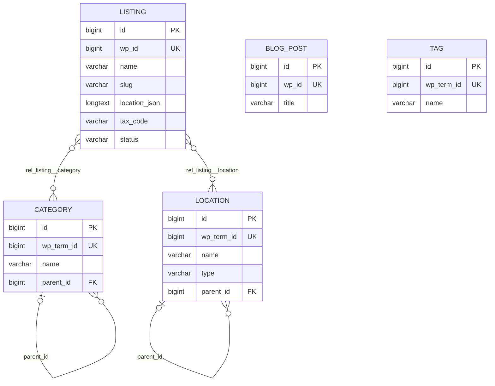
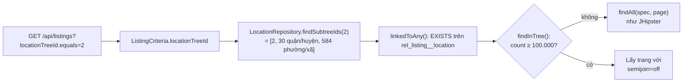

# Yellow Pages Vietnam — Tổng hợp dự án

> Cập nhật: 2026-10-01 · Phạm vi: cấu hình ứng dụng, JDL, mô hình dữ liệu và quan hệ, cách map và đồng bộ dữ liệu từ schema `jhipster_vnyp` sang database của dự án, chức năng phân cấp và lọc theo cây.

## Mục lục

1. [Tổng quan](#1-tổng-quan)
2. [Môi trường phát triển](#2-môi-trường-phát-triển)
3. [Mô hình dữ liệu](#3-mô-hình-dữ-liệu)
4. [JDL](#4-jdl)
5. [Map dữ liệu jhipster_vnyp → dự án](#5-map-dữ-liệu-jhipster_vnyp--dự-án)
6. [Quy trình đồng bộ dữ liệu](#6-quy-trình-đồng-bộ-dữ-liệu)
7. [Chức năng phân cấp và lọc theo cây](#7-chức-năng-phân-cấp-và-lọc-theo-cây)
8. [Elasticsearch](#8-elasticsearch)
9. [Xác thực và JWT](#9-xác-thực-và-jwt)
10. [API công khai cho FE (Next.js)](#10-api-công-khai-cho-fe-nextjs)
11. [Bài viết (Blog): đồng bộ WordPress và trang soạn bài](#11-bài-viết-blog-đồng-bộ-wordpress-và-trang-soạn-bài)
12. [Sinh lại code khi sửa JDL](#12-sinh-lại-code-khi-sửa-jdl)
13. [Lỗi đã gặp và cách xử lý](#13-lỗi-đã-gặp-và-cách-xử-lý)
14. [Việc còn tồn đọng](#14-việc-còn-tồn-đọng)
15. [Lệnh hay dùng](#15-lệnh-hay-dùng)

---

## 1. Tổng quan

Ứng dụng danh bạ doanh nghiệp (Yellow Pages Vietnam), chuyển từ hệ thống WordPress cũ sang JHipster. Dữ liệu chuẩn đã được trích từ WordPress vào schema MySQL `jhipster_vnyp`, sau đó đồng bộ sang database của dự án.

| Thành phần | Giá trị |
|---|---|
| Generator | JHipster 9.3.0, monolith |
| Backend | Spring Boot 4.1.1, Java 21, Maven |
| Frontend | Angular 22, TypeScript 6 |
| Database | MySQL (dev và prod), Liquibase quản lý schema |
| Tìm kiếm | Elasticsearch (`search * with elasticsearch`) |
| Xác thực | JWT |
| Ngôn ngữ giao diện | `en` (gốc), `vi` |
| Package | `com.mycompany.myapp` |
| Cấu hình generator | [`.yo-rc.json`](../.yo-rc.json) |
| Định nghĩa entity | [`yp-schema.jdl`](../yp-schema.jdl) |
| Script đồng bộ | [`db-sync/`](../db-sync/) |
| Tài liệu API (Swagger) | Giao diện quản trị **Quản trị → API** (`/admin/docs`), hoặc `/swagger-ui/index.html`; JSON ở `/v3/api-docs/springdocDefault`. Chỉ bật với profile `api-docs` (dev mặc định có). Mô tả tiếng Việt, xác thực JWT và mô tả filter theo cây được bổ sung trong [`OpenApiDocsConfiguration.java`](../src/main/java/com/mycompany/myapp/config/OpenApiDocsConfiguration.java). Class này viết tay, không bị `jhipster --force` ghi đè. |

**Ràng buộc kỹ thuật đã thống nhất:** không đổi phiên bản JHipster hay Spring Boot, không thêm thư viện, không đổi cấu trúc package.

---

## 2. Môi trường phát triển

### 2.1 Docker

Khi chạy `./mvnw`, Spring Docker Compose tự bật các container trong [`src/main/docker/services.yml`](../src/main/docker/services.yml):

| Container | Image | Cổng | Ghi chú |
|---|---|---|---|
| `javaspringbootbackend-mysql-1` | `mysql:26.7.0` | `127.0.0.1:3306` | user `root`, mật khẩu rỗng (chỉ dùng cho dev) |
| `javaspringbootbackend-elasticsearch-1` | `elasticsearch:9.4.5` | `127.0.0.1:9200` | 1 node, heap 1 GB, dữ liệu lưu ở volume `javaspringbootbackend_elasticsearch-data`; trạng thái `yellow` là bình thường (xem [mục 8.3](#83-cấu-hình-container-giai-đoạn-0-xong-2026-10-01)) |

> ⚠️ Dữ liệu MySQL nằm trong **anonymous volume** của Docker. Xóa container bằng `docker compose down -v` hoặc `docker rm -v` sẽ **mất toàn bộ dữ liệu**, gồm cả `jhipster_vnyp`.

> Elasticsearch không có giao diện riêng: `http://localhost:9200` chỉ trả JSON. Công cụ xem dữ liệu ở [mục 8.2](#82-giao-diện-quản-trị-elasticsearch).

### 2.2 Hai database trong cùng một MySQL server

| Schema | Vai trò | Ghi chú |
|---|---|---|
| `jhipster_vnyp` | **Dữ liệu chuẩn** (nguồn), trích từ WordPress | Chỉ đọc. Không được ghi vào. |
| `javaspringbootbackend` | Database của ứng dụng | Do Liquibase tạo, dữ liệu chép từ `jhipster_vnyp` |

### 2.3 Cổng và profile

- Backend dev: `http://localhost:8081` (đã đổi từ 8080 trong [`application-dev.yml`](../src/main/resources/config/application-dev.yml)).
- Liquibase dev chạy với `contexts: dev, faker`. Changeset faker đã chạy một lần nên **không chèn lại** dữ liệu giả khi khởi động lại.

### 2.4 Backup

| File | Nội dung |
|---|---|
| `C:\Users\ADMIN\Documents\tuanna\db_backup\jhipster_vnyp_20261001.sql.gz` | Toàn bộ `jhipster_vnyp` (495 MB, `mysqldump --single-transaction --set-gtid-purged=OFF`) |

Khôi phục (chạy trong Git Bash; PowerShell 5.1 làm hỏng UTF-8 khi pipe):

```bash
gunzip -c /c/Users/ADMIN/Documents/tuanna/db_backup/jhipster_vnyp_20261001.sql.gz \
  | docker exec -i javaspringbootbackend-mysql-1 mysql -uroot
```

---

## 3. Mô hình dữ liệu

### 3.1 Sơ đồ quan hệ



`BlogPost` và `Tag` không có quan hệ với bảng nào, giống hệt nguồn. Nguồn không có bảng nối giữa bài viết và thẻ, và bảng `tag` hiện có 0 dòng.

### 3.2 Entity và số liệu

| Entity | Bảng | Số dòng | Mô tả |
|---|---|---:|---|
| `Listing` | `listing` | 1.855.619 | Doanh nghiệp |
| `Category` | `category` | 2.394 | Ngành nghề, dạng cây cha/con |
| `Location` | `location` | 15.313 | Địa phương: 98 `province`, 4.035 `district`, 11.180 `ward` |
| `BlogPost` | `blog_post` | 2.288 | Bài viết tin tức |
| `Tag` | `tag` | 0 | Thẻ |
| (bảng nối) | `rel_listing__category` | 25.184.298 | Listing N–N Category |
| (bảng nối) | `rel_listing__location` | 1.798.195 | Listing N–N Location |
| built-in | `jhi_user`, `jhi_authority`, `jhi_user_authority` | | Người dùng và quyền của JHipster |

### 3.3 Quan hệ

| Quan hệ | Kiểu | Hiện thực trong code | Cột DB |
|---|---|---|---|
| Listing ↔ Category | ManyToMany, Listing là bên sở hữu | `Listing.categories` / `Category.listings` (`mappedBy`) | `rel_listing__category(listing_id, category_id)` |
| Listing ↔ Location | ManyToMany, Listing là bên sở hữu | `Listing.locations` / `Location.listings` (`mappedBy`) | `rel_listing__location(listing_id, location_id)` |
| Category → Category cha | ManyToOne | `Category.parent` | `category.parent_id → category.id` |
| Location → Location cha | ManyToOne | `Location.parent` | `location.parent_id → location.id` |

**Bảng nối không cần entity riêng.** Chúng chỉ có 2 cột khóa ngoại, và `@ManyToMany` + `@JoinTable` đã xử lý đủ. Chỉ tạo entity riêng khi bảng nối cần thêm cột dữ liệu (ví dụ `is_primary`, `display_order`).

> ⚠️ **Hiệu năng:** không gọi `category.getListings()` hay `location.getListings()`, vì một ngành có thể có hàng trăm nghìn doanh nghiệp. Muốn lọc doanh nghiệp theo ngành hoặc địa phương, dùng API có phân trang, ví dụ:
> `GET /api/listings?categoryTreeId.equals=123&page=0&size=20` (lọc theo ngành và mọi ngành con, xem [mục 7](#7-chức-năng-phân-cấp-và-lọc-theo-cây)).

### 3.4 Chi tiết trường

Kiểu JDL được sinh thành kiểu MySQL như sau: `String` → `VARCHAR(n)`, `TextBlob` → `LONGTEXT`, `Instant` → `DATETIME(6)`, `Boolean` → `TINYINT`, `Double` → `DOUBLE`, `Long` → `BIGINT`, `Integer` → `INT`.

#### Listing (`listing`)

| Field | Cột | Kiểu | Ràng buộc | Ghi chú |
|---|---|---|---|---|
| `wpId` | `wp_id` | Long | required, unique | `wp_posts.ID` |
| `apiId` | `api_id` | String(100) | | ID từ API nguồn (dạng chuỗi) |
| `name` | `name` | String(500) | required | Tên doanh nghiệp |
| `nameEn` | `name_en` | String(500) | | |
| `nameAlias` | `name_alias` | String(500) | | |
| `slug` | `slug` | String(500) | | **Không unique**: nguồn có 7 slug NULL và 34 nhóm trùng |
| `description` | `description` | TextBlob | | |
| `phone` | `phone` | String(100) | | |
| `mobile` | `mobile` | String(100) | | |
| `email` | `email` | String(255) | | |
| `website` | `website` | String(500) | | |
| `address` | `address` | TextBlob | | |
| `locationJson` | `location_json` | TextBlob | | JSON: `province`, `ward`, `street`, `province_code`, `ward_code`, `coordinate` |
| `taxCode` | `tax_code` | String(100) | | Mã số thuế |
| `representative` | `representative` | String(255) | | |
| `capital` | `capital` | String(100) | | Vốn |
| `foundedYear` | `founded_year` | String(50) | | Dạng text gốc, ví dụ `2024-01-11` |
| `businessType` | `business_type` | String(100) | | |
| `businessStatus` | `business_status` | String(50) | | |
| `industryCode` | `industry_code` | String(100) | | |
| `managedBy` | `managed_by` | String(255) | | |
| `thumbnail` | `thumbnail` | String(500) | | **ID attachment WordPress**, không phải URL |
| `images` | `images` | TextBlob | | Danh sách ID attachment WordPress |
| `viewCount` | `view_count` | Integer | | |
| `isFeatured` | `is_featured` | Boolean | | |
| `status` | `status` | String(50) | | `publish` (1.855.611), `draft` (8) |
| `publishedAt` | `published_at` | Instant | | |
| `modifiedAt` | `modified_at` | Instant | | |
| `createdAt` | `created_at` | Instant | | Ở nguồn là thời điểm migrate (2026-06-29), không phải ngày đăng |
| `updatedAt` | `updated_at` | Instant | | |
| `esIndexed` | `es_indexed` | Boolean | | |

> **Tọa độ doanh nghiệp** nằm trong `location_json` dưới dạng chuỗi `"coordinate":"21.0001:105.698"` (1.791.151 doanh nghiệp có tọa độ). Phải giữ nguyên dạng text: **không** chuyển sang DECIMAL hay Double, vì làm tròn hoặc thêm số 0 đều làm sai tọa độ.

#### Category (`category`)

| Field | Cột | Kiểu | Ràng buộc |
|---|---|---|---|
| `wpTermId` | `wp_term_id` | Long | unique |
| `name` | `name` | String(255) | required |
| `slug` | `slug` | String(255) | |
| `description` | `description` | TextBlob | |
| `icon` | `icon` | String(255) | |
| `listingCount` | `listing_count` | Integer | |
| `createdAt` / `updatedAt` | `created_at` / `updated_at` | Instant | |
| `parent` (quan hệ) | `parent_id` | → `category.id` | |

#### Location (`location`)

| Field | Cột | Kiểu | Ràng buộc |
|---|---|---|---|
| `wpTermId` | `wp_term_id` | Long | unique |
| `name` | `name` | String(255) | required |
| `slug` | `slug` | String(255) | |
| `type` | `type` | String(50) | `province` / `district` / `ward` |
| `code` | `code` | String(50) | |
| `latitude` / `longitude` | `latitude` / `longitude` | Double | Ở nguồn đã là `double`, giữ nguyên |
| `createdAt` | `created_at` | Instant | |
| `parent` (quan hệ) | `parent_id` | → `location.id` | |

#### BlogPost (`blog_post`)

| Field | Cột | Kiểu | Ràng buộc |
|---|---|---|---|
| `wpId` | `wp_id` | Long | required, unique |
| `title` | `title` | String(500) | required |
| `slug` | `slug` | String(500) | (nguồn có 1 slug trùng) |
| `content` / `excerpt` | `content` / `excerpt` | TextBlob | |
| `thumbnail` | `thumbnail` | String(500) | |
| `status` | `status` | String(50) | |
| `viewCount` | `view_count` | Integer | |
| `publishedAt` / `createdAt` / `updatedAt` | | Instant | |

#### Tag (`tag`)

| Field | Cột | Kiểu | Ràng buộc |
|---|---|---|---|
| `wpTermId` | `wp_term_id` | Long | unique |
| `name` | `name` | String(255) | required |
| `slug` | `slug` | String(255) | |

---

## 4. JDL

File: [`yp-schema.jdl`](../yp-schema.jdl). Nguyên tắc: **bám đúng schema `jhipster_vnyp`** về tên bảng/cột, kiểu, độ dài, NOT NULL, UNIQUE và quan hệ. Lần kiểm tra tự động gần nhất cho kết quả khớp 100%.

### 4.1 Quy ước đặt tên

| Quy ước | Lý do |
|---|---|
| Tên bảng ghi rõ: `entity Listing(listing)`, `entity BlogPost(blog_post)`… | Cố định tên bảng trùng với nguồn |
| Field camelCase, JHipster tự đổi sang snake_case | `wpId` → `wp_id`, `locationJson` → `location_json`… trùng tên cột nguồn |
| Tên quan hệ ManyToMany để **số ít**: `Listing{category(name)} to Category{listing}` | Cột nối sinh ra là `category_id`, đúng như nguồn. Field Java vẫn là số nhiều (`categories`). |
| `required` chỉ đặt khi nguồn là NOT NULL; `unique` chỉ đặt khi nguồn có UNIQUE KEY | Không thêm ràng buộc làm dữ liệu cũ không lưu được |

### 4.2 Tùy chọn

```
dto * with mapstruct
service * with serviceImpl
paginate Listing, Category, Location, BlogPost with pagination
paginate Tag with infinite-scroll
filter Listing, Category, Location, BlogPost
search * with elasticsearch
```

### 4.3 Giới hạn của JDL và JHipster 9.3.0

| Giới hạn | Cách xử lý |
|---|---|
| Bảng nối luôn có tiền tố `rel_` (`rel_listing__category`); JDL không đổi được, vì generator ghi đè tên | Script đồng bộ map `listing_category` → `rel_listing__category` |
| Không khai báo được index thường (`slug`, `status`, `tax_code`, `api_id`, `is_featured`, `type`) | Viết thêm changelog Liquibase tay (xem [mục 14](#14-việc-còn-tồn-đọng)) |
| Không khai báo được `ON DELETE CASCADE` và `DEFAULT` | Như trên |
| Không thêm được cột vào entity built-in `User` (`jhi_user.wp_user_id` của nguồn) | Chưa chuyển user từ nguồn |
| Bảng không có cột `id` làm khóa chính (`staging_listing` dùng `wp_id`) | Không đưa vào app |
| Comment `/** … */` trên field được chép nguyên vào file i18n JSON **mà không escape** | **Không dùng dấu `"` trong comment JDL** (xem [mục 13](#13-lỗi-đã-gặp-và-cách-xử-lý)) |

---

## 5. Map dữ liệu jhipster_vnyp → dự án

### 5.1 Map bảng

| `jhipster_vnyp` | `javaspringbootbackend` | Cách chép |
|---|---|---|
| `listing` | `listing` | Chép thẳng 32 cột, giữ nguyên `id` |
| `category` | `category` | Chép, sau đó đổi `parent_id` (xem 5.2) |
| `location` | `location` | Chép, sau đó đổi `parent_id` (xem 5.2) |
| `listing_category(listing_id, category_id)` | `rel_listing__category(listing_id, category_id)` | Chép thẳng |
| `listing_location(listing_id, location_id)` | `rel_listing__location(listing_id, location_id)` | Chép thẳng |
| `blog_post` | `blog_post` | Chép thẳng |
| `tag` | `tag` | Chép thẳng (0 dòng) |
| `jhi_user`, `jhi_authority`, `jhi_user_authority` | — | **Không chép.** App dùng user mặc định của JHipster (`admin`, `user`). |
| `staging_listing` | — | **Không chép.** Bảng tạm lúc migrate, trùng nội dung với `listing`. |
| `migration_log` | — | **Không chép.** Nhật ký migrate. |

### 5.2 Điểm cần chú ý khi map

1. **`parent_id` ở nguồn trỏ tới `wp_term_id`, không phải `id`.** Ví dụ: `category.parent_id = 523` nghĩa là cha có `wp_term_id = 523`. Khi chép phải tra cha theo `wp_term_id` rồi gán `id` của cha. Đã kiểm tra: 2.354/2.354 category và 15.215/15.215 location có cha đều tìm được cha.
2. **Giữ nguyên `id` gốc.** Quan hệ và đường dẫn cũ vẫn đúng. Entity dùng `GenerationType.IDENTITY`, nên MySQL tự đẩy `AUTO_INCREMENT` lên sau id lớn nhất.
3. **Datetime chép nguyên giá trị, không đổi múi giờ.** App đọc `DATETIME` theo UTC (`hibernate.jdbc.time_zone: UTC`). Nếu dữ liệu nguồn là giờ Việt Nam thì giao diện sẽ hiển thị lệch 7 tiếng (xem [mục 14](#14-việc-còn-tồn-đọng)).
4. **Ảnh doanh nghiệp chưa dùng được.** `thumbnail` và `images` chỉ chứa ID attachment của WordPress. Muốn có URL ảnh cần thêm dữ liệu `wp_posts.guid` từ WordPress.
5. **Tiếng Việt** ở nguồn là UTF-8 chuẩn (`utf8mb4`). Dấu `?` thấy trong PowerShell chỉ là lỗi hiển thị của console.

---

## 6. Quy trình đồng bộ dữ liệu

### 6.1 Các file

| File | Chức năng |
|---|---|
| [`db-sync/sync_from_jhipster_vnyp.sql`](../db-sync/sync_from_jhipster_vnyp.sql) | Xóa dữ liệu đích rồi chép toàn bộ từ `jhipster_vnyp`. Chạy lại nhiều lần được. |
| [`db-sync/verify_sync.sql`](../db-sync/verify_sync.sql) | So số dòng, checksum nội dung, datetime, cây cha/con, AUTO_INCREMENT |

### 6.2 Các bước trong script đồng bộ

| Bước | Việc làm |
|---|---|
| 0 | Xóa dữ liệu đích theo thứ tự khóa ngoại: bảng nối → `listing` → `category`/`location` (đặt `parent_id = NULL` trước) → `blog_post`, `tag` |
| 1 | `category`: chép với `parent_id = NULL`, sau đó `UPDATE … JOIN` theo `wp_term_id` để gán cha |
| 2 | `location`: như bước 1 |
| 3 | `listing`: `INSERT … SELECT` 32 cột cùng tên |
| 4 | Bảng nối: `listing_category` → `rel_listing__category`, `listing_location` → `rel_listing__location` |
| 5 | `blog_post`, `tag` |

Chép category/location với `parent_id = NULL` trước rồi mới gán cha để tránh lỗi khóa ngoại khi bản ghi con được chèn trước bản ghi cha.

### 6.3 Cách chạy

**Bước 1: tăng bộ nhớ InnoDB (bắt buộc).** Image MySQL mặc định chỉ có buffer pool 128 MB và redo log 100 MB. Với cấu hình đó, chép 25 triệu dòng bảng nối mất hơn 1 giờ. Các lệnh sau chỉ có hiệu lực tới khi container khởi động lại:

```bash
echo "SET GLOBAL innodb_buffer_pool_size = 2147483648;
      SET GLOBAL innodb_redo_log_capacity = 2147483648;" \
  | docker exec -i javaspringbootbackend-mysql-1 mysql -uroot
```

**Bước 2: đồng bộ** (Git Bash, tại thư mục dự án):

```bash
docker exec -i javaspringbootbackend-mysql-1 mysql -uroot < db-sync/sync_from_jhipster_vnyp.sql
```

**Bước 3: kiểm tra.** Mọi dòng kết quả phải có `ok = 1`:

```bash
docker exec -i javaspringbootbackend-mysql-1 mysql -uroot < db-sync/verify_sync.sql
```

**Bước 4: reindex Elasticsearch.** Dữ liệu chép bằng SQL không đi qua tầng service nên ES không được cập nhật (xem [mục 14](#14-việc-còn-tồn-đọng)).

**Bước 5: tính lại số doanh nghiệp theo ngành.** Nguồn có `listing_count = 0`, nên sau khi đồng bộ phải chạy `POST /api/admin/categories/listing-counts` (khoảng 1 phút, xem [mục 10.6](#106-ngành-nghề-mục-lục-theo-chữ-cái-số-doanh-nghiệp)).

**Bước 6: sửa đơn vị hành chính 2025.** Đồng bộ chép lại bảng `location` từ nguồn (mã, tên sai), nên gọi `POST /api/admin/administrative-units/fix-locations?dryRun=false` ([mục 7.10](#710-đơn-vị-hành-chính-sau-sáp-nhập-0172025)).

> Nếu terminal bị ngắt giữa chừng, câu lệnh SQL vẫn chạy tiếp trong MySQL. Kiểm tra bằng `SELECT id, time, LEFT(info,80) FROM information_schema.processlist WHERE command <> 'Sleep';` trước khi chạy lại, tránh chèn trùng.

### 6.4 Kết quả đồng bộ ngày 2026-10-01

| Kiểm tra | Kết quả |
|---|---|
| Số dòng 7 bảng | Khớp hết (bảng ở [mục 3.2](#32-entity-và-số-liệu)) |
| Checksum nội dung `listing` (28 cột) | `3982185450798924` ở cả hai phía |
| Datetime `listing` (4 cột) | 0 dòng lệch |
| Checksum hai bảng nối | Khớp |
| Cây cha/con category, location | 0 dòng sai |
| AUTO_INCREMENT | `listing` 1.855.620, `category` 2.395, `location` 15.314, `blog_post` 2.289 |

---

## 7. Chức năng phân cấp và lọc theo cây

Mục này dành cho dev cần hiểu, sửa hoặc mở rộng 3 chức năng:

1. **Xem Địa phương và Ngành nghề dạng cây.**
2. **Lọc doanh nghiệp (Listing) theo địa phương hoặc ngành nghề.** Chọn một nút là lấy cả các cấp con bên dưới.
3. **Dùng chung code cây** ở frontend (`shared/tree`) và backend (`ListingQueryService`).

### 7.1 Đặc điểm dữ liệu: vì sao phải lọc theo cả cây

| | Địa phương (`location`) | Ngành nghề (`category`) |
|---|---|---|
| Số cấp | 3: `province` → `district` → `ward` (98 / 4.035 / 11.180) | Tối đa 4 (40 / 911 / 245 / 1.198 nút theo độ sâu) |
| Phân biệt cấp | Cột `type` | Không có cột cấp, chỉ biết qua `parent_id` |
| Doanh nghiệp gắn vào | **Đúng một** địa phương, ở **bất kỳ cấp nào**: tỉnh 1.456.416, phường/xã 318.783, quận/huyện 22.950; 57.470 doanh nghiệp không có địa phương | Gần như chỉ **ngành lá** (24,4 trên 25,2 triệu liên kết ở cấp 4); trung bình 13 ngành/doanh nghiệp |
| Hệ phân loại | Hành chính | Hai hệ trong cùng một cây: nhóm Yellow Pages cũ (gốc id 1–14, ~494 nghìn doanh nghiệp) và hệ ngành kinh tế VSIC (gốc id 846–866, ~1,24 triệu doanh nghiệp) |
| Số con lớn nhất của một nút | 168 | 415 (gốc "CHƯA PHÂN LOẠI") |

**Hệ quả:** filter có sẵn của JHipster `locationId.equals=X` chỉ khớp doanh nghiệp gắn **đúng** vào X. Ví dụ:

| Lọc | `locationId` (chỉ đúng nút) | `locationTreeId` (cả cây con) |
|---|---:|---:|
| Thành phố Hà Nội (id 2) | 206.901 | **265.942** |
| TP. Hồ Chí Minh (id 51) | 443.460 | **541.032** |
| Huyện Ba Vì (id 256) | 0 | **536** |

Vì vậy dự án thêm 2 filter **theo cây**: `locationTreeId` và `categoryTreeId`.

### 7.2 Giao diện

| Trang / menu | Đường dẫn | Mô tả |
|---|---|---|
| Thực thể → **Tỉnh thành** → Đơn vị hành chính | `/location/tree` | Cây tỉnh → quận/huyện → phường/xã, tải dần từng cấp |
| Thực thể → Tỉnh thành → Tỉnh thành / Quận huyện / Phường xã | `/location?filter[type.equals]=province` (`district`, `ward`) | Trang danh sách Location có sẵn, lọc theo cấp |
| Thực thể → **Ngành nghề** → Cây ngành nghề | `/category/tree` | Cây ngành nghề tối đa 4 cấp |
| Thực thể → Ngành nghề → Danh sách ngành nghề | `/category` | Trang danh sách có sẵn |
| Trang **Listing** | `/listing` | 2 dãy ô chọn: địa phương và ngành nghề, kết hợp được |

- Trên trang cây, mỗi nút có biểu tượng danh sách để mở `/listing` đã lọc sẵn theo nút đó.
- Lựa chọn lọc nằm trên URL, ví dụ `/listing?filter[locationTreeId.equals]=2&filter[categoryTreeId.equals]=848`. Tải lại trang hay gửi link vẫn giữ nguyên bộ lọc.

### 7.3 API

| Mục đích | Request |
|---|---|
| Các nút gốc | `GET /api/locations?parentId.specified=false&size=1000&sort=id,asc` |
| Con của một nút | `GET /api/locations?parentId.equals=2&size=1000&sort=name,asc` |
| Lọc doanh nghiệp theo cây địa phương | `GET /api/listings?locationTreeId.equals=2&page=0&size=20&sort=id,asc` |
| Lọc doanh nghiệp theo cây ngành nghề | `GET /api/listings?categoryTreeId.equals=848&page=0&size=20&sort=id,asc` |
| Kết hợp | `GET /api/listings?locationTreeId.equals=2&categoryTreeId.equals=848&…` (110.642 kết quả) |

Hai API đầu cũng dùng được cho `/api/categories`. Tổng số kết quả trả trong header `X-Total-Count`. Id không tồn tại thì trả danh sách rỗng, không báo lỗi.

> ⚠️ Ô **tìm kiếm** trên trang Listing gọi `/api/listings/_search` (Elasticsearch). Endpoint này **bỏ qua mọi filter**, kể cả filter theo cây. Hiện chưa kết hợp được tìm kiếm với lọc theo cây.

### 7.4 Backend: luồng xử lý



| Thành phần | File | Việc làm |
|---|---|---|
| Filter mới | [`ListingCriteria.java`](../src/main/java/com/mycompany/myapp/service/criteria/ListingCriteria.java) | Thêm `locationTreeId`, `categoryTreeId` (`LongFilter`, chỉ dùng `.equals`); Spring tự bind từ query string |
| Lấy cây con | [`LocationRepository.findSubtreeIds`](../src/main/java/com/mycompany/myapp/repository/LocationRepository.java), [`CategoryRepository.findSubtreeIds`](../src/main/java/com/mycompany/myapp/repository/CategoryRepository.java) | JPQL `left join` lên cha, ông, (cụ): nút + mọi cấp con |
| Điều kiện lọc | [`ListingQueryService.linkedToAny`](../src/main/java/com/mycompany/myapp/service/ListingQueryService.java) | Sinh `EXISTS (SELECT 1 FROM rel_listing__x r WHERE r.listing_id = l.id AND r.x_id IN (…))` |
| Chọn cách truy vấn | `ListingQueryService.findInTree` | Đếm trước; tập lớn thì lấy trang với `semijoin=off` |

**SQL thực tế Hibernate gửi đi** (đã kiểm tra trong `performance_schema`):

```sql
SELECT COUNT(l1_0.id) FROM listing l1_0
WHERE EXISTS (SELECT ? FROM rel_listing__location l2_0
              WHERE l2_0.location_id IN (...) AND l1_0.id = l2_0.listing_id)
```

**Vì sao dùng `EXISTS` mà không dùng join** (đo trên TP.HCM, 541 nghìn doanh nghiệp):

| Cách viết | Đếm | Lấy trang 1 |
|---|---:|---:|
| `join` của JHipster (`locationId`) | Trùng dòng nếu doanh nghiệp gắn nhiều nút trong cây | |
| `id IN (SELECT … JOIN listing …)` | 3,3 s | 3,0 s |
| **`EXISTS` chỉ trên bảng nối** | **1,1 s** | 1,2 s |

**Vì sao tắt semi-join khi tập lớn** (đo với cách `EXISTS`):

| Cấu hình MySQL | Đếm | Lấy trang 1 đủ cột |
|---|---:|---:|
| Mặc định (semi-join) | **1,35 s** | 3–22 s: dựng cả 541 nghìn dòng rồi mới sắp xếp |
| `semijoin=off` | 2,4–3,7 s | **0,002 s**: duyệt `listing` theo khóa chính, dừng khi đủ 20 dòng |

Vì vậy `findInTree()` **đếm bằng cấu hình mặc định**, rồi:
- **Tập ≥ 100.000** (`LARGE_TREE_RESULT`): lấy trang với `SET SESSION optimizer_switch = 'semijoin=off'`, và bật lại trong `finally` để connection trả về pool ở trạng thái mặc định.
- **Tập nhỏ:** giữ cách mặc định. Doanh nghiệp của một huyện có thể dồn ở cuối bảng (Ba Vì: id ~1,44 triệu); tắt semi-join thì phải duyệt từ đầu, mất 3,3 s thay vì 0,2 s.

**Tốc độ hiện tại** (khi MySQL đã có dữ liệu trong bộ nhớ đệm; trang 20 dòng, sắp theo id):

| Bộ lọc | Số doanh nghiệp | Thời gian |
|---|---:|---:|
| TP.HCM | 541.032 | ~1,1 s |
| Hà Nội | 265.942 | ~0,65 s |
| Hải Phòng / Bình Dương / Đồng Nai | 53–64 nghìn | 0,5–0,6 s |
| Tỉnh, huyện nhỏ | < 6 nghìn | 0,1–0,3 s |
| Ngành < 120 nghìn doanh nghiệp (đa số ngành) | | 0,3–0,5 s |
| "Dịch vụ lưu trú và ăn uống" (VSIC) | 323.939 | ~3 s |
| "Công nghiệp chế biến, chế tạo" (VSIC) | 717.984 | ~8 s |
| "Bán buôn và bán lẻ…" (VSIC) | 1.088.771 | **~33 s** |

Nhóm VSIC lớn chậm vì **phần đếm** phải loại trùng hàng triệu liên kết (7,7 triệu với "Bán buôn và bán lẻ"). Không chỉnh được bằng cách viết lại truy vấn; hướng xử lý ở [mục 14](#14-việc-còn-tồn-đọng).

### 7.5 Frontend: component dùng chung `shared/tree`

| File | Export | Vai trò |
|---|---|---|
| [`tree-source.ts`](../src/main/webapp/app/shared/tree/tree-source.ts) | `TreeItem`, `TreeSource`, `createTreeSource(service)` | Bọc service entity của JHipster thành nguồn cây: `roots()`, `children(id)`, `find(id)`, dựa trên filter `parentId` có sẵn của API |
| [`tree-view.ts`](../src/main/webapp/app/shared/tree/tree-view.ts) | `<jhi-tree-view>` | Cây tải dần: mở nút nào mới gọi API lấy con nút đó |
| [`tree-filter.ts`](../src/main/webapp/app/shared/tree/tree-filter.ts) | `<jhi-tree-filter>` | Dãy ô chọn; ô cấp sau chỉ hiện khi nút đang chọn có con |

**`<jhi-tree-view>`**

| Input | Bắt buộc | Ý nghĩa |
|---|---|---|
| `source` | ✔ | `TreeSource` |
| `entityRoute` | ✔ | Ví dụ `/location`; link chi tiết là `/location/{id}/view` |
| `listingFilterName` | ✔ | Ví dụ `locationTreeId.equals`; link "Xem doanh nghiệp" là `/listing?filter[...]={id}` |
| `isLeaf` | | Hàm biết trước nút lá (địa phương: `type === 'ward'`). Mặc định: lá khi đã mở mà không có con |
| `itemLabel` | | Hàm trả khóa i18n hiện cạnh tên (địa phương: tên cấp) |
| `leafIcon` | | Icon nút lá, mặc định `circle` |

Gọi `load()` qua template ref để làm mới, ví dụ `<jhi-tree-view #tree …/>` rồi `(click)="tree.load()"`.

**`<jhi-tree-filter>`**

| Input | Ý nghĩa |
|---|---|
| `filters` | `IFilterOptions` của trang danh sách (trang Listing truyền `filters`) |
| `source` | `TreeSource` |
| `filterName` | Ví dụ `categoryTreeId.equals` |
| `placeholders` | Khóa i18n cho lựa chọn "tất cả" từng cấp; cấp sâu hơn dùng khóa cuối |

Cách hoạt động:
- **Chọn:** đặt filter bằng **nút sâu nhất** đang chọn (thay giá trị cũ), sau đó tải con của nút đó; có con thì hiện thêm một ô. Bỏ chọn một cấp thì lọc theo cấp cha.
- **Đồng bộ với URL:** đọc `filter[<filterName>]` trên URL. Khi URL đổi từ bên ngoài (tải lại trang, bấm × trên chip filter, mở link từ trang cây), component đi ngược lên cha bằng `find()` để dựng lại đủ các ô.
- **Không tải lại thừa:** trang Listing đọc filter qua signal, nên `removeFilter` rồi `addFilter` liền nhau chỉ gây **một** lần tải lại.

### 7.6 Thêm bộ lọc theo cây cho entity khác

Ví dụ: lọc `BlogPost` theo cây chuyên mục.

1. **Dữ liệu:** entity cây cần quan hệ `ManyToOne` `parent` tới chính nó (JDL `relationship ManyToOne { X{parent(name)} to X }`), và filter `parentId` (bật `filter X` trong JDL).
2. **Repository:** thêm `findSubtreeIds(id)` với đủ số tầng `left join … parent` bằng **độ sâu tối đa** của dữ liệu.
3. **Criteria:** thêm field `LongFilter xTreeId` vào `<Entity>Criteria`, kèm getter/setter, `optional…()`, constructor copy, `equals`, `hashCode`, `toString`.
4. **QueryService:** trong `createSpecification` thêm `linkedToAny(Entity_.xs, X_.id, xRepository.findSubtreeIds(id))`. Nếu tập kết quả có thể lớn, áp dụng cách của `findInTree()`.
5. **Frontend:** trong component danh sách tạo `readonly xTree = createTreeSource(inject(XService))`, rồi thêm `<jhi-tree-filter [filters]="filters" [source]="xTree" filterName="xTreeId.equals" [placeholders]="[...]" />`.
6. **Trang cây** (nếu cần): tạo component chứa `<jhi-tree-view>`, thêm route `tree` vào `x.routes.ts`, thêm menu và khóa i18n.
7. **Test:** spec của trang danh sách phải thay `TreeFilter` bằng stub (xem `listing.spec.ts`), nếu không sẽ có thêm request lấy nút gốc và các test `expectOne` sẽ fail.

### 7.7 Kiểm thử

| Test | Nội dung |
|---|---|
| [`shared/tree/tree-filter.spec.ts`](../src/main/webapp/app/shared/tree/tree-filter.spec.ts) | Nguồn dữ liệu giả 4 cấp: hiện nút gốc; chỉ thêm ô khi có con; filter theo nút sâu nhất; bỏ chọn thì lùi về cha hoặc xóa filter; dựng lại từ URL; placeholder theo cấp |
| [`entities/listing/list/listing.spec.ts`](../src/main/webapp/app/entities/listing/list/listing.spec.ts) | Test JHipster sinh sẵn; `TreeFilter` được thay bằng stub |

Chạy (dùng `*.spec.ts` trong `--include`; nếu để `**` thì sẽ lẫn cả file `.html`):

```bash
npx ng test --watch=false --include='src/main/webapp/app/shared/tree/*.spec.ts' --include='src/main/webapp/app/entities/listing/list/*.spec.ts'
```

Backend: kiểm tra thủ công bằng API ở [mục 7.3](#73-api), so với SQL đối chiếu. **Chưa có** integration test cho `locationTreeId` và `categoryTreeId`.

### 7.8 Lưu ý và bẫy thường gặp

- **Không map `listings` trong `LocationMapper` / `CategoryMapper`.** JHipster 9.3.0 luôn sinh chiều ngược của ManyToMany. Nếu map, `/api/locations` sẽ tải hàng trăm nghìn doanh nghiệp cho mỗi nút và bị treo. Sau mỗi lần `jhipster jdl --force`, kiểm tra lại (xem [mục 12](#12-sinh-lại-code-khi-sửa-jdl)).
- **Độ sâu cây đang cố định** trong JPQL `findSubtreeIds`: địa phương 3 cấp, ngành nghề 4 cấp. Dữ liệu sâu hơn sẽ bị thiếu nút con khi lọc.
- **Mỗi cấp tải tối đa 1.000 nút con** (`CHILDREN_PAGE_SIZE`). Hiện nhiều nhất là 415.
- **`SET SESSION optimizer_switch` phải luôn được bật lại** (`finally`), nếu không connection trong pool sẽ giữ `semijoin=off` cho các truy vấn khác.
- **Sắp xếp theo cột không có index** (ví dụ `name`) rất chậm với tập lớn: TP.HCM sắp theo tên mất ~44 s. Cần changelog index (xem [mục 14](#14-việc-còn-tồn-đọng)).
- **Tên ngành có `&amp;`** (ví dụ `SỨC KHỎE &amp; LÀM ĐẸP`): dữ liệu WordPress lưu sẵn trong `jhipster_vnyp`. Giao diện hiển thị nguyên văn.
- **Tìm kiếm Elasticsearch không kết hợp với lọc theo cây** (xem [mục 7.3](#73-api)).

### 7.9 Mục lục ngành nghề A–Z (trang quản trị)

> Làm ngày 2026-10-08. Giao diện theo trang **Mục lục ngành nghề** của FE cũ: dãy nút chữ cái, ô tìm theo tên, thẻ ngành kèm số doanh nghiệp.

**Mở:** menu **Thực thể → Ngành nghề → Mục lục A–Z**, hoặc `/category/index`. Trang **Cây ngành nghề** và **Danh sách ngành nghề** có nút chuyển qua lại.

| Vùng | Chức năng |
|---|---|
| Đầu trang (nền xanh) | Nút **Tất cả** và các chữ cái có ngành (A–Z; chữ có dấu gộp vào chữ gốc: Ô → O, Đ → D). Rê chuột lên nút để xem số ngành |
| Ô tìm kiếm | Tìm trong tên ngành, **không phân biệt dấu**, nhiều từ thì phải có đủ (`may vi tinh`). Gõ xong 300 ms mới gọi API. Dùng được cùng chữ cái |
| Tùy chọn | **Ẩn ngành chưa có doanh nghiệp** (mặc định bật); sắp xếp **Tên A–Z** hoặc **Nhiều doanh nghiệp nhất** |
| Thanh tóm tắt | "Ngành nghề bắt đầu bằng chữ: L" và số ngành tìm được |
| Thẻ ngành (60 thẻ/trang) | Ô vuông số doanh nghiệp rút gọn (74, 1k, 321k, 1tr, 1,2tr), tên ngành, **"Thuộc: tên ngành cha"** (phân biệt ngành trùng tên ở các cấp), số doanh nghiệp đầy đủ (353.317). **Bấm thẻ** → danh sách doanh nghiệp lọc theo cả cây ngành đó (`/listing?filter[categoryTreeId.equals]=id`, [mục 7.3](#73-api)) |

Trạng thái lưu trên URL (`/category/index?letter=L&q=may%20vi%20tinh&sort=count&page=2&all=true`), nên tải lại trang, quay lại hay gửi link đều giữ nguyên bộ lọc.

**Dữ liệu:** API quản trị (đăng nhập JWT), cùng logic với API công khai [mục 10.6](#106-ngành-nghề-mục-lục-theo-chữ-cái-số-doanh-nghiệp) nhưng không cần khóa `X-API-Key` (khóa đó dành cho FE Next.js, không đưa vào trang quản trị):

| API | Ghi chú |
|---|---|
| `GET /api/category-index/letters?hideEmpty=` | Như `/api/public/v1/categories/letters` |
| `GET /api/category-index?letter=&q=&hideEmpty=&page=&size=&sort=` | Như `/api/public/v1/categories` |

| File | Nội dung |
|---|---|
| [`web/rest/CategoryIndexResource.java`](../src/main/java/com/mycompany/myapp/web/rest/CategoryIndexResource.java) | 2 API quản trị, dùng `PublicCategoryService` |
| [`entities/category/index/category-index.ts`](../src/main/webapp/app/entities/category/index/category-index.ts), `.html`, `.scss` | Trang mục lục. Gọi API qua `switchMap` nên bấm chữ cái liên tục chỉ lấy kết quả mới nhất; `shortCount()` rút gọn số |
| [`entities/category/service/category-index.service.ts`](../src/main/webapp/app/entities/category/service/category-index.service.ts) | Gọi `/api/category-index` |
| `category.routes.ts` (route `index`), `navbar.html` (mục **Mục lục A–Z**, icon `arrow-down-a-z`), `font-awesome-icons.ts` (`faArrowDownAZ`, `faTableCellsLarge`), `i18n/{vi,en}/category.json` (`category.index.*`), `global.json` (`menu.entities.categoryIndex`) | Gắn trang vào ứng dụng |

**Kiểm thử (2026-10-08):**

| Test | Kết quả |
|---|---|
| [`category-index.spec.ts`](../src/main/webapp/app/entities/category/index/category-index.spec.ts): rút gọn số; đọc trạng thái từ URL khi mở trang; bấm chữ cái (về trang 1, ghi URL); gõ tìm chờ 300 ms; hiện ngành trống, sắp theo số doanh nghiệp; link sang danh sách doanh nghiệp. Cả thư mục `entities/category` và navbar | 62/62 ✅, ESLint sạch |
| Chrome headless trên app: mở trang (2.195 ngành, 11 trang); bấm L (30 ngành, khớp API); thêm "may vi tinh" (4 ngành); mở lại bằng URL giữ chữ cái, từ khóa, sắp xếp; bấm thẻ sang `/listing` đúng bộ lọc | ✅ |
| API quản trị không có JWT | 401 ✅ |

> ⚠️ **Bấm thẻ của một số ngành mở danh sách doanh nghiệp rất chậm**: ví dụ "Lập trình máy vi tính" (id 1524, 85.609 doanh nghiệp) mất **21–24 s**, trong khi ngành cha 1114 (116.715) chỉ 2,1 s và ngành nhỏ dưới 1 s. Đây là vấn đề lọc theo cây đã ghi ở [mục 14](#14-việc-còn-tồn-đọng) #8, xem số đo ở đó.

### 7.10 Đơn vị hành chính sau sáp nhập 01/7/2025

> Bắt đầu 2026-10-08. Từ 01/7/2025 cả nước còn 34 tỉnh, bỏ cấp huyện, 3.321 xã/phường/đặc khu. Dữ liệu doanh nghiệp phần lớn gắn theo địa giới cũ, nên tra cứu theo địa giới mới bị sai. Làm theo 4 bước; **bước 1 xong**.

#### Hiện trạng (phân tích 2026-10-08)

Bảng `location` chứa **cả hai bộ**, phân biệt bằng đuôi slug `-2025` (mã trùng nhau giữa hai bộ, ví dụ Hà Nội là 01 ở cả hai):

| | Bộ cũ (trước 01/7/2025) | Bộ mới (từ 01/7/2025) |
|---|---|---|
| Cấp | Tỉnh → huyện → xã | Tỉnh → xã |
| Số đơn vị | 63 tỉnh (+ "QUỐC TẾ"), 715 huyện, 11.180 xã | 34 tỉnh, 3.321 xã |
| Slug | mã ở cuối: `huyen-ba-vi-271`, `xa-phu-cuong-09625` | mã + `-2025`: `phuong-cua-nam-00082-2025` |
| Doanh nghiệp đang gắn | 1.456.416 ở cấp tỉnh, 318.783 ở cấp xã, 153 ở cấp huyện | 22.797 ở cấp xã |

Thêm 57.470 doanh nghiệp không gắn địa phương nào. Mỗi doanh nghiệp gần như chỉ gắn **một** đơn vị.

**Nguồn để chuyển đổi:**

1. **File Excel chuyển đổi** `BangChuyendoiĐVHCmoi_cu_final.xlsx` (sheet "Tổng hợp_không merge"): 10.571 dòng, mỗi dòng là một xã cũ nhập vào một xã mới. Gồm 10.034 xã cũ, 696 huyện cũ, 63 tỉnh cũ, 3.321 xã mới, 34 tỉnh mới. Có 969 dòng "nhập một phần": 442 xã cũ chia cho nhiều xã mới. 6 dòng cấp huyện, cả huyện đảo thành đặc khu (Bạch Long Vĩ, Cồn Cỏ, Hoàng Sa, Lý Sơn, Côn Đảo, Thổ Châu) hoặc vùng bãi bồi chưa có mã.
2. **`listing.location_json`** đã ghi theo **địa giới mới**: 1.502.608 doanh nghiệp có mã xã mới, **khớp 100% với Excel** (đúng tỉnh); 288.536 doanh nghiệp chỉ có mã tỉnh mới; 64.475 doanh nghiệp không có JSON hợp lệ. Ví dụ địa chỉ ghi "P. Thành Công, Q. Ba Đình" nhưng JSON ghi "Phường Giảng Võ" (00025).

**Lỗi trong file Excel** (script tự sửa khi chuyển sang CSV, xem bên dưới):

| Lỗi | Sửa |
|---|---|
| 348 mã mất số 0 đầu (`1558`) | Thêm số 0: xã 5 chữ số, huyện 3, tỉnh 2 |
| Phường 4, TP Tân An (794) ghi tỉnh Tiền Giang (82) | Long An (80), theo đa số dòng cùng huyện |
| Xã Tiên Hải, TP Hà Tiên (900) ghi An Giang (89) | Kiên Giang (91) |
| Huyện Cồn Cỏ ghi "Quảng Trị (44)"; 44 là Quảng Bình cũ | 45, theo tên |
| 31 tên sai tiền tố: "Xa Ea Kly", "phường Vĩnh Hải", "Thi trấn Ngan Dừa", "Thị Trấn Yên Minh" | Xã, Phường, Thị trấn |
| Dấu nháy cong "M’Droh", tên tỉnh cũ không thống nhất ("Quảng Trị" / "Tỉnh Quảng Trị") | Nháy thẳng; tên phổ biến nhất của mã |

Sau khi sửa: mỗi tỉnh cũ về đúng một tỉnh mới, và mọi cặp huyện cũ → tỉnh cũ khớp với bảng `location`.

**Lỗi của bộ mới trong bảng `location`** (dữ liệu gốc `jhipster_vnyp`), so với Excel và JSON doanh nghiệp (hai nguồn này khớp nhau):

- **123 xã mới mang mã sai**, có chỗ gán lẫn mã giữa các xã. Ví dụ "Phường Cửa Nam" 00073 → đúng 00082; "Phường Kim Liên" mang mã 00226 của "Văn Miếu - Quốc Tử Giám" → đúng 00229.
- 5 xã sai tên: "Phường Hoàng Văn Thụ" 06187 → "Phường Kỳ Lừa" (JSON của 903 doanh nghiệp cũng ghi Kỳ Lừa); "Xã Tân Thanh" 06172 → "Xã Hoàng Văn Thụ"; "Đào Duy Tư" → "Đào Duy Từ"; "Albá" → "Al Bá"; "Lục Sỹ Thành" → "Lục Sĩ Thành".
- 81 tên khác kiểu đặt dấu, nháy, gạch ngang ("Thuỷ"/"Thủy", "M’Drắk", "Chân Mây – Lăng Cô"); 4 tỉnh ghi "Tp …".
- Thiếu "Xã Khuôn Lùng" (Tuyên Quang, 01147).
- Xã mới lưu nhầm `type = district` (cây địa phương hiện nút mở rộng thừa cho xã mới; trang "Quận huyện" liệt kê cả 3.320 xã mới).
- Cột `code` để trống ở cả hai bộ.

#### Kế hoạch (người dùng đã chọn 2026-10-08)

| Bước | Nội dung | Trạng thái |
|---|---|---|
| 1 | Nạp bảng chuyển đổi vào DB; sửa bộ mới trong `location` theo danh mục chính thức (**sửa cả slug**) | ✅ 2026-10-08 |
| 2 | Gắn doanh nghiệp vào đơn vị mới: **thêm liên kết, giữ liên kết cũ** (lấy từ `location_json`, không có thì qua bảng chuyển đổi) | Chưa làm |
| 3 | Giao diện tra cứu, bộ lọc: **mặc định địa giới mới**, có nút chuyển sang địa giới cũ | Chưa làm |
| 4 | API tra cứu địa chỉ cũ → mới (quản trị và công khai) | Chưa làm |

#### Bước 1: bảng chuyển đổi và sửa bảng location

**Bảng `location_conversion`** (changelog viết tay [`20261008100000_location_conversion.xml`](../src/main/resources/config/liquibase/changelog/20261008100000_location_conversion.xml), dữ liệu [`data/location_conversion.csv`](../src/main/resources/config/liquibase/data/location_conversion.csv)): mỗi dòng có tỉnh mới, xã mới, xã cũ (NULL với dòng cấp huyện), huyện cũ, tỉnh cũ (mã và tên), `note`, `partial_merge` (nhập một phần). Có index theo mã xã cũ, mã xã mới, mã huyện cũ. Changeset nạp dữ liệu có `runOnChange`: sửa CSV thì lần khởi động sau tự xóa và nạp lại.

**Cập nhật khi có file Excel mới:**

```bash
node db-sync/dvhc/excel-to-csv.mjs "BangChuyendoiĐVHCmoi_cu_final.xlsx" src/main/resources/config/liquibase/data/location_conversion.csv
# khởi động lại app → Liquibase nạp lại bảng; rồi gọi API sửa location (dưới đây)
```

[`db-sync/dvhc/excel-to-csv.mjs`](../db-sync/dvhc/excel-to-csv.mjs) đọc `.xlsx` không cần thư viện (giải nén XML bằng `unzip`), tự sửa các lỗi ở bảng trên, in ra các chỗ đã sửa.

**Sửa bảng `location`:** `POST /api/admin/administrative-units/fix-locations?dryRun=true|false` (`ROLE_ADMIN`, Swagger nhóm **administrative-unit-admin**). Mặc định `dryRun=true` (chỉ xem trước). Trả số thay đổi theo loại, `unmatched` (đơn vị không khớp, **không bị xóa**), `renames` (mọi xã đổi tên và thêm mới, để xem lại), `samples`.

| Phần | Cách làm |
|---|---|
| Bộ cũ | Điền `code` từ mã trong slug |
| Bộ mới, tỉnh | Mã từ slug; tên theo danh mục ("Tp Hồ Chí Minh" → "Thành phố Hồ Chí Minh") |
| Bộ mới, xã | Khớp **theo tên trong cùng tỉnh trước** (không phân biệt kiểu đặt dấu cũ/mới, nháy, gạch ngang); xử lý được chỗ DB gán lẫn mã. Rồi khớp **theo mã** cho xã còn lại (đổi tên). Xã khớp được: sửa mã, tên, slug (`ten-khong-dau-<mã>-2025`), `type = ward`, tỉnh cha. Xã chính thức chưa có: thêm mới |

Code: [`service/dvhc/LocationFixPlanner.java`](../src/main/java/com/mycompany/myapp/service/dvhc/LocationFixPlanner.java) (lập kế hoạch, hàm thuần), [`AdministrativeUnitService.java`](../src/main/java/com/mycompany/myapp/service/dvhc/AdministrativeUnitService.java) (đọc DB, ghi trong một transaction, reindex `location`), [`AdministrativeUnits.java`](../src/main/java/com/mycompany/myapp/service/dvhc/AdministrativeUnits.java) (quy ước: đuôi `-2025`, mã trong slug, slug, khóa so tên), [`web/rest/AdministrativeUnitResource.java`](../src/main/java/com/mycompany/myapp/web/rest/AdministrativeUnitResource.java).

**Kết quả áp dụng 2026-10-08** (sao lưu bảng `location` trước khi ghi, 15.313 dòng):

| Thay đổi | Số dòng |
|---|---|
| Bộ cũ: điền mã | 11.958 |
| Tỉnh mới: sửa mã, tên | 34 |
| Xã mới: khớp theo tên / theo mã | 3.315 / 5 |
| Xã mới: sửa mã sai / sửa tên / đổi slug / `type` → `ward` | 123 / 86 / 166 / 3.320 |
| Xã mới: thêm | 1 (Xã Khuôn Lùng) |
| Không khớp | 0 |

Chạy lại ngay sau đó: 0 thay đổi. Kết quả: bộ mới 34 tỉnh + 3.321 xã, đủ mã; bộ cũ 63 tỉnh, 715 huyện, 11.180 xã, đủ mã ("QUỐC TẾ" không có mã). Elasticsearch `location` tự reindex.

**Kiểm thử:** [`LocationFixPlannerTest`](../src/test/java/com/mycompany/myapp/service/dvhc/LocationFixPlannerTest.java) 6/6: điền mã bộ cũ; sửa mã sai và mã gán lẫn; kiểu đặt dấu, gạch dài, đổi tên cùng mã; thêm xã thiếu; xã không khớp chỉ báo cáo; **chạy lại sau khi sửa không còn gì để sửa**; slug, khóa so tên.

> ⚠️ Đọc cột nullable bằng JDBC: dùng `rs.getObject("parent_id", Long.class)`. `rs.wasNull()` chỉ đúng với cột đọc ngay trước nó; lần chạy thử đầu tiên đã coi mọi xã mới là tỉnh vì lỗi này (chưa ghi gì nhờ `dryRun`).

---

## 8. Elasticsearch

### 8.1 Elasticsearch được tích hợp thế nào

JHipster sinh sẵn toàn bộ phần tích hợp, vì `.yo-rc.json` đặt `searchEngine: elasticsearch` và JDL có `search * with elasticsearch`:

| Thành phần | Ở đâu | Việc làm |
|---|---|---|
| Thư viện | `spring-boot-starter-data-elasticsearch` trong [`pom.xml`](../pom.xml) | Spring Data Elasticsearch |
| Kết nối | `spring.elasticsearch.uris: http://localhost:9200` trong [`application-dev.yml`](../src/main/resources/config/application-dev.yml) | |
| Mapping | `@Document(indexName = "listing")`, `@Field`/`@MultiField` trên entity (ví dụ [`Listing.java`](../src/main/java/com/mycompany/myapp/domain/Listing.java)) | Field chuỗi được index 2 kiểu: `text` để tìm kiếm và `.keyword` để sắp xếp. Quan hệ (`categories`, `locations`, `parent`) có `@Transient` nên **không** được index. |
| Repository | [`repository/search/`](../src/main/java/com/mycompany/myapp/repository/search/): `Listing`, `Category`, `Location`, `BlogPost`, `Tag`, `User` + `SearchRepository` | `search(query, pageable)` dùng `query_string` (cú pháp Lucene); `index(entity)`, `deleteFromIndexById(id)` chạy `@Async` |
| Đồng bộ DB → ES | `*ServiceImpl.save/update/partialUpdate/delete`, `UserService` | Mỗi lần lưu hoặc xóa qua service thì ghi hoặc xóa trên ES. **Chép dữ liệu bằng SQL thì ES không biết**, nên phải reindex. |
| API | `GET /api/<entity>/_search?query=...&page=&size=` | Ví dụ `/api/listings/_search?query=xây dựng` |
| Giao diện | Ô tìm kiếm trên trang danh sách mỗi entity | Có nội dung tìm kiếm thì gọi `/_search`, ô trống thì gọi API thường (MySQL) |
| Tạo index | Spring Data tự tạo index kèm mapping **khi app khởi động**, nếu index chưa có | |

> ⚠️ Nếu index bị xóa trong lúc app đang chạy, lần lưu tiếp theo qua service sẽ để Elasticsearch **tự tạo index với mapping động** (sai kiểu). Sau khi xóa index, khởi động lại app trước khi sửa dữ liệu.

### 8.2 Giao diện quản trị Elasticsearch

Bản thân Elasticsearch **không có giao diện**: `http://127.0.0.1:9200` chỉ trả JSON thông tin node. Các lựa chọn để xem index và dữ liệu:

| Công cụ | Cách dùng | Ghi chú |
|---|---|---|
| **Kibana** (giao diện chính thức), **đã thêm vào dự án** | `http://localhost:5601`, xem cách bật bên dưới | Đầy đủ nhất. RAM khoảng 1,7 GB khi chạy. |
| **Elasticvue** | Tiện ích trình duyệt hoặc app desktop, kết nối `http://localhost:9200` | Nhẹ, không cài gì trên server |
| `curl.exe` | `curl.exe "http://localhost:9200/_cat/indices?v"`, `curl.exe "http://localhost:9200/listing/_search?q=xay+dung&size=3&pretty"` | Có sẵn |

#### Kibana

Khai báo trong [`src/main/docker/kibana.yml`](../src/main/docker/kibana.yml), gắn vào [`services.yml`](../src/main/docker/services.yml) với **profile `kibana`**. Vì vậy `./mvnw` (Spring Docker Compose) **không** tự bật Kibana, không tốn RAM khi không dùng.

```powershell
# Bật (chờ khoảng 1 phút tới khi container báo healthy)
docker compose -f src/main/docker/services.yml --profile kibana up -d kibana
# Tắt
docker compose -f src/main/docker/services.yml --profile kibana stop kibana
```

| Cấu hình | Giá trị |
|---|---|
| Image | `docker.elastic.co/kibana/kibana:9.4.5` (cùng phiên bản với ES) |
| Kết nối ES | `ELASTICSEARCH_HOSTS=http://elasticsearch:9200` (cùng network của project compose) |
| Cổng | `127.0.0.1:5601`, chỉ truy cập từ máy dev |
| Đăng nhập | Không cần (ES tắt `xpack.security`) |
| Healthcheck | `GET /api/status` có `"level":"available"` |
| Phụ thuộc | Chỉ khởi động khi container `elasticsearch` đã healthy |

**Data view đã tạo sẵn** (để mở **Discover** là xem được ngay): `listing` (Doanh nghiệp), `category` (Ngành nghề), `location` (Địa phương), `blogpost` (Bài viết), `tag` (Thẻ), `user` (Người dùng). Data view lưu trong index hệ thống `.kibana*` của ES. Nếu mất (ví dụ xóa volume ES), tạo lại trong **Stack Management → Data Views** hoặc qua API `POST /api/data_views/data_view`.

#### Dùng Kibana để làm gì

Kibana **không cần cho app chạy**. App gọi thẳng Elasticsearch, có hay không có Kibana đều chạy được. Kibana là công cụ cho dev và quản trị:

| Việc | Màn hình | Ví dụ trong dự án |
|---|---|---|
| Kiểm tra reindex đã đủ chưa | Dev Tools, Index Management | So số tài liệu `listing` với số dòng MySQL (1.855.619) |
| Tìm hiểu vì sao tìm kiếm không ra kết quả | Dev Tools | Chạy đúng truy vấn app gửi đi, xem tài liệu được index thế nào (`_analyze`) |
| Xem nhanh dữ liệu trong index | Discover | Xem một doanh nghiệp có đủ field không |
| Thử truy vấn trước khi viết code Java | Dev Tools | Viết truy vấn cho giai đoạn 2 và 3 |

**Discover** (Menu → Discover):

1. Chọn data view **Doanh nghiệp (listing)** ở góc trên bên trái.
2. Gõ truy vấn KQL vào ô tìm kiếm, ví dụ `name : "xây dựng"` hoặc `status : "draft"`, rồi Enter.
3. Bấm vào một dòng để xem đủ mọi field của tài liệu. Bấm `+` cạnh tên field để thêm thành cột.

Data view của dự án không có field thời gian nên không có bộ chọn khoảng thời gian; mọi tài liệu đều hiện.

**Dev Tools** (Menu → Management → Dev Tools): dán từng khối vào khung bên trái, đặt con trỏ trong khối rồi bấm ▶. Các câu dưới đây đã chạy thử trên dữ liệu thật:

```text
# Số tài liệu và dung lượng từng index
GET _cat/indices?v&s=index

# Đếm doanh nghiệp (so với MySQL)
GET listing/_count

# Tìm theo tên; track_total_hits để đếm đủ (mặc định ES chỉ đếm tới 10.000)
GET listing/_search
{
  "track_total_hits": true,
  "size": 5,
  "_source": ["name", "address", "phone"],
  "query": { "match": { "name": "xây dựng" } }
}

# Thống kê theo trạng thái (field chuỗi dùng .keyword để gom nhóm/sắp xếp)
GET listing/_search
{
  "size": 0,
  "aggs": { "theo_trang_thai": { "terms": { "field": "status.keyword" } } }
}

# Xem ES tách từ thế nào (giai đoạn 2 sẽ thêm bỏ dấu)
POST _analyze
{ "analyzer": "standard", "text": "Hà Nội" }

# Mapping của index
GET listing/_mapping
```

**Index Management** (Menu → Stack Management → Index Management): danh sách index, số tài liệu, dung lượng, trạng thái. Bấm tên index để xem Settings (ví dụ `refresh_interval`) và Mappings.

### 8.3 Cấu hình container (giai đoạn 0, xong 2026-10-01)

Sửa trong [`src/main/docker/elasticsearch.yml`](../src/main/docker/elasticsearch.yml) và [`services.yml`](../src/main/docker/services.yml):

| Sửa | Trước | Sau | Lý do |
|---|---|---|---|
| Heap | `-Xms256m -Xmx256m` | `-Xms1g -Xmx1g` | Đủ cho 1,86 triệu listing và aggregation |
| Dữ liệu | Nằm trong container, mất khi tạo lại | Named volume `javaspringbootbackend_elasticsearch-data` | Không phải reindex mỗi lần tạo lại container |
| Healthcheck | Chờ `green` (luôn `unhealthy`) | Chờ `yellow` | Một node không cấp được replica nên chỉ đạt `yellow` khi có index |

`extends` không kế thừa phần `volumes` ở cấp cao nhất, nên `services.yml` phải khai báo lại `elasticsearch-data`. Tạo lại container (chỉ ES, không đụng MySQL):

```powershell
docker compose -f src/main/docker/services.yml up -d elasticsearch
```

### 8.4 Job reindex (giai đoạn 1)

Đưa dữ liệu MySQL vào Elasticsearch. Cần chạy sau mỗi lần [đồng bộ dữ liệu bằng SQL](#6-quy-trình-đồng-bộ-dữ-liệu), hoặc khi đổi mapping.

| API (chỉ `ROLE_ADMIN`) | Việc làm |
|---|---|
| `POST /api/admin/elasticsearch/reindex` | Reindex tất cả, theo thứ tự `category`, `location`, `tag`, `blogpost`, `user`, `listing`. Trả **202** ngay, job chạy nền. |
| `POST /api/admin/elasticsearch/reindex?entities=category,location` | Chỉ reindex các entity được chỉ định. Tên sai trả **400**; đang có job chạy trả **409**. |
| `GET /api/admin/elasticsearch/reindex` | Trạng thái (`IDLE`/`RUNNING`/`DONE`/`FAILED`), tiến độ `done/total` từng entity, lỗi nếu có. Chỉ lưu trong bộ nhớ, khởi động lại app thì về `IDLE`. |
| `GET /api/admin/elasticsearch/indices` | **Kiểm tra index đã đủ chưa**: với mỗi entity trả `dbCount` (MySQL), `esCount` (ES, `-1` nếu chưa có index), `complete` (`true` khi bằng nhau) |

Gọi được từ Swagger (nhóm `elasticsearch-admin`), hoặc:

```powershell
$token = (Invoke-RestMethod -Method Post http://localhost:8081/api/authenticate -ContentType 'application/json' -Body '{"username":"admin","password":"admin"}').id_token
Invoke-RestMethod -Method Post http://localhost:8081/api/admin/elasticsearch/reindex -Headers @{ Authorization = "Bearer $token" }
Invoke-RestMethod http://localhost:8081/api/admin/elasticsearch/reindex -Headers @{ Authorization = "Bearer $token" }
```

Cách làm ([`ElasticsearchReindexService.java`](../src/main/java/com/mycompany/myapp/service/ElasticsearchReindexService.java), [`ElasticsearchReindexResource.java`](../src/main/java/com/mycompany/myapp/web/rest/ElasticsearchReindexResource.java)):

1. **Xóa và tạo lại index** với mapping từ annotation của entity.
2. Đặt `refresh_interval = -1` để ghi nhanh.
3. **Đọc DB theo lô 1.000 dòng**, phân trang keyset (`where id > :lastId order by id`). Mỗi lô chạy trong một transaction chỉ đọc; ghi ES bằng **bulk**, rồi `entityManager.clear()` để không đầy RAM.
4. Đặt lại `refresh_interval = 1s`, refresh index.
5. Chạy trên **luồng riêng** `elasticsearch-reindex`, không dùng pool `@Async` mà JHipster dùng để index khi lưu dữ liệu; mỗi lúc chỉ một job.
6. **Khi app khởi động**, index nào còn kẹt `refresh_interval = -1` (do job trước bị ngắt) được tự đặt lại `1s` và ghi cảnh báo vào log.

Để reindex nhanh và mapping gọn, 4 quan hệ `Listing.categories`, `Listing.locations`, `Category.parent`, `Location.parent` được đánh dấu `@org.springframework.data.annotation.Transient`. Annotation này **chỉ bỏ quan hệ khỏi ES**; JPA và API vẫn như cũ. Nếu không, mỗi doanh nghiệp sẽ kéo theo các entity ngành nghề và địa phương lồng nhau, và Hibernate phải lazy-load từng dòng. Giai đoạn 3 sẽ index các quan hệ này dưới dạng danh sách id.

**Kết quả đo:**

| Entity | Tài liệu | Thời gian |
|---|---:|---:|
| category, location, tag, blogpost, user | 2.394 / 15.313 / 0 / 2.288 / 2 | **15 s** cho cả 5 |
| listing | 1.855.619 | **8 phút 14 giây** (2026-10-02, trung bình ~3.760 tài liệu/giây; ES dùng 36–73% CPU, MySQL ~3%). Index 1,2 GB. Lần chạy đầu (2026-10-01) bị ngắt ở 423.000 tài liệu vì app tắt giữa chừng (xem [mục 13](#13-lỗi-đã-gặp-và-cách-xử-lý)). |

#### Biết index đã đủ chưa

| Cách | Xem gì |
|---|---|
| **`GET /api/admin/elasticsearch/indices`** (Swagger, nhóm `elasticsearch-admin`) | Cách chính. Mọi dòng `complete: true` là đủ. Ngày 2026-10-02 sau reindex: cả 6 entity `true` (listing 1.855.619 = 1.855.619). |
| `GET /api/admin/elasticsearch/reindex` | Job vừa chạy: `state: DONE` và `done = total` ở mọi entity |
| Kibana Dev Tools: `GET _cat/indices?v&s=index` | Cột `docs.count`, đem so với `SELECT COUNT(*)` trong MySQL |
| Kibana: Stack Management → Index Management | Số tài liệu và dung lượng từng index |

Lệch vài tài liệu so với MySQL trong lúc có người đang sửa dữ liệu là bình thường, vì JHipster index **bất đồng bộ** (`@Async`). Lệch nhiều hoặc `esCount = -1` thì chạy lại reindex cho entity đó.

#### Khi nào mất index, khi nào phải reindex

Dữ liệu ES nằm trong volume `javaspringbootbackend_elasticsearch-data`, **không** nằm trong app hay trong container.

| Thao tác | Mất index? | Phải reindex? |
|---|---|---|
| Khởi động lại app, `./mvnw`, build lại (`mvnw package`), DevTools tự khởi động lại | Không. Spring Data chỉ tạo index khi **chưa có**, không xóa index đang có. (Đã kiểm tra: index tạo 2026-10-01 vẫn còn sau nhiều lần khởi động lại.) | Không |
| Thêm, sửa, xóa dữ liệu qua giao diện hoặc API | Không | Không: service tự ghi vào ES |
| Tắt hoặc bật container ES; `docker compose up -d` tạo lại container ES | Không (volume được giữ) | Không |
| Khởi động lại máy, Docker Desktop | Không | Không |
| `./mvnw verify` (integration test) | Không: test dùng ES riêng (Testcontainers) | Không |
| Đồng bộ dữ liệu bằng SQL ([mục 6](#6-quy-trình-đồng-bộ-dữ-liệu)) | Không, nhưng ES **cũ** so với MySQL | **Có** |
| Đổi field, mapping hoặc analyzer (sửa JDL, `@Field`, giai đoạn 2 và 3) | Không, nhưng mapping cũ | **Có**, job tạo lại index với mapping mới |
| Tắt app khi job reindex đang chạy | Index của entity đang chạy bị thiếu | **Có**, chạy lại entity đó |
| `docker compose down -v`, `docker volume rm …elasticsearch-data`, xóa index | **Có** | **Có** (khởi động lại app trước để tạo index với mapping đúng) |

#### Tìm kiếm sau reindex (bản JHipster sinh sẵn)

Đã thử `GET /api/listings/_search?query=...` sau khi reindex xong (trả kết quả trong 0,1–0,6 s):

| Truy vấn | Kết quả đầu | Nhận xét |
|---|---|---|
| `xây dựng` | "CH VLXD BẢO", "CH VLXD LÊ THỊ HOA SEN" | Khớp trong phần mô tả nhưng đứng trước doanh nghiệp có "xây dựng" ngay trong tên |
| `Hà Nội` | "CÔNG TY TNHH PCP HÀ NỘI" | Đúng |
| `ha noi` (không dấu) | "THẢO MỘC HHT", "Top of Ha Noi" | Không hiểu "ha noi" là "Hà Nội" |
| `name:"xây dựng"` | "BÁO XÂY DỰNG - BỘ XÂY DỰNG" | Đúng nhưng người dùng phải biết cú pháp Lucene |

Các hạn chế của bản sinh sẵn, sẽ xử lý ở giai đoạn 2:

- `query_string` tìm trên **mọi field** và nối các từ bằng **OR**, nên kết quả nhiều nhưng xếp hạng kém.
- Analyzer `standard` không bỏ dấu.
- **Tổng số kết quả (`X-Total-Count`) tối đa 10.000**, vì ES mặc định chỉ đếm tới 10.000 (`track_total_hits`). Phân trang trên giao diện bị sai khi kết quả nhiều hơn.

> ⚠️ Trong lúc reindex, CPU của app, MySQL và ES tăng cao trong vài phút. Tìm kiếm trên entity đang reindex chỉ trả một phần kết quả. **Không tắt app khi job đang chạy**; nếu đã tắt, chạy lại job.

### 8.5 CPU, RAM và triển khai production

**Vì sao CPU cao khi bật Elasticsearch và Kibana** (đo trên máy dev: 20 CPU logic, 15,7 GB RAM):

| Lúc | CPU | Nguyên nhân |
|---|---|---|
| Kibana vừa khởi động (1–2 phút) | Cao | Kibana (Node.js) tạo index hệ thống `.kibana*`, migrate saved object, nạp plugin. Xong thì giảm. |
| Đang reindex (vài phút) | Cao | App đọc MySQL và chuyển đổi tài liệu; ES phân tích văn bản và gộp segment Lucene |
| Bình thường, không làm gì | ES ~3%, Kibana ~1,5%, MySQL ~0,6% | |
| **Thiếu RAM** | Cao và chậm kéo dài | Lúc đo, máy chỉ còn trống 0,5 GB. Riêng máy ảo Docker (WSL) dùng 4,2 GB: MySQL (buffer pool 2 GB khi đồng bộ), ES (heap 1 GB, cộng bộ nhớ ngoài heap thành khoảng 2 GB), Kibana khoảng 1,1–1,7 GB. Windows phải đẩy bộ nhớ xuống đĩa nên CPU tăng. |

Giảm tải trên máy dev:

- **Tắt Kibana khi không dùng** (`docker compose … --profile kibana stop kibana`). App không cần Kibana.
- Đóng bớt ứng dụng khác khi reindex hoặc đồng bộ dữ liệu.
- Có thể giới hạn RAM của Docker/WSL bằng file `%UserProfile%\.wslconfig` (`[wsl2]` → `memory=6GB`), rồi chạy `wsl --shutdown` và mở lại Docker Desktop.

**Có cần hệ thống Elasticsearch riêng không?**

- **Dev:** không. Một container ES trên máy dev là đủ.
- **Production:** nên chạy ES **trên máy chủ hoặc VM riêng**, hoặc dùng dịch vụ quản lý sẵn (Elastic Cloud), không chung máy với app và MySQL. ES cần RAM ổn định và cạnh tranh tài nguyên rất mạnh khi index.

| Hạng mục | Gợi ý cho production |
|---|---|
| Quy mô | Index `listing` khoảng 1 GB cho 1,86 triệu doanh nghiệp (ước từ 227 MB / 423 nghìn tài liệu); các index khác nhỏ |
| Máy | 1 node: 4 vCPU, 8 GB RAM (heap 4 GB, không quá 50% RAM), SSD. Cần chịu lỗi thì 3 node, `number_of_replicas: 1`. |
| Bảo mật | **Bật** `xpack.security` (user/mật khẩu, TLS). Dev đang tắt; không đưa cấu hình dev lên production. |
| Mạng | Chỉ app server truy cập được cổng 9200, không mở ra Internet |
| Kibana | Không bắt buộc. Nếu dùng: đặt sau đăng nhập hoặc VPN, chỉ cho quản trị. |
| Kết nối từ app | Đặt `spring.elasticsearch.uris`, `username`, `password` trong `application-prod.yml` hoặc biến môi trường |

### 8.6 Tiến độ

| Giai đoạn | Nội dung | Trạng thái |
|---|---|---|
| 0 | Cấu hình container (mục 8.3); xóa các index có mapping cũ | ✅ Xong 2026-10-01 |
| 1 | Job reindex ([mục 8.4](#84-job-reindex-giai-đoạn-1)) | ✅ Xong 2026-10-02: 6/6 entity đủ, tìm kiếm `/api/listings/_search` trả kết quả trong 0,1–0,6 s |
| 2 | Tìm kiếm tiếng Việt: bỏ dấu (`asciifolding`), ưu tiên tên doanh nghiệp, các từ phải cùng xuất hiện, đếm tổng đúng (xem nhận xét ở mục 8.4) | ✅ **Bài viết** xong 2026-10-05 ([mục 11.4](#114-tìm-kiếm-bài-viết-bằng-elasticsearch)), dùng làm mẫu cho listing. ⏳ Listing: tiếp theo |
| 3 | Lọc theo cây địa phương/ngành nghề bằng ES, kết hợp với tìm kiếm | Chưa làm |

---

## 9. Xác thực và JWT

> Rà soát ngày 2026-10-05. JWT do JHipster sinh sẵn, **chưa sửa gì**.

### 9.1 Cấu hình hiện tại

| Hạng mục | Giá trị | Ở đâu |
|---|---|---|
| Cơ chế | Spring Security OAuth2 Resource Server, JWT ký **HS512** (khóa đối xứng), **stateless** (không session) | [`SecurityConfiguration.java`](../src/main/java/com/mycompany/myapp/config/SecurityConfiguration.java), [`SecurityJwtConfiguration.java`](../src/main/java/com/mycompany/myapp/config/SecurityJwtConfiguration.java) |
| Đăng nhập | `POST /api/authenticate` `{username, password, rememberMe}`, trả `{"id_token": "..."}` và header `Authorization: Bearer ...` | [`AuthenticateController.java`](../src/main/java/com/mycompany/myapp/web/rest/AuthenticateController.java) |
| Nội dung token | `sub` (login), `auth` (quyền, ví dụ `ROLE_ADMIN ROLE_USER FACTOR_PASSWORD`), `userId`, `iat`, `exp` | |
| Thời hạn | **24 giờ**; tick "Remember me" thì **30 ngày** | `jhipster.security.authentication.jwt.token-validity-in-seconds*` trong `application-dev.yml`, `application-prod.yml` |
| Khóa ký (dev) | 128 byte (đủ cho HS512, cần ≥ 64 byte), nằm trong [`application-secret-samples.yml`](../src/main/resources/config/application-secret-samples.yml); profile `secret-samples` chỉ bật cùng `dev` | |
| Khóa ký (prod) | **Không có trong file.** Prod không bật `secret-samples` nên phải đặt biến môi trường `JHIPSTER_SECURITY_AUTHENTICATION_JWT_BASE64_SECRET`; thiếu thì app không khởi động (cố ý) | |
| Mật khẩu | Băm BCrypt | |
| Frontend | Token lưu ở `sessionStorage`, hoặc `localStorage` nếu "Remember me"; gắn header `Authorization` cho mọi request `/api` | `core/auth/state-storage.service.ts` |

**Phân quyền đường dẫn:**

| Đường dẫn | Ai được gọi |
|---|---|
| `POST/GET /api/authenticate`, `/api/register`, `/api/activate`, `/api/account/reset-password/*` | Mọi người |
| `/api/admin/**` (quản lý user, reindex Elasticsearch…) | `ROLE_ADMIN` |
| **`/api/**` còn lại** (kể cả xem doanh nghiệp, ngành nghề, địa phương) | **Phải đăng nhập** |
| `/v3/api-docs/**`, `/management/**` (trừ `health`, `info`, `prometheus`) | `ROLE_ADMIN` |
| `/swagger-ui/**`, file tĩnh, `/management/health` | Mọi người |

### 9.2 Kết quả kiểm thử thực tế

Chạy trên app dev ngày 2026-10-05:

| Tình huống | Kết quả | |
|---|---|---|
| Đăng nhập đúng | 200, token HS512, hạn 24 giờ; "Remember me" hạn 30 ngày | ✅ |
| Sai mật khẩu | 401 (mật khẩu < 4 ký tự: 400 do validate) | ✅ |
| Không gửi token tới `/api/listings` | 401 | ✅ |
| Token bị sửa chữ ký | 401 | ✅ |
| Token tự ký bằng khóa khác (giả `sub`, `auth`) | 401 | ✅ |
| Token `alg: none` | 401 `Unsupported algorithm` | ✅ |
| Token hết hạn (ký đúng khóa) | 401 | ✅ |
| `ROLE_USER` gọi `/api/admin/users`, reindex ES, `/v3/api-docs`, `/management/env` | 403 | ✅ |
| `GET /api/authenticate` với token hợp lệ | 204 (hành vi của JHipster) | ✅ |
| 20 lần sai mật khẩu liên tiếp rồi đăng nhập đúng | Vẫn đăng nhập được, không khóa | ⚠️ |
| Tài khoản mặc định `admin/admin`, `user/user` | Vẫn dùng được | ⚠️ |

**Kết luận:** phần lõi JWT **đủ và an toàn** (ký và kiểm chữ ký, hết hạn, chống `alg: none`, phân quyền admin). Các điểm ở 9.3 là phần **chưa có**, cần làm trước khi lên production.

### 9.3 Còn thiếu và cần làm trước production

| # | Vấn đề | Rủi ro | Hướng xử lý |
|---|---|---|---|
| 1 | **Khóa JWT dev đã lên GitHub** (`application-secret-samples.yml`, `jwtSecretKey` trong `.yo-rc.json`) | Ai có khóa thì tự ký được token admin. **Chỉ nguy hiểm nếu dùng khóa này ở production.** | Production đặt khóa riêng qua `JHIPSTER_SECURITY_AUTHENTICATION_JWT_BASE64_SECRET` (`openssl rand -base64 64`); không bao giờ bật profile `secret-samples` ở production |
| 2 | **Tài khoản mặc định** `admin/admin`, `user/user` | Ai cũng đoán được | Đổi mật khẩu hoặc khóa tài khoản `user` ngay khi triển khai |
| 3 | **Không chống dò mật khẩu** | Thử mật khẩu không giới hạn | Giới hạn số lần đăng nhập sai theo IP và tài khoản (ở reverse proxy, hoặc filter trong app) |
| 4 | **Không thu hồi được token** | Đăng xuất chỉ xóa token ở trình duyệt; token bị lộ hoặc sau khi đổi mật khẩu vẫn dùng được tới hết hạn (24 giờ, "Remember me" 30 ngày) | Rút ngắn hạn "Remember me"; thêm danh sách token bị thu hồi, hoặc lưu "phiên bản token" theo user để vô hiệu khi đổi mật khẩu |
| 5 | **Không có refresh token** | Muốn hạn ngắn thì người dùng phải đăng nhập lại thường xuyên | Thêm access token ngắn hạn (15–60 phút) và refresh token có thể thu hồi |
| 6 | Token "Remember me" nằm trong `localStorage` | Nếu trang bị XSS thì token có thể bị đọc | Giữ CSP chặt (đang có), không chèn HTML chưa lọc (ví dụ `description` của doanh nghiệp) |
| 7 | ~~Mọi API đọc dữ liệu đều phải đăng nhập~~ | | **Đã chọn (2026-10-05):** quản trị viên dùng JWT như cũ; FE Next.js dùng API công khai chỉ đọc `/api/public/v1/**` với `X-API-Key` ([mục 10](#10-api-công-khai-cho-fe-nextjs)) |
| 8 | HTTPS | Token gửi bằng HTTP có thể bị nghe lén | Production bắt buộc HTTPS (reverse proxy hoặc profile `tls`) |

---

## 10. API công khai cho FE (Next.js)

> Bắt đầu 2026-10-05. Thay cho cách FE Next.js cũ gửi thẳng truy vấn Elasticsearch qua proxy `/api/ypvn-post-1/_search`, `/api/ypvn-term-1/_search` (file Postman `yp.vn.postman_collection`, 35 request).

### 10.1 Kiến trúc

| Người dùng | Cách vào | Xác thực |
|---|---|---|
| **Quản trị viên** | Trang quản trị JHipster, API `/api/**` | JWT (đăng nhập, [mục 9](#9-xác-thực-và-jwt)) |
| **FE Next.js** | API công khai **chỉ đọc** `/api/public/v1/**` | Header **`X-API-Key`**. Chỉ gọi từ **server** Next.js (SSR, Route Handler), không để lộ khóa ra trình duyệt. |
| Trình duyệt (thẻ ``) | File ảnh `/api/public/v1/media/**` | Không cần, vì ảnh quảng cáo vốn công khai |

**Không dùng lại kiểu proxy Elasticsearch của FE cũ**, vì FE được gửi truy vấn tùy ý (rủi ro quá tải, lộ mọi field) và bị trói vào cấu trúc WordPress (`post_type`, `terms.pointfinderltypes`…).

### 10.2 Cơ chế X-API-Key

| Thành phần | File | Việc làm |
|---|---|---|
| Cấu hình khóa | `application.public-api.keys` trong [`ApplicationProperties.java`](../src/main/java/com/mycompany/myapp/config/ApplicationProperties.java) | Danh sách khóa; nhiều khóa để đổi khóa không gián đoạn |
| Bộ lọc | [`PublicApiKeyFilter.java`](../src/main/java/com/mycompany/myapp/security/PublicApiKeyFilter.java) | So khóa theo thời gian hằng (`MessageDigest.isEqual`); đúng thì gán quyền `ROLE_PUBLIC_API` |
| Chuỗi bảo mật riêng | [`PublicApiSecurityConfiguration.java`](../src/main/java/com/mycompany/myapp/config/PublicApiSecurityConfiguration.java) | `@Order(1)`, chỉ cho `/api/public/**`, stateless. Không sửa `SecurityConfiguration` của JHipster. |

| Môi trường | Khóa |
|---|---|
| Dev | `dev-public-api-key-doi-khi-trien-khai` trong `application-dev.yml` (chỉ dùng trên máy dev) |
| Test | `test-public-api-key` trong `src/test/resources/config/application.yml` |
| **Production** | Biến môi trường `APPLICATION_PUBLIC_API_KEYS=khoa1,khoa2` (tạo khóa bằng `openssl rand -base64 32`). **Không đặt thì mọi request bị từ chối** và app ghi cảnh báo khi khởi động. |

Quy tắc phân quyền:

| Request | Kết quả |
|---|---|
| `GET /api/public/v1/media/**` | Ai cũng tải được |
| `GET /api/public/**` có khóa đúng | 200 |
| `GET /api/public/**` không có hoặc sai khóa; chỉ gửi JWT | **401** |
| `POST`/`PUT`/`DELETE`/`PATCH` `/api/public/**` | **403** có khóa, **401** không khóa: API công khai chỉ đọc |

Swagger: nhóm **public-gallery**, khai báo xác thực `apiKey` (bấm Authorize, nhập vào ô `X-API-Key`).

### 10.3 Banner quảng cáo (Gallery)

Thay cho `post_type=gallery` của WordPress. Ví dụ các vị trí trên WordPress: footer banner, quảng cáo listing, right banner 1, left center banner, right-banner-2. Mỗi vị trí có nhiều ảnh, mỗi ảnh có link đích; trên WordPress, link đích nằm trong ô "Mô tả ngắn", mỗi dòng một URL. Dữ liệu do **quản trị viên tự nhập**, không chuyển từ WordPress.

**Mô hình** (sinh từ [`jdl/gallery.jdl`](../jdl/gallery.jdl), cũng có trong `yp-schema.jdl`):

| Entity / bảng | Field | Ghi chú |
|---|---|---|
| **Gallery** / `gallery` (vị trí banner) | `name`, **`code`** (duy nhất, `^[a-z0-9-]+$`), `description`, `active`, `wpId` | FE lấy theo `code`, ví dụ `footer-banner` |
| **GalleryImage** / `gallery_image` (ảnh) | `title`, **`image`** (upload, `LONGBLOB` + `image_content_type`) **hoặc** **`imageUrl`** (link ảnh có sẵn), **`linkUrl`**, `altText`, `displayOrder`, `active`, `startAt`, `endAt`, `openInNewTab`, `gallery` (bắt buộc) | Có cả hai thì ưu tiên ảnh upload |

Không đưa vào Elasticsearch (`search ... with no`), vì không cần tìm kiếm và không nên index ảnh nhị phân.

**Quản trị viên nhập banner:** menu **Thực thể → Banner quảng cáo**:

1. **Vị trí banner** → Thêm mới: nhập Tên (ví dụ `footer banner`), Mã (ví dụ `footer-banner`, FE dùng mã này), tick **Đang bật**.
2. **Ảnh banner** → Thêm mới, cho từng ảnh:
   - Chọn **Vị trí banner**.
   - **Upload ảnh** *hoặc* dán **Link ảnh**.
   - **Link khi bấm**: lấy từ dòng tương ứng trong "Mô tả ngắn" trên WordPress.
   - **Thứ tự** (nhỏ đứng trước), tick **Đang bật**.
   - Có thể hẹn giờ bằng **Bắt đầu hiển thị** / **Ngừng hiển thị**.

**API cho FE:**

| Endpoint | Trả về |
|---|---|
| `GET /api/public/v1/galleries` | Mọi vị trí đang bật, mỗi vị trí kèm ảnh đang chạy |
| `GET /api/public/v1/galleries?codes=footer-banner,right-banner-1` | Chỉ các vị trí được chỉ định |
| `GET /api/public/v1/galleries/{code}` | Một vị trí; **404** nếu không có hoặc đang tắt |
| `GET /api/public/v1/media/gallery-images/{id}` | File ảnh upload; `Content-Type` theo ảnh, `ETag` (trả 304 khi không đổi), `Cache-Control: max-age=3600` |

"Ảnh đang chạy" nghĩa là: ảnh `active`, vị trí `active`, `startAt` ≤ hiện tại < `endAt` (bỏ trống = không giới hạn), và có ảnh upload hoặc link ảnh. Sắp theo `displayOrder`, rồi theo `id`. JSON có `Cache-Control: max-age=60`: quản trị viên đổi banner thì tối đa 1 phút sau FE mới thấy.

Ví dụ (đã chạy thật trên dev):

```json
{
  "code": "footer-banner",
  "name": "footer banner",
  "description": null,
  "images": [
    { "id": 1501, "title": "Ảnh có sẵn", "imageUrl": "https://yp.com.vn/wp-content/uploads/banner-vnpt.jpg",
      "linkUrl": "https://www.vienthonglaocai.vn/", "altText": null, "openInNewTab": false, "displayOrder": 1 },
    { "id": 1500, "title": "Ảnh upload", "imageUrl": "http://localhost:8081/api/public/v1/media/gallery-images/1500",
      "linkUrl": "https://brgshopping.vn/new_detail/khuyen-mai.html", "altText": "BRG khuyến mãi", "openInNewTab": true, "displayOrder": 2 }
  ]
}
```

`imageUrl` của ảnh upload là URL tuyệt đối, dựng theo địa chỉ server mà FE gọi tới. Chạy sau reverse proxy thì proxy phải gửi `X-Forwarded-Host`/`X-Forwarded-Proto` (dev đã bật `server.forward-headers-strategy: native`).

**API quản trị: tất cả banner kèm ảnh** (JWT, dùng trong Swagger: Quản trị → API, nhóm **gallery-admin-resource**, bấm Execute là có):

| Endpoint | Trả về |
|---|---|
| `GET /api/galleries/with-images` | **Mọi** vị trí banner (kể cả đang tắt), mỗi vị trí kèm `imageCount` và **mọi** ảnh (kể cả tắt, hết hạn) với đủ thông tin: `uploaded`, `imageContentType`, **`previewUrl`** (mở được trên trình duyệt; ảnh upload dùng endpoint media, không trả base64), `imageUrl`, `linkUrl`, `altText`, `displayOrder`, `active`, `startAt`, `endAt`, `openInNewTab`, **`showingNow`** (ảnh có đang hiện trên FE không, cùng điều kiện với API công khai) |

API CRUD JHipster sinh (`GET /api/galleries`, `GET /api/gallery-images`) vẫn giữ nguyên: có phân trang, và `/api/gallery-images` trả ảnh dạng base64.
Code: [`GalleryAdminResource.java`](../src/main/java/com/mycompany/myapp/web/rest/GalleryAdminResource.java) → [`GalleryAdminService.java`](../src/main/java/com/mycompany/myapp/service/GalleryAdminService.java) → [`GalleryAdminRepository.java`](../src/main/java/com/mycompany/myapp/repository/GalleryAdminRepository.java) (không tải ảnh nhị phân). Test: [`GalleryAdminServiceTest`](../src/test/java/com/mycompany/myapp/service/GalleryAdminServiceTest.java).

> ⚠️ **Form thêm ảnh banner của JHipster tự điền "Bắt đầu hiển thị" = "Ngừng hiển thị" = giờ hiện tại**, nên ảnh mới **hết hạn ngay khi tạo** (khung hiển thị dài 0 giây). Đã sửa từ 2026-10-05: hai ô để trống khi thêm mới; ô trống được lưu `null` (= hiện ngay, không hết hạn). Ảnh tạo **trước** khi sửa cần mở lại và **xóa trắng** hai ô này. API `with-images` giúp phát hiện các ảnh như vậy: `active: true` nhưng `showingNow: false`.

**Gọi từ Next.js** (phía server, khóa trong biến môi trường của Next.js):

```ts
// app/lib/yp-api.ts (chỉ chạy trên server)
export async function getGallery(code: string) {
  const res = await fetch(`${process.env.YP_API_URL}/api/public/v1/galleries/${code}`, {
    headers: { 'X-API-Key': process.env.YP_API_KEY! },
    next: { revalidate: 60 },
  });
  if (res.status === 404) return null;
  if (!res.ok) throw new Error(`YP API ${res.status}`);
  return res.json();
}
```

**Code:** [`PublicGalleryResource.java`](../src/main/java/com/mycompany/myapp/web/rest/publicapi/PublicGalleryResource.java) → [`PublicGalleryService.java`](../src/main/java/com/mycompany/myapp/service/PublicGalleryService.java) → [`GalleryPublicRepository.java`](../src/main/java/com/mycompany/myapp/repository/GalleryPublicRepository.java). Truy vấn danh sách trả dòng rút gọn [`GalleryPublicRow`](../src/main/java/com/mycompany/myapp/repository/GalleryPublicRow.java), **không tải ảnh nhị phân**; chỉ endpoint media mới đọc ảnh. Mọi file đều viết tay, `jhipster --force` không ghi đè. Các file do JHipster sinh cho Gallery/GalleryImage (CRUD quản trị) giữ nguyên.

**Kiểm thử (2026-10-05):**

| Kiểm tra | Kết quả |
|---|---|
| [`PublicApiKeyFilterTest`](../src/test/java/com/mycompany/myapp/security/PublicApiKeyFilterTest.java): khóa đúng, khóa có khoảng trắng, thiếu, sai, rỗng, không cấu hình khóa | 4/4 ✅ |
| Test sinh sẵn của Gallery/GalleryImage (domain, criteria, DTO) + `TechnicalStructureTest` | 16/16 ✅ |
| Frontend: menu, trang Gallery/GalleryImage (vitest) | 101/101 ✅ |
| Thủ công trên app dev: không/sai key → 401; chỉ JWT → 401; đúng key → 200; ảnh tắt, hết hạn, thuộc vị trí tắt không xuất hiện; đúng thứ tự; URL ảnh tuyệt đối; ảnh không cần key; `ETag` → 304; vị trí tắt → 404; POST/PUT/DELETE có key → 403 | 15/15 ✅ |

### 10.4 Kế hoạch các API còn lại

Đối chiếu với 35 request của FE cũ:

| Nhóm | API dự kiến | Dữ liệu | Trạng thái |
|---|---|---|---|
| Banner, gallery | `/galleries` | Quản trị viên nhập | ✅ Xong |
| Chi tiết doanh nghiệp theo slug hoặc id WordPress | `/listings/{slug}`, `/listings/wp/{wpId}` | ✅ | Chưa làm |
| Danh sách doanh nghiệp theo ngành, khu vực, nổi bật; tìm theo tên, mã số thuế, địa chỉ | `/listings?category=&location=&q=&featured=` | ✅ (tìm kiếm cần Elasticsearch giai đoạn 2–3) | Chưa làm |
| Doanh nghiệp liên quan; số doanh nghiệp theo tỉnh trong một ngành | `/listings/{slug}/related`, `/listings/facets` | ✅ | Chưa làm |
| Ngành nghề (slug, id, chữ cái đầu, con) | `/categories/letters`, `/categories?letter=&q=` | ✅ (số doanh nghiệp tự tính, [mục 10.6](#106-ngành-nghề-mục-lục-theo-chữ-cái-số-doanh-nghiệp)) | ✅ Mục lục chữ cái xong 2026-10-08; chi tiết theo slug, ngành con: chưa làm |
| Địa phương (cấp 1, con, slug) | `/locations` | ✅ | Chưa làm |
| Tin tức, sự kiện; cây danh mục bài viết | `/blog-posts`, `/blog-posts/{slug}`, `/blog-categories/tree`, `/blog-categories/{slug}` | ✅ Đã đồng bộ 2.433 bài, 52 danh mục, 54 thẻ ([mục 11](#11-bài-viết-blog-đồng-bộ-wordpress-và-trang-soạn-bài)) | ✅ Xong 2026-10-08 ([mục 10.5](#105-bài-viết-và-cây-danh-mục-bài-viết)) |
| Mã ngành (`industry_code`) của ngành nghề | | ⚠️ Không có trong `jhipster_vnyp` | Chờ dữ liệu |

> ⚠️ File Postman của FE cũ chứa **JWT RS256 không có hạn dùng** của hệ thống cũ. Không commit hay gửi file này; nên thu hồi hoặc đổi khóa ở hệ thống cũ.

### 10.5 Bài viết và cây danh mục bài viết

> Làm ngày 2026-10-08. FE cũ lọc tin theo slug danh mục (`terms.category.slug: "tin-tuc"`), lấy chi tiết theo slug bài, sắp theo ngày đăng; API mới giữ đúng các cách dùng đó.

Cần header `X-API-Key` (như [mục 10.2](#102-cơ-chế-x-api-key)). **Chỉ trả bài đã xuất bản** (`status = publish`), bài nháp không bao giờ lộ ra. Cache-Control 1 phút. Swagger nhóm **public-blog**.

| API | Dùng cho | Ghi chú |
|---|---|---|
| `GET /api/public/v1/blog-categories/tree?hideEmpty=` | Menu, sidebar danh mục | Danh mục gốc, mỗi danh mục có `children` (sắp theo tên tiếng Việt). `postCount`: số bài gắn trực tiếp; `totalPostCount`: tính cả danh mục con, **mỗi bài đếm một lần** (bài gắn cả cha và con không bị đếm đôi). `hideEmpty=true` bỏ danh mục không có bài (ví dụ "Chưa phân loại") |
| `GET /api/public/v1/blog-categories/{slugOrId}` | Đầu trang danh mục | Danh mục kèm cây con, số bài và `breadcrumb` (các danh mục cha từ gốc). 404 nếu không có |
| `GET /api/public/v1/blog-posts?category=&tag=&q=&page=&size=&sort=` | Trang danh sách, trang chủ (10 tin mới), trang tìm kiếm | `category`: slug hoặc id, **lấy cả bài của danh mục con**; `tag`: slug hoặc id; danh mục/thẻ không có → 404. `q`: từ khóa, cùng cách tìm với [mục 11.4](#114-tìm-kiếm-bài-viết-bằng-elasticsearch). Không có `sort`: bài mới đăng trước (có `q` thì theo độ liên quan). `sort` chỉ nhận `publishedAt`, `viewCount`, `id` (khác → 400). `size` tối đa 100. **Không có `content`** (nhẹ) |
| `GET /api/public/v1/blog-posts/{slug}` | Trang chi tiết | Có `content` (HTML), danh mục, thẻ. 404 nếu không có hoặc là bài nháp. Slug trùng (có 1 cặp) thì lấy bài đăng mới nhất |

Danh sách trả về một trang có tổng số ngay trong body (FE không phải đọc header):

```json
{
  "items": [
    {
      "id": 2442, "title": "…", "slug": "…",
      "excerpt": "Chữ thuần, tối đa 300 ký tự…",
      "content": null,
      "thumbnail": "https://yp.com.vn/wp-content/uploads/…",
      "authorName": "ADMIN HCM", "viewCount": 0,
      "publishedAt": "2026-10-05T07:09:50Z", "updatedAt": "…",
      "categories": [{ "id": 1550, "name": "Chăn nuôi", "slug": "chan-nuoi" }],
      "tags": []
    }
  ],
  "page": 0, "size": 10, "totalItems": 1820, "totalPages": 182
}
```

Ví dụ cho Next.js:

```
GET /api/public/v1/blog-posts?category=tin-tuc&size=9              # 9 tin mới trang chủ
GET /api/public/v1/blog-posts?category=su-kien&page=1&size=6       # trang 2 mục sự kiện
GET /api/public/v1/blog-posts?q=khuyen mai ha noi                  # tìm kiếm
GET /api/public/v1/blog-posts/tet-nay-them-do-cung-…               # chi tiết
GET /api/public/v1/blog-categories/tree?hideEmpty=true             # menu danh mục
```

**Làm sạch nội dung** ([`service/BlogContent.java`](../src/main/java/com/mycompany/myapp/service/BlogContent.java)):

- `excerpt`: chữ thuần. Bỏ thẻ HTML, shortcode, link **"Xem bài viết"** trỏ về `yp.com.vn` (có ở 2.420/2.433 tóm tắt), giải mã `&#8230;`, `&nbsp;`…, cắt ở ranh giới từ. Bài không có tóm tắt thì lấy đầu nội dung.
- `content`: bỏ shortcode WPBakery `[vc_…]` (giữ chữ, ảnh, link bên trong) và đoạn `<p>` rỗng còn sót.
- ⚠️ **Ảnh trong `[vc_single_image image="123"]` bị mất**: shortcode chỉ chứa id ảnh của WordPress, không có URL. 366 bài có shortcode này, 363 bài trong đó không có thẻ `` nào khác, nên ở trang chi tiết chỉ còn ảnh đại diện (xem [mục 14](#14-việc-còn-tồn-đọng)).

**Cách làm:**

| File | Nội dung |
|---|---|
| [`web/rest/publicapi/PublicBlogResource.java`](../src/main/java/com/mycompany/myapp/web/rest/publicapi/PublicBlogResource.java) | 4 endpoint, mô tả Swagger tiếng Việt |
| [`service/PublicBlogService.java`](../src/main/java/com/mycompany/myapp/service/PublicBlogService.java) | Dựng cây từ danh sách phẳng (danh mục có cha không tồn tại hoặc nằm trong vòng lặp thì đưa lên gốc, không mất); đếm bài bằng tập id bài của cả cây con; tìm danh mục/thẻ theo slug hoặc id; danh sách bài gọi `BlogPostSearchRepository.search` với `status = publish` (lọc danh mục con nhờ `categoryIds` trong ES), rồi đọc lại từ MySQL |
| [`repository/BlogPublicRepository.java`](../src/main/java/com/mycompany/myapp/repository/BlogPublicRepository.java) | Cặp [bài, danh mục] của bài đã xuất bản (để đếm); bài theo slug |
| `service/dto/publicapi/PublicBlogCategoryDTO`, `PublicBlogCategoryDetailDTO`, `PublicBlogPostDTO`, `PublicPageDTO` | Dữ liệu trả cho FE |

Bảo mật và Swagger tự áp dụng cho mọi đường dẫn `/api/public/**` ([`PublicApiSecurityConfiguration`](../src/main/java/com/mycompany/myapp/config/PublicApiSecurityConfiguration.java), `OpenApiDocsConfiguration`), không phải sửa gì thêm.

**Kiểm thử (2026-10-08):**

| Test | Kết quả |
|---|---|
| [`PublicBlogServiceTest`](../src/test/java/com/mycompany/myapp/service/PublicBlogServiceTest.java): dựng cây, đếm bài trực tiếp và cả cây con (bài gắn cha và con đếm một lần), danh mục vòng lặp lên gốc, `hideEmpty`; tìm theo slug (không phân biệt hoa thường) hoặc id; breadcrumb; giới hạn `size`, chặn `sort` sai | 4/4 ✅ |
| [`BlogContentTest`](../src/test/java/com/mycompany/myapp/service/BlogContentTest.java): bỏ shortcode giữ nội dung (giữ `[ITALY]`), bỏ link "Xem bài viết", giải mã ký tự, bỏ script/style, cắt ở ranh giới từ | 3/3 ✅ |
| Gọi thật trên app (khóa dev): cây 52 danh mục, 6 gốc (`hideEmpty` còn 49); Tin tức 234 bài trực tiếp / 1.820 cả cây; `category=su-kien` ra 20 bài, khớp `totalPostCount`; danh mục con khớp; không lọc ra 2.433 (đúng số bài đã xuất bản, 2 bài nháp không lộ); `q=khuyen mai` 153 (bản quản trị 154, gồm 1 bài nháp); `tag` khớp; `sort=title` → 400; danh mục sai → 404; `size=1000` → 100; chi tiết không còn `[vc_`; slug bài nháp → 404; thiếu khóa → 401. Thời gian 20–260 ms | ✅ |

> Dữ liệu từ WordPress: chỉ **1 bài** có gắn thẻ (2 thẻ), `viewCount` của mọi bài bằng 0 (WordPress không có số lượt xem qua REST API). Lọc theo thẻ và sắp theo lượt xem đã chạy, nhưng chưa có ý nghĩa với dữ liệu hiện tại.

### 10.6 Ngành nghề: mục lục theo chữ cái, số doanh nghiệp

> Làm ngày 2026-10-08. Thay cho trang **Mục lục ngành nghề** của FE cũ (dãy nút A–Z, ô tìm kiếm, thẻ ngành kèm số doanh nghiệp; request cũ `prefix category_name` / `letter`).

| API (cần `X-API-Key`, Swagger nhóm **public-category**, Cache-Control 5 phút) | Dùng cho |
|---|---|
| `GET /api/public/v1/categories/letters?hideEmpty=` | Dãy nút chữ cái: `[{ "letter": "B", "count": 313 }, …]`, theo A–Z, `#` (tên không bắt đầu bằng chữ cái) ở cuối |
| `GET /api/public/v1/categories?letter=L&q=&hideEmpty=&page=&size=&sort=` | Danh sách thẻ ngành và ô tìm kiếm. Trả `{ items, page, size, totalItems, totalPages }` như [mục 10.5](#105-bài-viết-và-cây-danh-mục-bài-viết) |

Mỗi ngành: `{ id, name, slug, letter, parentId, parentName, listingCount }`.

- **`letter`**: một chữ cái, không phân biệt hoa thường; **chữ có dấu gộp vào chữ gốc** (Ô, Ơ → O; Ă, Â → A; Ư → U; **Đ → D**), giống FE cũ chỉ có A–Z. Dữ liệu có 12 ngành bắt đầu bằng "Ô", 1 bằng "Ư". `letter=#` lấy ngành không bắt đầu bằng chữ cái. Sai (ví dụ `LA`, `1`) → 400.
- **`q`**: tìm trong tên ngành, không phân biệt dấu và hoa thường; nhiều từ thì phải có đủ (`lap dat dien`). Dùng được cùng `letter`.
- **`sort`**: mặc định theo tên (A–Z tiếng Việt); `sort=listingCount,desc` để ngành nhiều doanh nghiệp lên trước. Field khác → 400. `size` tối đa 500.
- **`hideEmpty=true`**: bỏ ngành chưa có doanh nghiệp (199/2.394 ngành).
- **`parentName`**: nhiều ngành **trùng tên ở các cấp khác nhau** (VSIC lặp tên khi nhánh chỉ có một con, ví dụ "Lập trình máy vi tính" 85.609 ở cấp 4 và 74 ở cấp 5). FE nên hiện tên ngành cha để người dùng phân biệt.
- Tên được giải mã `&amp;` → `&` khi trả ra (dữ liệu gốc vẫn còn `&amp;`, xem [mục 14](#14-việc-còn-tồn-đọng) #9).
- Đọc cả ~2.400 ngành rồi lọc, sắp xếp trong bộ nhớ: 60–140 ms.

```
GET /api/public/v1/categories/letters?hideEmpty=true          # dãy nút chữ cái
GET /api/public/v1/categories?letter=L&hideEmpty=true&size=60  # các ngành chữ L
GET /api/public/v1/categories?q=lap dat dien                   # ô tìm kiếm
```

#### Số doanh nghiệp của mỗi ngành (`listingCount`)

Dữ liệu gốc `jhipster_vnyp` **không có số này**: cột `category.listing_count` bằng 0 ở cả 2.394 ngành. Đếm trực tiếp mỗi lần FE gọi thì quá chậm (25 triệu liên kết; nhóm VSIC lớn mất 3–33 s, xem [mục 7.4](#74-backend-luồng-xử-lý)), nên **tính một lần rồi lưu vào cột này**.

| API (`ROLE_ADMIN`, Swagger nhóm **category-admin**) | Việc làm |
|---|---|
| `POST /api/admin/categories/listing-counts` | Bắt đầu tính (chạy nền), trả **202**; đang chạy thì **409** |
| `GET /api/admin/categories/listing-counts` | Trạng thái: số liên kết đã đọc, số ngành có doanh nghiệp, số dòng cập nhật, lỗi |

- **Cách đếm:** số doanh nghiệp **đã xuất bản** của ngành **và mọi ngành con**, mỗi doanh nghiệp đếm một lần. Cùng nghĩa với bộ lọc `categoryTreeId` ([mục 7](#7-chức-năng-phân-cấp-và-lọc-theo-cây)): bấm vào ngành trên FE sẽ ra đúng chừng ấy doanh nghiệp.
- **Cách làm** ([`CategoryListingCountService`](../src/main/java/com/mycompany/myapp/service/CategoryListingCountService.java), [`CategorySubtreeCounter`](../src/main/java/com/mycompany/myapp/service/CategorySubtreeCounter.java)): đọc tuần tự `rel_listing__category` theo khóa chính `(listing_id, category_id)` bằng JDBC streaming (`fetchSize = Integer.MIN_VALUE`, không nạp 25 triệu dòng vào bộ nhớ). Với mỗi listing, cộng 1 cho ngành của nó và mọi ngành tổ tiên; mảng "listing cuối cùng đã cộng" của từng ngành đảm bảo listing gắn nhiều ngành cùng nhánh chỉ được đếm một lần. Bỏ qua 8 listing nháp. Chỉ `UPDATE` dòng có giá trị thay đổi, rồi tự reindex `category` trên Elasticsearch.
- **Thời gian:** 25.184.298 liên kết trong **~55 giây**, 2.195/2.394 ngành có doanh nghiệp.
- ⚠️ **Phải chạy lại sau mỗi lần đồng bộ** từ `jhipster_vnyp` ([mục 6.3](#63-cách-chạy), bước 5): script đồng bộ chép `listing_count = 0` của nguồn đè lên.

**Đối chiếu** với trang Mục lục ngành nghề của FE cũ (ảnh chụp chữ L) và với SQL đếm trực tiếp (`WITH RECURSIVE` + `COUNT(DISTINCT listing_id)`):

| Ngành | FE cũ | Job | SQL trực tiếp |
|---|---|---|---|
| LỊCH / LEN / LUYỆN KIM - THIẾT BỊ | 51 / 50 / 89 | 51 / 50 / 89 | LEN 50 |
| Lắp đặt hệ thống cấp, thoát nước | 1.337 | 1.337 | 1.337 |
| Lắp đặt hệ thống sưởi và điều hoà không khí | 205 | 205 | 205 |
| Lắp đặt hệ thống cấp, thoát nước, hệ thống sưởi và điều hoà không khí | 321.741 | 323.091 | 323.091 |
| Lắp đặt hệ thống điện (cấp 4) | 352.693 | 353.317 | |
| Lập trình máy vi tính (cấp 4 / cấp 5) | 85.536 / 74 | 85.609 / 74 | |

Ngành nhỏ khớp tuyệt đối; ngành lớn lệch dưới 0,5% so với FE cũ, có thể vì dữ liệu site cũ lúc chụp khác bản sao lưu. Job khớp đúng SQL trực tiếp. FE cũ đếm 22 ngành chữ L, API mới trả 30 (gồm cả ngành trùng tên ở các cấp; FE cũ có thể đã ẩn bớt).

**Kiểm thử (2026-10-08):**

| Test | Kết quả |
|---|---|
| [`CategorySubtreeCounterTest`](../src/test/java/com/mycompany/myapp/service/CategorySubtreeCounterTest.java): đếm cả ngành con, listing gắn 2 ngành cùng nhánh chỉ đếm 1 lần ở tổ tiên, bỏ listing nháp, ngành không tồn tại, vòng lặp | 1/1 ✅ |
| [`PublicCategoryServiceTest`](../src/test/java/com/mycompany/myapp/service/PublicCategoryServiceTest.java): chữ cái đầu bỏ dấu (Lắp, Đá, ống, Ưu, ăn, 3D); giải mã `&amp;`; mục lục A–Z rồi `#`; lọc `l`, `đ`, `#`; tìm không dấu nhiều từ; ẩn ngành trống; sắp theo số doanh nghiệp; phân trang; tham số sai → 400 | 5/5 ✅ |
| Gọi thật trên app: job 202 → DONE, cập nhật 2.195 dòng, reindex category tự chạy; các API trên trả đúng; `letter=LA`, `sort=slug` → 400; thiếu khóa → 401 | ✅ |

---

## 11. Bài viết (Blog): đồng bộ WordPress và trang soạn bài

> Làm ngày 2026-10-05. Thay cho mục Bài viết trên WordPress (`yp.com.vn/wp-admin/edit.php`): tiêu đề, nội dung dán từ website hoặc Word, danh mục dạng cây có ô tích, thẻ, ảnh đại diện.

### 11.1 Mô hình dữ liệu

Sinh từ [`jdl/blog.jdl`](../jdl/blog.jdl) (cũng có trong `yp-schema.jdl`) bằng lệnh `npx jhipster jdl jdl/blog.jdl --force --incremental-changelog`:

| Entity / bảng | Field | Ghi chú |
|---|---|---|
| **BlogPost** / `blog_post` | `wpId` (**không bắt buộc**), `title`, `slug`, `content` (HTML), `excerpt`, `thumbnail` (URL ảnh đại diện), `status` (`publish`/`draft`), `viewCount`, `publishedAt`, `createdAt`, `updatedAt`, **`authorName`** (mới) | `wpId` để trống với bài soạn mới trên trang quản trị |
| **BlogCategory** / `blog_category` (mới) | `wpTermId`, `name`, `slug`, `description`, `postCount`, `parent` (cây) | Danh mục bài viết của WordPress (taxonomy `category`) |
| **Tag** / `tag` | `wpTermId`, `name`, `slug` | |
| `rel_blog_post__category`, `rel_blog_post__tag` (mới) | `blog_post_id` + `category_id` / `tag_id` | Bài viết N–N danh mục, N–N thẻ |

`--incremental-changelog`: vì `blog_post` đã có dữ liệu, Liquibase chỉ **thêm** cột và bảng (`…_updated_entity_BlogPost.xml`), không tạo lại bảng. Thêm changelog viết tay [`20261005100000_blog_post_wp_id_optional.xml`](../src/main/resources/config/liquibase/changelog/20261005100000_blog_post_wp_id_optional.xml) để bỏ NOT NULL của `wp_id` (vẫn UNIQUE; MySQL cho phép nhiều NULL).

> ⚠️ Chế độ incremental có sinh thêm changelog **dữ liệu giả** (`…_updated_entity_migrate_BlogPost.xml`, context `faker`) dùng `loadUpdateData onlyUpdate=true` lên **bài viết thật id 1–30**. Đã xóa các changelog đó và changeset faker của BlogCategory (xem [mục 13](#13-lỗi-đã-gặp-và-cách-xử-lý)). **Mỗi lần sinh code có `--incremental-changelog`, kiểm tra và xóa changelog `*_migrate_*` trước khi chạy app.**

### 11.2 Đồng bộ từ WordPress

| API (chỉ `ROLE_ADMIN`, Swagger nhóm **wordpress-sync**) | Việc làm |
|---|---|
| `POST /api/admin/wordpress/sync-posts` | Bắt đầu đồng bộ (chạy nền), trả **202**; đang chạy thì **409** |
| `GET /api/admin/wordpress/sync-posts` | Trạng thái, giai đoạn (`categories` → `tags` → `posts` → `reindex`), số bản ghi tạo mới / cập nhật, lỗi |

Cách làm ([`WordPressPostSyncService.java`](../src/main/java/com/mycompany/myapp/service/wordpress/WordPressPostSyncService.java), [`WordPressClient.java`](../src/main/java/com/mycompany/myapp/service/wordpress/WordPressClient.java)):

- Đọc **REST API công khai** của WordPress dạng `https://yp.com.vn/?rest_route=/wp/v2/...`, vì đường dẫn `/wp-json/` bị chuyển hướng. Mỗi trang 100 bản ghi, sắp theo id; lỗi mạng thì thử lại tối đa 3 lần.
- **Danh mục** (`/wp/v2/categories`): thêm mới hoặc cập nhật theo `wpTermId`, rồi một lượt thứ hai gán `parent`.
- **Thẻ** (`/wp/v2/tags`): thêm mới hoặc cập nhật theo `wpTermId`.
- **Bài viết** (`/wp/v2/posts&_embed=author,wp:featuredmedia`): thêm mới hoặc cập nhật theo `wpId`, mỗi trang một transaction. Ánh xạ field:
  - `title.rendered` → `title` (giải mã `&#8220;`…)
  - `content.rendered` → `content`; `excerpt.rendered` → `excerpt`
  - `slug` → `slug` (giải mã `%xx`)
  - `date_gmt` → `publishedAt`; `modified_gmt` → `updatedAt`
  - ảnh `wp:featuredmedia` → `thumbnail`; `author` → `authorName`
  - `categories`, `tags` → quan hệ
- Xong thì tự reindex Elasticsearch cho `blogcategory`, `tag`, `blogpost`.
- **Không xóa gì**, chạy lại được. Bài chỉ có ở dự án mà không còn trên WordPress được đếm ở `postsOnlyInProject`.
- **Giới hạn:** API công khai chỉ trả bài **đã xuất bản**, không đọc được bài nháp.
- Cấu hình: `application.wordpress.base-url` (dev: `https://yp.com.vn`).

**Kết quả ngày 2026-10-05:** chạy hết khoảng 40 giây.

| | Kết quả |
|---|---|
| Danh mục | 52 tạo mới (46 có danh mục cha). Số bài theo danh mục gốc khớp WordPress: Tin tức 234, Doanh nghiệp 168, Công đoàn VNPT 42, Sự kiện 19, Covid 19 14 |
| Thẻ | 54 tạo mới |
| Bài viết | 2.433 trên WordPress: **147 tạo mới**, **2.286 cập nhật** (đã có từ `jhipster_vnyp`). 2.004 bài có ảnh đại diện; 1.955 bài có danh mục |
| Chỉ có ở dự án | 2 bài nháp cũ (id 1, 2) |

> Ảnh trong nội dung và ảnh đại diện vẫn trỏ về `yp.com.vn/wp-content/uploads/...`. Site WordPress cũ cần còn chạy để ảnh hiển thị, cho tới khi chuyển ảnh về server mới.

### 11.3 Trang soạn bài (quản trị)

Menu **Thực thể → Blog Post → Thêm mới / Sửa**: route `new` và `:id/edit` trỏ tới [`entities/blog-post/editor/blog-post-editor`](../src/main/webapp/app/entities/blog-post/editor/blog-post-editor.ts), thay cho form JHipster sinh ra (form cũ vẫn còn file nhưng không dùng).

| Vùng | Chức năng |
|---|---|
| Cột chính | **Tiêu đề** (bắt buộc); **Đường dẫn** tự sinh từ tiêu đề (bỏ dấu tiếng Việt; tự sửa thì thôi sinh, bài từ WordPress giữ slug cũ); **Nội dung** (trình soạn thảo bên dưới); **Tóm tắt** |
| Xuất bản | Trạng thái, Ngày đăng (bỏ trống khi xuất bản = bây giờ), Tác giả, nút **Lưu nháp** / **Xuất bản**; hiện WordPress ID nếu có |
| Danh mục | **Cây có ô tích** (cha trước, con thụt lề), ô tìm kiếm không dấu (giữ cả danh mục cha của mục khớp), đếm số đã chọn |
| Thẻ | Danh sách ô tích có tìm kiếm |
| Ảnh đại diện | Dán link ảnh hoặc **Chọn ảnh trong bài** (lấy các ảnh `http(s)` trong nội dung), có xem trước |

**Trình soạn thảo nội dung** [`shared/rich-text/rich-text-editor`](../src/main/webapp/app/shared/rich-text/rich-text-editor.ts) (`<jhi-rich-text-editor formControlName="content" />`):

- Viết bằng `contenteditable` của trình duyệt, **không thêm thư viện**.
- Thanh công cụ: Định dạng (đoạn văn, tiêu đề 2–4, trích dẫn), đậm, nghiêng, gạch chân, gạch ngang, danh sách, căn lề, đường kẻ, xóa định dạng, hoàn tác, làm lại, chèn hoặc bỏ link, chèn ảnh từ URL, chế độ **HTML** để sửa mã.
- **Dán (Ctrl+V) từ website hoặc Word:** giữ chữ, tiêu đề, danh sách, bảng, ảnh, link; [`sanitizeHtml(..., { strict: true })`](../src/main/webapp/app/shared/rich-text/html-sanitizer.ts) bỏ `script`, `style`, `iframe`, `form`…, thuộc tính `on*`, link `javascript:`, cùng class, style, id và thẻ rác của Word (`o:p`, `font`, `span`).
- Nội dung có sẵn (đồng bộ từ WordPress) chỉ bị bỏ phần nguy hiểm; **class và style được giữ** để không vỡ trình bày WPBakery.
- Dùng `document.execCommand`: API này bị đánh dấu deprecated nhưng mọi trình duyệt vẫn hỗ trợ và chưa có API thay thế. Gom trong một hàm `runCommand`, có giải thích lý do tắt quy tắc ESLint.
- Ảnh dán từ Word (không có URL) được nhúng dạng base64 trong nội dung, làm nội dung nặng; nên dùng ảnh có URL.

**Kiểm thử (2026-10-05):**

| Test | Kết quả |
|---|---|
| [`html-sanitizer.spec.ts`](../src/main/webapp/app/shared/rich-text/html-sanitizer.spec.ts): bỏ mã nguy hiểm; giữ class với nội dung có sẵn; chế độ dán (Word, bảng, link, ảnh); lấy URL ảnh | 4/4 ✅ |
| [`blog-post-editor.spec.ts`](../src/main/webapp/app/entities/blog-post/editor/blog-post-editor.spec.ts): slug tiếng Việt; cây danh mục; lọc không dấu; bài mới (slug, danh mục, thẻ, ảnh, ngày đăng); thiếu tiêu đề; sửa bài WordPress (giữ `wpId`, slug, lượt xem) | 6/6 ✅ |
| [`WordPressPostSyncServiceTest`](../src/test/java/com/mycompany/myapp/service/wordpress/WordPressPostSyncServiceTest.java): ngày GMT, giải mã HTML entity, slug `%xx`, cắt độ dài, đọc JSON | 5/5 ✅ |
| Thủ công trên app: tạo bài không `wpId` có danh mục con, thẻ, ảnh đại diện, nội dung HTML (201) → đọc lại đúng → xóa đúng bài thử | ✅ |

### 11.4 Tìm kiếm bài viết bằng Elasticsearch

> Làm ngày 2026-10-05. Bài viết là entity đầu tiên làm xong "giai đoạn 2" (tìm tiếng Việt) của [mục 8](#8-elasticsearch). Listing vẫn dùng tìm kiếm mặc định của JHipster.

**Trước khi sửa** (index do JHipster sinh, analyzer mặc định, `query_string`):

| Vấn đề | Ví dụ |
|---|---|
| Index thiếu bài | ES có 2.000 bài, DB có 2.435: bài đồng bộ từ WordPress chưa được reindex |
| Có dấu và không dấu ra khác nhau | "khuyến mại" 538 bài, "khuyen mai" 95; "Hà Nội" 631, "ha noi" 136 |
| Tìm trúng mã HTML | "div" 747 bài, "class" 1.997 bài; shortcode WPBakery "vc_row" 371 bài |
| Các từ không bắt buộc cùng có | "khuyến mại" ra cả bài chỉ có "khuyến" hoặc chỉ có "mại" |
| Kết quả không có danh mục, thẻ; không lọc được | `categories: []`, `tags: []` |

**Sau khi sửa** (lần 2, cùng ngày: tìm có dấu phải đúng dấu). Cột "Đếm từ MySQL" do script đếm trực tiếp trên nội dung bài (bỏ HTML, chuẩn hóa như ES), để chắc ES không sót, không thừa:

| Truy vấn | ES | Đếm từ MySQL |
|---|---|---|
| "khuyen mai" (không dấu: mọi dấu) | 154 | 154 |
| "khuyến mại" / "khuyến mãi" (có dấu: đúng dấu) | 108 / 33 | 108 / 33 |
| "khuyến mai" (lẫn: "khuyến" đúng dấu, "mai" mọi dấu) | 136 | 136 |
| "da" / "đá" | 2.111 / 95 | – / 95 |
| "bàn" / "bán" | 458 / 578 | 458 / 572 (6 bài thêm nhờ tên danh mục "Cà phê - sản xuất buôn bán") |
| "Hà Nội" (kể cả "TP.Hà Nội", chữ gõ Unicode tổ hợp) | 262 | 262 |
| "hoà bình" / "hòa bình" (hai kiểu đặt dấu) | 175 / 175 | 175 |
| "thuỷ sản" | 243 | 243 |
| "div", "nbsp", "vc_row", "vc_column" | 0 |
| "class" | 4 (đều là chữ "class" thật trong bài) |
| `categoryId=1500` (danh mục gốc, gồm danh mục con) | 1.820, khớp đúng số đếm trên MySQL |
| `status=draft` | 2 |
| Thời gian | 30–130 ms; reindex 2.435 bài mất khoảng 8 giây |

#### API

`GET /api/blog-posts/_search` (đăng nhập JWT; Swagger: *Tìm bài viết (Elasticsearch, không dấu)…*). Mọi tham số đều không bắt buộc:

| Tham số | Ý nghĩa |
|---|---|
| `query` | Từ khóa. Bài phải chứa **đủ mọi từ**, ở tiêu đề, tóm tắt, nội dung, tên danh mục hoặc tên thẻ (các từ có thể nằm ở các field khác nhau). **Từ có dấu phải khớp đúng dấu** ("đá" không ra "da", "đa"); **từ không dấu khớp mọi dấu** ("da" ra cả "đá", "da", "dạ"). Kiểu đặt dấu cũ/mới coi như nhau ("hoà" = "hòa"). Bỏ trống thì lấy tất cả |
| `categoryId` | Bài thuộc danh mục này **hoặc danh mục con** |
| `tagId` | Bài có thẻ này |
| `status` | `publish` / `draft` |
| `page`, `size`, `sort` | Như mọi API danh sách. Có `query` mà không có `sort` thì xếp theo độ liên quan; không có `query` và không có `sort` thì bài mới đăng trước (`publishedAt` giảm dần) |

```
GET /api/blog-posts/_search?query=khuyen mai ha noi&categoryId=1500&size=20
```

Trang danh sách bài viết trong quản trị dùng sẵn API này qua ô tìm kiếm. Bản JHipster sinh ra vẫn gửi `sort=id,asc` khi tìm, nên kết quả xếp theo id. Đã sửa [`entities/blog-post/list/blog-post.ts`](../src/main/webapp/app/entities/blog-post/list/blog-post.ts): có từ khóa thì không gửi `sort` (xếp theo độ liên quan), bấm tiêu đề cột vẫn sắp xếp được, xóa từ khóa thì về `id,asc`.

#### Cách làm

| Phần | File | Nội dung |
|---|---|---|
| Analyzer | [`config/elasticsearch/blogpost-settings.json`](../src/main/resources/config/elasticsearch/blogpost-settings.json), gắn vào entity bằng `@Setting` | `vi_folding`: chữ thường + `asciifolding` (bỏ dấu, `đ` → `d`). `vi_html_folding`: thêm `html_strip` (bỏ thẻ HTML, giải mã `&nbsp;`…) và `wp_shortcode` (bỏ `[vc_…]`, kể cả shortcode bị cắt cụt trong tóm tắt). `vi_exact`, `vi_html_exact`: giữ dấu. Mọi analyzer có `dot_split`: tách dấu chấm giữa hai chữ cái ("TP.Hà" → "TP Hà"; nếu không, tokenizer giữ "tp.hà" thành một từ) |
| Chuẩn hóa tiếng Việt | [`repository/search/VietnameseText.java`](../src/main/java/com/mycompany/myapp/repository/search/VietnameseText.java), gắn vào `title`, `content`, `excerpt` bằng `@ValueConverter`; tên danh mục, thẻ chuẩn hóa trong `BlogPostSearchFields`; truy vấn chuẩn hóa trong `buildQuery` | **NFC**: 111 bài (18 tiêu đề) có chữ gõ kiểu Unicode tổ hợp (dấu rời, ví dụ `ô` + U+0323), khác byte với chữ dựng sẵn nên tìm đúng dấu sẽ sót. **Kiểu đặt dấu mới** cho vần mở oa, oe, uy: `hoà → hòa`, `thuỷ → thủy`, `uỷ → ủy` (trừ `quý`); dữ liệu có 2.225 bài kiểu cũ, 1.771 bài kiểu mới. Chỉ áp dụng cho ES, **không sửa dữ liệu MySQL** (ES chỉ trả id nên bản chuẩn hóa trong `_source` không hiện ra) |
| Mapping | [`domain/BlogPost.java`](../src/main/java/com/mycompany/myapp/domain/BlogPost.java) | `title`: `vi_folding` + `title.exact` (giữ dấu) + `title.keyword` (sắp xếp). `content`, `excerpt`: index bằng `vi_html_folding`, tìm bằng `vi_folding` + `.exact` (giữ dấu). Bỏ `content.keyword` (vô nghĩa với HTML) |
| Field chỉ có trong ES | `BlogPost`: `categoryIds`, `categoryNames` (+ `.exact`), `tagIds`, `tagNames` (+ `.exact`) (`@jakarta.persistence.Transient`, không phải cột DB) | `categoryIds` gồm cả **id danh mục cha** (đi ngược lên gốc), nên lọc theo danh mục cha ra cả bài của danh mục con |
| Điền field | [`repository/search/BlogPostSearchFields.java`](../src/main/java/com/mycompany/myapp/repository/search/BlogPostSearchFields.java) | Đọc cả cây danh mục (`BlogCategoryRepository.findAllTreeRows()`, vài chục dòng) và tên thẻ theo id |
| Truy vấn | [`repository/search/BlogPostSearchRepository.java`](../src/main/java/com/mycompany/myapp/repository/search/BlogPostSearchRepository.java), [`BlogPostSearchFilter.java`](../src/main/java/com/mycompany/myapp/repository/search/BlogPostSearchFilter.java) | Tách truy vấn thành từng từ (tối đa 20). `bool`: mỗi từ một **must** `multi_match` (`best_fields`, `tie_breaker 0.3`): từ **có dấu** trên field giữ dấu (`title.exact^3`, `excerpt.exact^2`, `content.exact`, `categoryNames.exact^2`, `tagNames.exact^2`), từ **không dấu** trên field bỏ dấu (`title^3`, `excerpt^2`, `content`, `categoryNames^2`, `tagNames^2`); **should** `match_phrase` cả cụm trên tiêu đề (`title.exact` nếu có từ có dấu) để bài khớp cả cụm ở tiêu đề xếp trước; **filter** `term` theo `categoryIds`, `tagIds`, `status.keyword` |
| Kết quả | như trên | ES chỉ trả `id` (`_source` lọc còn `id`); bài viết đọc lại từ MySQL kèm danh mục, thẻ, giữ thứ tự của ES |
| Lưu bài | [`service/impl/BlogPostServiceImpl.java`](../src/main/java/com/mycompany/myapp/service/impl/BlogPostServiceImpl.java) | `save`/`update`/`partialUpdate` gọi `BlogPostSearchFields.fill()` **trong transaction lưu bài**, rồi `index()` (chạy nền) chỉ ghi document lên ES, không đọc lại DB |
| Reindex | [`service/ElasticsearchReindexService.java`](../src/main/java/com/mycompany/myapp/service/ElasticsearchReindexService.java) | Với `blogpost`: mỗi lô nạp danh mục, thẻ bằng `fetchBagRelationships` (2 câu query) rồi `fill()` |
| API | [`web/rest/BlogPostResource.java`](../src/main/java/com/mycompany/myapp/web/rest/BlogPostResource.java), [`service/BlogPostService.java`](../src/main/java/com/mycompany/myapp/service/BlogPostService.java) | Thêm `categoryId`, `tagId`, `status`; `query` không bắt buộc; mô tả Swagger tiếng Việt |

Vì sao tách từng từ thay cho một `multi_match` `cross_fields` (bản đầu): mỗi từ cần chọn nhóm field riêng tùy có dấu hay không ("khuyến mai" = "khuyến" đúng dấu + "mai" mọi dấu). Mỗi từ là một điều kiện **must** riêng nên các từ vẫn có thể nằm ở các field khác nhau ("khuyến mại" ở tiêu đề, "Hà Nội" ở nội dung). Tách từ trong Java (`VietnameseText.words`: theo ký tự không phải chữ, số) khớp với cách tokenizer `standard` + `dot_split` tách trong ES.

> ⚠️ **Khi nào phải reindex `blogpost`** (`POST /api/admin/elasticsearch/reindex?entities=blogpost`, khoảng 8 giây):
> - Sửa `blogpost-settings.json` hoặc annotation ES trong `BlogPost.java`. Spring Data **không** cập nhật index đã tồn tại; job reindex xóa và tạo lại index theo mapping mới.
> - **Đổi tên hoặc đổi cha của danh mục bài viết**, đổi tên thẻ. Tên danh mục và cây cha được chép vào từng bài lúc index.
> - Sau khi chép dữ liệu thẳng vào MySQL. Đồng bộ WordPress ([mục 11.2](#112-đồng-bộ-từ-wordpress)) tự reindex khi xong.

**Kiểm thử (2026-10-05):**

| Test | Kết quả |
|---|---|
| [`BlogPostSearchFieldsTest`](../src/test/java/com/mycompany/myapp/repository/search/BlogPostSearchFieldsTest.java): `categoryIds` gồm danh mục cha, cây có vòng lặp không treo, tên lấy theo id; truy vấn có từ khóa và bộ lọc; từ có dấu dùng field `.exact`, từ không dấu dùng field bỏ dấu; truy vấn rỗng = `match_all` | 5/5 ✅ |
| [`VietnameseTextTest`](../src/test/java/com/mycompany/myapp/repository/search/VietnameseTextTest.java): ghép dấu tổ hợp (NFC); đổi kiểu đặt dấu cũ (hoà, thuỷ, uỷ, khoẻ, HOÀ); giữ nguyên hoàn, xoáy, quý, quà, huỳnh; bỏ dấu; tách từ | 5/5 ✅ |
| Đối chiếu ES với số đếm từ MySQL cho 11 truy vấn có dấu, không dấu, lẫn (bảng "Sau khi sửa"); bài thử tạo/sửa/xóa qua API (id 2447, đã xóa) | ✅ |
| `blog-post.spec.ts` (danh sách): tìm kiếm không gửi sort, xóa từ khóa về `id,asc`. Cả thư mục `entities/blog-post` | 60/60 ✅ |
| Chrome headless: tìm trên 6 trang (bài viết, danh mục bài viết, thẻ, ngành nghề, địa phương, listing) rồi bấm menu sang trang khác: không đơ, chuyển trang 0,3–0,8 s | ✅ |
| `BlogPostResourceIT` (Testcontainers MySQL + ES). Riêng `searchBlogPost` sửa từ `query=id:…` (cú pháp `query_string`, không còn dùng) sang tìm theo tiêu đề | 68/68 ✅ |
| Thủ công trên app: tạo bài thử (danh mục con 1512, một thẻ, nội dung có HTML và shortcode) → tìm thấy ngay theo tiêu đề không dấu, nội dung, tên danh mục, `categoryId` của danh mục cha, `tagId`; không thấy khi tìm "strong" (thẻ HTML) hoặc lọc danh mục khác. Sửa tiêu đề, bỏ danh mục → tìm theo tiêu đề mới thấy, theo tiêu đề cũ và danh mục cũ không thấy. Xóa → biến khỏi index. Đã xóa đúng các bài thử (id 2444–2446) | ✅ |

---

## 12. Sinh lại code khi sửa JDL

```powershell
# 1. Commit trước để có thể quay lại
git add yp-schema.jdl
git commit -m "..."

# 2. Sinh code
npx jhipster jdl yp-schema.jdl --force

# 3. Xem thay đổi, commit
git add -A
git commit -m "..."
```

Lưu ý:

- **Xóa entity:** JHipster không có lệnh xóa entity. Phải gỡ code của entity đó trước khi sinh lại (lần này dùng `git revert --no-commit` commit chứa code sinh tự động).
- **Đổi cấu trúc bảng đã có dữ liệu:** Liquibase không tự sửa bảng đã tồn tại. Ở dev: xóa và tạo lại database `javaspringbootbackend`, chạy app để Liquibase tạo bảng mới, rồi chạy lại [quy trình đồng bộ](#6-quy-trình-đồng-bộ-dữ-liệu).
- **Đổi mapping Elasticsearch:** Spring Data không cập nhật index đã tồn tại. Chạy reindex entity đó (`POST /api/admin/elasticsearch/reindex?entities=...`): job xóa và tạo lại index theo mapping mới.
- Sau khi sinh lại, kiểm tra `application-dev.yml` vẫn giữ `port: 8081`.

### Code sửa tay: kiểm tra lại sau mỗi lần sinh code với `--force`

| File | Sửa gì | Vì sao |
|---|---|---|
| `service/mapper/LocationMapper.java`, `CategoryMapper.java` | `toDto` và `partialUpdate` bỏ qua `listings` (`@Mapping(target = "listings", ignore = true)`) | JHipster 9.3.0 **luôn** sinh chiều ngược của ManyToMany, kể cả khi JDL khai báo một chiều. Nếu map `listings`, mỗi địa phương hoặc ngành tải hàng trăm nghìn listing, và `/api/locations` bị treo. |
| `service/criteria/ListingCriteria.java` | Thêm filter `locationTreeId`, `categoryTreeId` | Lọc listing theo cả cây. Mỗi listing chỉ gắn vào **một** cấp địa phương (tỉnh 1,46 triệu, phường/xã 319 nghìn, quận/huyện 23 nghìn) và gần như chỉ gắn vào **ngành lá** (24,4/25,2 triệu liên kết), nên lọc theo một nút phải gồm cả cây con. |
| `repository/LocationRepository.java`, `CategoryRepository.java` | `findSubtreeIds(id)` | Lấy id của nút và mọi cấp con (địa phương 3 cấp, ngành nghề 4 cấp) |
| `service/ListingQueryService.java` | `linkedToAny()` dùng `EXISTS` trên bảng nối; `findInTree()`: với tập ≥ 100 nghìn dòng thì lấy trang bằng `semijoin=off` | Địa phương: TP.HCM ~1,1 s, Hà Nội ~0,65 s. Ngành nghề: nhóm < 100 nghìn listing 0,3–0,5 s, nhóm VSIC lớn **chậm** (xem mục 14) |
| `shared/tree/*` | Dùng chung: `createTreeSource()`, `jhi-tree-view` (cây tải dần, link "Xem doanh nghiệp"), `jhi-tree-filter` (dãy ô chọn theo số cấp thực tế, đồng bộ với URL `filter[...]`) | Dùng cho cả địa phương và ngành nghề |
| `entities/listing/list/listing.html`, `listing.ts`, `listing.spec.ts` | 2 bộ lọc `jhi-tree-filter` (địa phương, ngành nghề); trong spec thay bằng stub | |
| `entities/location/tree/*`, `entities/category/tree/*` | Trang `/location/tree` (Đơn vị hành chính), `/category/tree` (Cây ngành nghề) | |
| `entities/location/location.routes.ts`, `entities/category/category.routes.ts` | Route `tree`; ngành nghề thêm route `index` (Mục lục A–Z, [mục 7.9](#79-mục-lục-ngành-nghề-az-trang-quản-trị)) | |
| `layouts/navbar/navbar.html`, `navbar.ts` | Các nhóm menu: **Tỉnh thành** (Đơn vị hành chính, Tỉnh thành, Quận huyện, Phường xã), **Ngành nghề** (Cây ngành nghề, Danh sách), **Blogs** (Bài viết, Danh mục bài viết, Thẻ), **Banner quảng cáo** (Vị trí banner, Ảnh banner); icon `newspaper`, `folder-tree`, `tags` | Sinh lại entity thì JHipster thêm lại mục menu rời (tên tiếng Anh) ở cuối danh sách; xóa và đưa vào nhóm |
| `config/font-awesome-icons.ts` | Icon `map`, `sitemap`, `briefcase`, `circle`, `chevron-*`, `location-dot`, `spinner`, `arrow-down-a-z`, `table-cells-large` | |
| `src/main/docker/elasticsearch.yml`, `services.yml` | Heap 1 GB, named volume `elasticsearch-data`, healthcheck chờ `yellow`; service `kibana` (profile `kibana`) | Xem [mục 8.3](#83-cấu-hình-container-giai-đoạn-0-xong-2026-10-01), [mục 8.2](#82-giao-diện-quản-trị-elasticsearch) |
| `src/main/docker/kibana.yml` (file mới) | Kibana 9.4.5 cho dev | |
| `domain/Listing.java` (`categories`, `locations`), `domain/Category.java` (`parent`), `domain/Location.java` (`parent`) | Thêm `@org.springframework.data.annotation.Transient` | Không ghi quan hệ vào ES, để reindex không lazy-load ([mục 8.4](#84-job-reindex-giai-đoạn-1)). **`jhipster --force` sẽ xóa, phải thêm lại.** |
| `service/ElasticsearchReindexService.java`, `web/rest/ElasticsearchReindexResource.java` (file mới) | Job và API reindex | File viết tay, không bị ghi đè |
| `layouts/navbar/navbar.html` (mục Gallery), `i18n/{vi,en}/global.json`, `gallery.json`, `galleryImage.json`, `config/font-awesome-icons.ts` | Gom 2 mục JHipster sinh cho Gallery thành nhóm **Banner quảng cáo**; dịch nhãn tiếng Việt; icon `image`, `images` | Sinh lại Gallery thì JHipster thêm lại 2 mục menu rời và nhãn tiếng Anh |
| `config/ApplicationProperties.java` (`publicApi.keys`), `security/AuthoritiesConstants.java` (`PUBLIC_API`), `application-dev.yml`, `application-prod.yml`, `src/test/resources/config/application.yml` | Cấu hình khóa API công khai | [Mục 10.2](#102-cơ-chế-x-api-key) |
| `config/PublicApiSecurityConfiguration.java`, `security/PublicApiKeyFilter.java`, `repository/GalleryPublicRepository.java`, `GalleryPublicRow.java`, `service/PublicGalleryService.java`, `service/dto/publicapi/*`, `web/rest/publicapi/*` (file mới) | API công khai, gallery | File viết tay, không bị ghi đè |
| `entities/gallery-image/update/gallery-image-form.service.ts` (+ `gallery-image-form.dates.spec.ts` mới) | Ảnh mới để trống `startAt`/`endAt`; ô trống lưu `null` | JHipster mặc định cả hai = giờ hiện tại, làm ảnh hết hạn ngay ([mục 10.3](#103-banner-quảng-cáo-gallery)). **Sinh lại GalleryImage sẽ mất, phải sửa lại.** |
| `liquibase/changelog/20261008100000_location_conversion.xml`, `liquibase/data/location_conversion.csv`, `master.xml` (include), `db-sync/dvhc/excel-to-csv.mjs`, `service/dvhc/*`, `web/rest/AdministrativeUnitResource.java` (file mới) | Bảng chuyển đổi ĐVHC, sửa bộ đơn vị mới | [Mục 7.10](#710-đơn-vị-hành-chính-sau-sáp-nhập-0172025). Sinh lại code: kiểm tra `master.xml` còn include changelog này |
| `web/rest/CategoryIndexResource.java`, `entities/category/index/*`, `entities/category/service/category-index.service.ts` (file mới); mục **Mục lục A–Z** trong `navbar.html` (nhóm Ngành nghề) | Trang Mục lục ngành nghề A–Z | [Mục 7.9](#79-mục-lục-ngành-nghề-az-trang-quản-trị). Sinh lại Category: kiểm tra `category.routes.ts` còn route `index`, menu còn mục này |
| `web/rest/publicapi/PublicCategoryResource.java`, `service/PublicCategoryService.java`, `repository/CategoryPublicRepository.java`, `service/dto/publicapi/PublicCategoryDTO.java`, `service/CategoryListingCountService.java`, `service/CategorySubtreeCounter.java`, `web/rest/CategoryListingCountResource.java` (file mới) | Mục lục ngành nghề theo chữ cái; job tính số doanh nghiệp | File viết tay ([mục 10.6](#106-ngành-nghề-mục-lục-theo-chữ-cái-số-doanh-nghiệp)) |
| `web/rest/publicapi/PublicBlogResource.java`, `service/PublicBlogService.java`, `service/BlogContent.java`, `repository/BlogPublicRepository.java`, `service/dto/publicapi/PublicBlog*DTO.java`, `PublicPageDTO.java` (file mới) | API công khai bài viết, cây danh mục | File viết tay ([mục 10.5](#105-bài-viết-và-cây-danh-mục-bài-viết)) |
| `web/rest/GalleryAdminResource.java`, `service/GalleryAdminService.java`, `service/dto/GalleryWithImagesDTO.java`, `repository/GalleryAdminRepository.java`, `GalleryImageAdminRow.java` (file mới) | API quản trị `GET /api/galleries/with-images` | File viết tay |
| `domain/BlogPost.java` (`wpId` bỏ `@NotNull`; `categories`, `tags` thêm `@Transient` cho ES), `domain/BlogCategory.java` (`parent` `@Transient` cho ES), `service/dto/BlogPostDTO.java` (`wpId` không bắt buộc), `BlogPostResourceIT.java` (bỏ `checkWpIdIsRequired`) | Bài soạn mới không có id WordPress; reindex không lazy-load | [Mục 11](#11-bài-viết-blog-đồng-bộ-wordpress-và-trang-soạn-bài). **Sinh lại BlogPost hoặc BlogCategory sẽ mất, phải sửa lại.** |
| `service/mapper/BlogCategoryMapper.java`, `TagMapper.java` | `toDto`/`partialUpdate` bỏ `blogPosts` | Không tải mọi bài viết của danh mục hoặc thẻ (chiều ngược JHipster luôn sinh) |
| `liquibase/master.xml`, `changelog/20261005075250_added_entity_BlogCategory.xml` | Bỏ changeset dữ liệu giả và 2 changelog `*_updated_entity_migrate_BlogPost.xml` | Faker ghi đè dữ liệu thật ([mục 13](#13-lỗi-đã-gặp-và-cách-xử-lý)) |
| `changelog/20261005100000_blog_post_wp_id_optional.xml`, `service/wordpress/*`, `web/rest/WordPressSyncResource.java`, `shared/rich-text/*`, `entities/blog-post/editor/*` (file mới) | Đồng bộ WordPress, trình soạn thảo, trang soạn bài | File viết tay |
| `entities/blog-post/blog-post.routes.ts` | Route `new`, `:id/edit` trỏ tới `editor/blog-post-editor` | Sinh lại BlogPost sẽ trỏ về form JHipster |
| `service/ElasticsearchReindexService.java` | Thêm entity `blogcategory` | |
| `config/ApplicationProperties.java` (`wordpress.baseUrl`, `pageSize`), `application-dev.yml` | Địa chỉ WordPress để đồng bộ | |
| `domain/BlogPost.java` (`@Setting`, mapping và `@ValueConverter` của `title`/`content`/`excerpt`, field `categoryIds`, `categoryNames`, `tagIds`, `tagNames`), `repository/search/BlogPostSearchRepository.java`, `service/BlogPostService.java`, `service/impl/BlogPostServiceImpl.java`, `web/rest/BlogPostResource.java` (`_search` thêm bộ lọc), `repository/BlogCategoryRepository.java` (`findAllTreeRows`), `BlogPostResourceIT.java` (`searchBlogPost`) | Tìm kiếm bài viết không dấu, lọc theo danh mục, thẻ | [Mục 11.4](#114-tìm-kiếm-bài-viết-bằng-elasticsearch). **Sinh lại BlogPost hoặc BlogCategory sẽ mất, phải sửa lại** (sinh lại `BlogPostSearchRepository` sẽ quay về `query_string` và đọc lại DB khi index). |
| `entities/blog-post/list/blog-post.ts`, `blog-post.spec.ts` | Tìm kiếm không gửi sort mặc định `id,asc` | Kết quả theo độ liên quan ([mục 11.4](#114-tìm-kiếm-bài-viết-bằng-elasticsearch)). Sinh lại BlogPost sẽ mất |
| `config/elasticsearch/blogpost-settings.json`, `repository/search/BlogPostSearchFields.java`, `BlogPostSearchFilter.java`, `VietnameseText.java`, `BlogPostSearchFieldsTest.java`, `VietnameseTextTest.java` (file mới) | Analyzer, chuẩn hóa tiếng Việt, điền field tìm kiếm, điều kiện tìm | File viết tay |
| `src/test/java/.../config/ElasticsearchTestContainer.java` | `ES_JAVA_OPTS=-Xms512m -Xmx512m` | ES test mặc định lấy heap 2 GB, không khởi động kịp khi ES dev đang chạy ([mục 13](#13-lỗi-đã-gặp-và-cách-xử-lý)) |
| `i18n/{vi,en}/global.json`, `location.json`, `category.json` | Key menu, `entity.tree.*`, `location.tree.*`, `location.filter.*`, `category.tree.*`, `category.filter.*` | |

---

## 13. Lỗi đã gặp và cách xử lý

| Lỗi | Nguyên nhân | Cách xử lý |
|---|---|---|
| `Expected ',' or '}' after property value in JSON` khi `jhipster jdl` | Comment JDL có dấu `"`, bị chép nguyên vào file i18n `listing.json` | Bỏ dấu `"` khỏi mọi comment `/** … */` |
| `Table 'listing' already exists` khi chạy app | Database còn bảng cũ, changelog mới lại `CREATE TABLE` | Xóa và tạo lại `javaspringbootbackend` (dev) |
| `Port 8081 was already in use` | Lần chạy trước vẫn còn sống: Liquibase chạy bất đồng bộ nên web server không dừng khi Liquibase lỗi | Ctrl+C ở terminal cũ hoặc `Stop-Process -Id <PID>` |
| `src refspec main does not match any` khi push | Branch local tên `master` | `git branch -M main` |
| Đồng bộ rất chậm (hơn 1 giờ) | Buffer pool InnoDB mặc định 128 MB | Tăng buffer pool và redo log trước khi chạy ([mục 6.3](#63-cách-chạy)) |
| `FUNCTION … MD5 does not exist` | MySQL 26.7 đã bỏ hàm `MD5()` | Dùng `SHA2(x, 256)` |
| `No database selected` | Script thiếu `USE` | Thêm `USE javaspringbootbackend;` ở đầu script |
| Lệnh `mysql -e "..."` có `\"` bị lỗi trong PowerShell | PowerShell xử lý dấu nháy khác bash | Ghi SQL ra file rồi pipe vào `docker exec -i … mysql`, hoặc dùng Git Bash |
| Trang Locations trống, `/api/locations` treo quá 180 s | Mapper map `listings` (chiều ngược ManyToMany do JHipster tự sinh): mỗi địa phương tải hàng trăm nghìn listing | Bỏ map `listings` trong `LocationMapper`/`CategoryMapper` ([mục 7.8](#78-lưu-ý-và-bẫy-thường-gặp)) |
| Lọc listing theo TP.HCM mất 5–22 s | MySQL chọn semi-join, dựng cả tập con rồi mới sắp xếp | `EXISTS` trên bảng nối + `semijoin=off` khi lấy trang của tập lớn ([mục 7.4](#74-backend-luồng-xử-lý)) |
| Spec sinh sẵn của trang Listing fail: `Expected one matching request…, found 2` | `jhi-tree-filter` tự gọi API lấy nút gốc | Thay `TreeFilter` bằng stub trong spec ([mục 7.6](#76-thêm-bộ-lọc-theo-cây-cho-entity-khác), bước 7) |
| `ng test`: `No loader is configured for ".html"` | `--include` dùng `**` nên lẫn cả file `.html` | Dùng `--include='…/*.spec.ts'` |
| `ng test`: `Timeout waiting for worker to respond` | Máy quá tải (truy vấn MySQL nặng đang chạy) | Dừng truy vấn nặng rồi chạy lại |
| `GROUP_CONCAT` trả thiếu id, số liệu đo sai | Mặc định `group_concat_max_len = 1024` | `SET SESSION group_concat_max_len = 1000000` |
| Reindex listing dừng ở 423.000/1.855.619; index kẹt `refresh_interval: -1` | App bị tắt giữa lúc job chạy nên bước đặt lại refresh không chạy | Đặt lại `PUT listing/_settings {"index":{"refresh_interval":"1s"}}`, chạy lại job. Từ 2026-10-02 app tự đặt lại khi khởi động ([mục 8.4](#84-job-reindex-giai-đoạn-1)). |
| Máy chậm, CPU cao sau khi bật ES và Kibana | Hết RAM (còn trống 0,5/15,7 GB): Docker 4,2 GB, cộng app, IDE, trình duyệt | Tắt Kibana khi không dùng; giới hạn RAM WSL ([mục 8.5](#85-cpu-ram-và-triển-khai-production)) |
| Gọi `POST /api/public/...` có khóa đúng nhận 401 thay vì 403 | Mặc định Spring từ chối bằng `sendError(403)`, chuyển sang `/error`; `/error` do chuỗi bảo mật JWT xử lý nên thành 401 | Chuỗi API công khai đặt mã trạng thái trực tiếp (`accessDeniedHandler` gọi `response.setStatus(403)`) |
| Ảnh banner đã bật nhưng FE không hiển thị | Form JHipster tự điền `startAt = endAt =` giờ tạo nên khung hiển thị dài 0 giây | Đã sửa form; ảnh cũ thì xóa trắng hai ô ngày giờ. Kiểm tra bằng `GET /api/galleries/with-images` (`showingNow`). |
| Sau `jhipster jdl … --incremental-changelog`: 30 danh mục giả trong `blog_category`, 30 bài viết thật (id 1–30) bị ghi `author_name` giả | Changelog faker (`loadUpdateData onlyUpdate=true`) lên bảng có dữ liệu thật; app (DevTools) **vẫn chạy trong lúc sinh code** nên chạy luôn changelog mới (14:53), trước khi kịp xóa | Dọn đúng các id giả (`DELETE` danh mục id 1–30 không có tham chiếu; `author_name = NULL` cho bài id 1–30), xóa changelog faker. **Dừng hẳn app trước khi chạy generator; xóa changelog `*_migrate_*` trước khi chạy lại app.** |
| Script test xóa nhầm dữ liệu banner thật đang nhập (2026-10-05) | Bước dọn dẹp dùng `DELETE FROM gallery_image; DELETE FROM gallery;` trong lúc người dùng đang nhập trên trang quản trị | Khôi phục bằng binlog (ROW/FULL): `mysqlbinlog` lấy từ image `percona/percona-server:8.0` (chạy `--user 0`, gắn volume chỉ đọc), vì image `mysql:26.7`/`8.4` không có. **Không dọn dẹp bằng xóa cả bảng**: chỉ xóa đúng id mà test tạo, hoặc kiểm thử chỉ đọc. |
| Sau khi thêm chuỗi bảo mật mới, app (DevTools) mất vài phút mới chạy lại cổng 8081 | DevTools khởi động lại chậm khi đổi cấu hình bảo mật và file yml | Chờ, hoặc Ctrl+C rồi chạy lại `./mvnw`. Chạy thử một bản trên cổng khác (`-Dspring-boot.run.arguments=--server.port=8082`) để xem lỗi khởi động. |
| Kibana báo `healthy` trong khi `/api/status` vẫn là `unavailable` | Healthcheck `grep available` khớp luôn chuỗi `unavailable` | Khớp đúng `'"level":"available"'` |
| Index `blogpost` có 2.000/2.435 bài (2026-10-05) | Bài đồng bộ từ WordPress chưa vào ES. Chưa rõ lý do: trạng thái job reindex chỉ giữ trong bộ nhớ, mất khi app khởi động lại | Reindex `blogpost`. Luôn kiểm tra bằng `GET /api/admin/elasticsearch/indices` (`complete: true`) |
| Lưu bài viết nhưng tìm kiếm không thấy bài mới, hoặc vẫn ra nội dung cũ | Code JHipster sinh: `index()` chạy `@Async` và **đọc lại bài từ DB**, trong khi transaction lưu bài **chưa commit**. Bài mới không thấy gì, bài sửa thì index bản cũ. Thêm vào đó, ngoài transaction `fetchBagRelationships` trả về bản thể có danh mục chưa nạp (LazyInitializationException) | Điền field tìm kiếm trong transaction lưu bài (`BlogPostSearchFields.fill`), `index()` chỉ ghi document lên ES. **Các entity khác do JHipster sinh (listing, category, location, tag, blogcategory, user) vẫn còn lỗi này**: sửa qua API có thể không cập nhật ES cho tới lần reindex sau ([mục 14](#14-việc-còn-tồn-đọng)). Không dùng `afterCommit` được vì test chạy `@Async` đồng bộ trong transaction của test, transaction đó không bao giờ commit |
| Integration test lỗi hết (68/68), log báo `Timed out waiting for log output … started` của container Elasticsearch | Container ES của Testcontainers lấy heap 2 GB (`-Xms2g`, `AlwaysPreTouch`) trong máy ảo Docker 7,6 GB, trong khi ES dev, Kibana, MySQL đang chạy | Giới hạn heap ES test 512 MB trong `ElasticsearchTestContainer.java`, hoặc tắt Kibana trước khi chạy IT |
| Giao diện "đơ": bấm sang menu khác, mở Swagger (`/admin/docs`) không được, sau khi sửa code Java (2026-10-05, gặp 2 lần) | Extension Java của VS Code (`redhat.java`) build vào **chung thư mục `target/classes`** với Maven. Khi nó build lại toàn bộ, nó dọn sạch thư mục này rồi chỉ chép lại resource Java, nên **bản build Angular `target/classes/static` bị mất**. Tab trình duyệt đang mở vẫn chạy phần đã tải, nhưng khi chuyển trang phải tải thêm file JS của trang đó → 404 → không chuyển được. Swagger UI cũng nằm trong `static/swagger-ui`. Đã kiểm tra: lệnh Maven có `-Dskip.npm` **không** xóa thư mục này | Kiểm tra `target/classes/static` còn không; build lại `npx ng build --configuration development` rồi F5. Cách tránh: dùng giao diện qua `npm start` (http://localhost:4200, phục vụ từ bộ nhớ, không phụ thuộc `target/classes`). Nếu language server Java ngốn CPU (đã gặp: khởi tạo lại mỗi giây, ~1,8 lõi): VS Code → `Java: Restart Java Language Server` hoặc `Developer: Reload Window` |
| Tiếng Việt bị lỗi (`Ð?a phuong`) khi gửi JSON bằng `curl -d "..."` trong Git Bash | Git Bash chuyển tham số dòng lệnh sang code page Windows | Gửi bằng file (`curl --data-binary @file.json`) hoặc script Node/PowerShell `-Encoding utf8` |

---

## 14. Việc còn tồn đọng

| # | Việc | Ghi chú |
|---|---|---|
| 1 | ~~Reindex Elasticsearch cho 1,86 triệu listing~~ | ✅ Xong 2026-10-02 ([mục 8.4](#84-job-reindex-giai-đoạn-1)) |
| 2 | **Changelog Liquibase viết tay**: index thường, `ON DELETE CASCADE`, `DEFAULT` | Index cần cho hiệu năng: `listing(slug)`, `listing(status)`, `listing(tax_code)`, `listing(api_id)`, `listing(is_featured)`, `location(type)`, `category(slug)` |
| 3 | **Xác định múi giờ** của datetime nguồn | Mở một listing trên giao diện, so với website cũ. Nếu lệch 7 giờ thì `UPDATE` trừ 7 giờ. |
| 4 | **URL ảnh** doanh nghiệp | Cần `wp_posts.guid` từ WordPress để đổi ID attachment thành URL |
| 5 | **User từ WordPress** (`jhi_user` của nguồn: 4 user, có `wp_user_id`) | Chưa chuyển |
| 6 | **Bảo mật khi lên production** | Danh sách đầy đủ ở [mục 9.3](#93-còn-thiếu-và-cần-làm-trước-production): khóa JWT riêng qua biến môi trường, đổi tài khoản mặc định, chống dò mật khẩu, thu hồi token, HTTPS, quyết định API công khai. MySQL dev dùng `root` không mật khẩu; ES dev tắt `xpack.security`. |
| 7 | Cố định cấu hình InnoDB | Nếu đồng bộ thường xuyên, ghi `innodb_buffer_pool_size` vào [`src/main/docker/config/mysql/my.cnf`](../src/main/docker/config/mysql/my.cnf) |
| 8 | **Lọc theo nhóm ngành VSIC lớn còn chậm** (3–33 s, khoảng 170 nhóm có hơn 100 nghìn doanh nghiệp). **Không chỉ nhóm lớn:** đo 2026-10-08 khi bấm thẻ ở Mục lục A–Z ([mục 7.9](#79-mục-lục-ngành-nghề-az-trang-quản-trị)), ngành 1524 "Lập trình máy vi tính" (85.609 doanh nghiệp, **dưới** ngưỡng 100 nghìn nên đi đường semi-join mặc định) mất 21–24 s qua API, còn ngành cha 1114 (116.715, trên ngưỡng) chỉ 2,1 s. Đo SQL lấy 20 id đầu: 1524 semi-join bật 5,4 s / tắt 7,4 s / gợi ý MATERIALIZATION 5,8 s / lấy id thẳng từ bảng nối `DISTINCT listing_id … ORDER BY LIMIT 20` 1,3 s; đếm `COUNT(DISTINCT listing_id)` từ bảng nối chỉ 50 ms. Ngành nhỏ (1962, 555, 2227) dưới 1 s mọi cách | **Chưa chọn hướng.** (a) Để nguyên. (b) Bảng phẳng hóa doanh nghiệp × mọi ngành tổ tiên (~30–45 triệu dòng, phải dựng lại sau mỗi lần đồng bộ). (c) Đưa bộ lọc sang Elasticsearch, gắn với việc reindex (#1). (d) Mới: lấy trang id và đếm thẳng từ bảng nối khi chỉ lọc theo một cây (nhanh hơn 4–20 lần theo số đo trên), rồi đọc listing theo id. Xem [mục 7.4](#74-backend-luồng-xử-lý). |
| 9 | Tên ngành có `&amp;` | Dữ liệu gốc của WordPress. API công khai đã giải mã khi trả ra ([mục 10.6](#106-ngành-nghề-mục-lục-theo-chữ-cái-số-doanh-nghiệp)); trang quản trị vẫn hiện `&amp;`. Có thể viết script SQL đổi thành `&` |
| 10 | Integration test backend cho `locationTreeId`, `categoryTreeId` | Hiện chỉ kiểm tra thủ công bằng API |
| 11 | Kết hợp tìm kiếm (Elasticsearch) với lọc theo cây | `/api/listings/_search` bỏ qua filter |
| 12 | **Các API công khai còn lại cho FE Next.js** (doanh nghiệp, ngành nghề, địa phương, tin tức) | Xem [mục 10.4](#104-kế-hoạch-các-api-còn-lại) |
| 13 | Chuyên mục bài viết, mã ngành của ngành nghề | Cần dữ liệu WordPress (`wp_term_relationships` của bài viết, `termmeta industry_code`) |
| 14 | Quản trị viên nhập banner thật | Theo các vị trí trên WordPress: footer banner, quảng cáo listing, right banner 1, left center banner, right-banner-2 ([mục 10.3](#103-banner-quảng-cáo-gallery)) |
| 15 | Chuyển ảnh bài viết (`yp.com.vn/wp-content/uploads`) về server mới | Hiện vẫn phụ thuộc site WordPress cũ ([mục 11.2](#112-đồng-bộ-từ-wordpress)) |
| 16 | ~~API công khai cho bài viết (danh sách theo danh mục, chi tiết theo slug)~~ ✅ Xong 2026-10-08 ([mục 10.5](#105-bài-viết-và-cây-danh-mục-bài-viết)) | Dữ liệu đã đủ ([mục 11](#11-bài-viết-blog-đồng-bộ-wordpress-và-trang-soạn-bài)); làm theo [mục 10.4](#104-kế-hoạch-các-api-còn-lại) |
| 17 | Upload ảnh (ảnh đại diện, ảnh trong bài) lên server mới | Hiện chỉ dùng URL ảnh; ảnh dán từ Word nhúng base64 |
| 18 | Sửa lỗi index chạy nền đọc DB trước khi commit cho các entity còn lại | Đã sửa cho bài viết ([mục 13](#13-lỗi-đã-gặp-và-cách-xử-lý)); listing, category, location, tag, blogcategory, user vẫn là code JHipster |
| 19 | Tự reindex bài viết khi đổi tên, đổi cha của danh mục bài viết hoặc đổi tên thẻ | Hiện phải chạy tay `reindex?entities=blogpost` ([mục 11.4](#114-tìm-kiếm-bài-viết-bằng-elasticsearch)) |
| 20 | Nội dung bài cũ còn shortcode WPBakery (`[vc_row]`, `[vc_column_text]`… ở 371 bài). **Đã bỏ khi trả API công khai** ([mục 10.5](#105-bài-viết-và-cây-danh-mục-bài-viết)); còn lại: **ảnh trong `[vc_single_image image="id"]` bị mất** ở 363 bài, cần đồng bộ thêm media WordPress (`/wp/v2/media?include=…`) để đổi id thành URL ảnh | ES đã bỏ qua khi tìm. Khi làm API công khai cho Next.js (#16) cần bỏ shortcode khỏi `content` (giữ phần chữ, ảnh bên trong) |
| 22 | **Đơn vị hành chính 2025, bước 2–4**: gắn doanh nghiệp vào đơn vị mới, giao diện mặc định địa giới mới, API tra cứu cũ → mới | [Mục 7.10](#710-đơn-vị-hành-chính-sau-sáp-nhập-0172025) |
| 21 | Bộ lọc danh mục, thẻ trên trang danh sách bài viết (quản trị) | API đã có (`categoryId`, `tagId`); giao diện hiện chỉ có ô tìm kiếm |

---

## 15. Lệnh hay dùng

```bash
# Chạy ứng dụng (dev)
./mvnw

# Mở MySQL shell
docker exec -it javaspringbootbackend-mysql-1 mysql -uroot javaspringbootbackend

# Đếm nhanh số dòng
echo "SELECT COUNT(*) FROM javaspringbootbackend.listing;" | docker exec -i javaspringbootbackend-mysql-1 mysql -uroot

# Xem câu SQL đang chạy
echo "SELECT id, time, LEFT(info,80) FROM information_schema.processlist WHERE command <> 'Sleep';" \
  | docker exec -i javaspringbootbackend-mysql-1 mysql -uroot

# Gọi API công khai (khóa dev)
curl.exe -H "X-API-Key: dev-public-api-key-doi-khi-trien-khai" http://localhost:8081/api/public/v1/galleries
curl.exe -H "X-API-Key: dev-public-api-key-doi-khi-trien-khai" "http://localhost:8081/api/public/v1/categories?letter=L"

# Tính lại số doanh nghiệp theo ngành (sau khi đồng bộ dữ liệu; cần JWT admin)
curl.exe -X POST -H "Authorization: Bearer <JWT>" http://localhost:8081/api/admin/categories/listing-counts

# Bật / tắt Kibana (http://localhost:5601)
docker compose -f src/main/docker/services.yml --profile kibana up -d kibana
docker compose -f src/main/docker/services.yml --profile kibana stop kibana

# Trạng thái và index Elasticsearch
curl.exe http://localhost:9200/_cluster/health
curl.exe "http://localhost:9200/_cat/indices?v"

# Backup jhipster_vnyp
docker exec javaspringbootbackend-mysql-1 sh -c 'mysqldump -uroot --single-transaction --quick \
  --set-gtid-purged=OFF --default-character-set=utf8mb4 --databases jhipster_vnyp | gzip -c > /tmp/jhipster_vnyp.sql.gz'
docker cp javaspringbootbackend-mysql-1:/tmp/jhipster_vnyp.sql.gz ./jhipster_vnyp.sql.gz
```
