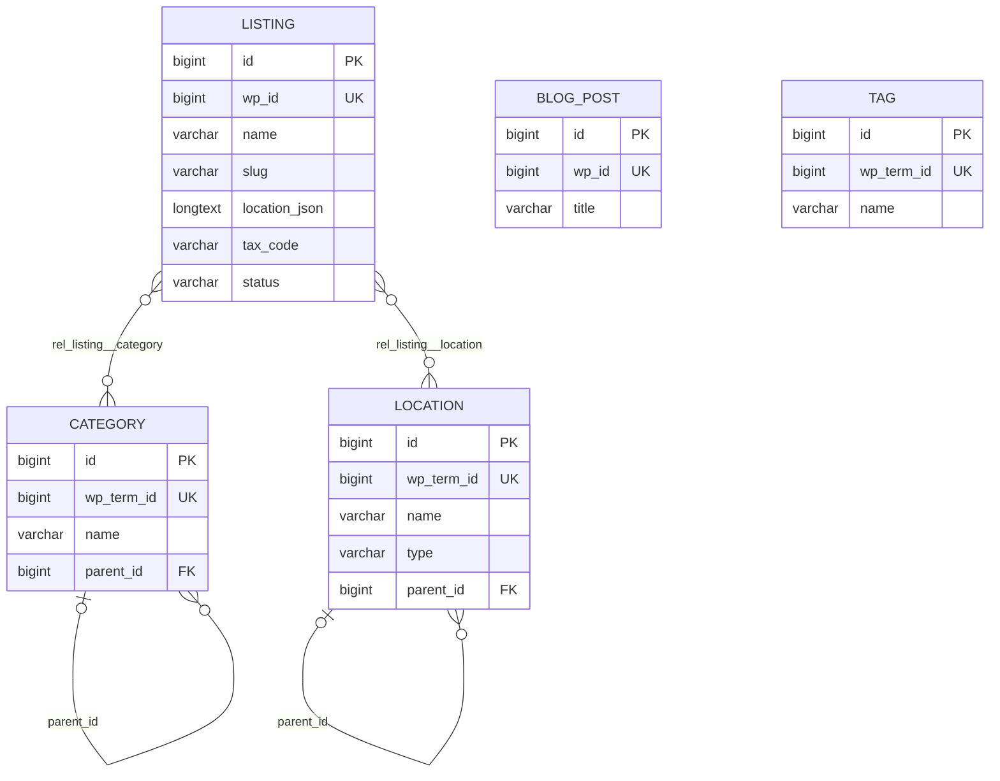
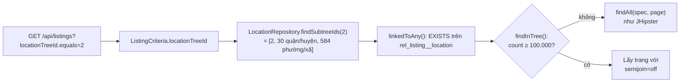

# Yellow Pages Vietnam — Tổng hợp dự án

> Cập nhật: 2026-10-01 · Phạm vi: cấu hình ứng dụng, JDL, mô hình dữ liệu và quan hệ, cách map và đồng bộ dữ liệu từ schema `jhipster_vnyp` sang database của dự án, chức năng phân cấp và lọc theo cây.

## Mục lục

1. [Tổng quan](#1-tổng-quan)
2. [Môi trường phát triển](#2-môi-trường-phát-triển)
3. [Mô hình dữ liệu](#3-mô-hình-dữ-liệu)
4. [JDL](#4-jdl)
5. [Map dữ liệu jhipster_vnyp → dự án](#5-map-dữ-liệu-jhipster_vnyp--dự-án)
6. [Quy trình đồng bộ dữ liệu](#6-quy-trình-đồng-bộ-dữ-liệu)
7. [Chức năng phân cấp và lọc theo cây](#7-chức-năng-phân-cấp-và-lọc-theo-cây)
8. [Sinh lại code khi sửa JDL](#8-sinh-lại-code-khi-sửa-jdl)
9. [Lỗi đã gặp và cách xử lý](#9-lỗi-đã-gặp-và-cách-xử-lý)
10. [Việc còn tồn đọng](#10-việc-còn-tồn-đọng)
11. [Lệnh hay dùng](#11-lệnh-hay-dùng)

---

## 1. Tổng quan

Ứng dụng danh bạ doanh nghiệp (Yellow Pages Vietnam), chuyển từ hệ thống WordPress cũ sang JHipster. Dữ liệu chuẩn đã được trích từ WordPress vào schema MySQL `jhipster_vnyp`, sau đó đồng bộ sang database của dự án.

| Thành phần | Giá trị |
|---|---|
| Generator | JHipster 9.3.0, monolith |
| Backend | Spring Boot 4.1.1, Java 21, Maven |
| Frontend | Angular 22, TypeScript 6 |
| Database | MySQL (dev và prod), Liquibase quản lý schema |
| Tìm kiếm | Elasticsearch (`search * with elasticsearch`) |
| Xác thực | JWT |
| Ngôn ngữ giao diện | `en` (gốc), `vi` |
| Package | `com.mycompany.myapp` |
| Cấu hình generator | [`.yo-rc.json`](../.yo-rc.json) |
| Định nghĩa entity | [`yp-schema.jdl`](../yp-schema.jdl) |
| Script đồng bộ | [`db-sync/`](../db-sync/) |
| Tài liệu API (Swagger) | Giao diện quản trị **Quản trị → API** (`/admin/docs`), hoặc `/swagger-ui/index.html`; JSON ở `/v3/api-docs/springdocDefault`. Chỉ bật với profile `api-docs` (dev mặc định có). Mô tả tiếng Việt, xác thực JWT và mô tả filter theo cây được bổ sung trong [`OpenApiDocsConfiguration.java`](../src/main/java/com/mycompany/myapp/config/OpenApiDocsConfiguration.java). Class này viết tay, không bị `jhipster --force` ghi đè. |

**Ràng buộc kỹ thuật đã thống nhất:** không đổi phiên bản JHipster hay Spring Boot, không thêm thư viện, không đổi cấu trúc package.

---

## 2. Môi trường phát triển

### 2.1 Docker

Khi chạy `./mvnw`, Spring Docker Compose tự bật các container trong [`src/main/docker/services.yml`](../src/main/docker/services.yml):

| Container | Image | Cổng | Ghi chú |
|---|---|---|---|
| `javaspringbootbackend-mysql-1` | `mysql:26.7.0` | `127.0.0.1:3306` | user `root`, mật khẩu rỗng (chỉ dùng cho dev) |
| `javaspringbootbackend-elasticsearch-1` | `elasticsearch:9.4.5` | `127.0.0.1:9200` | 1 node, trạng thái `yellow` là bình thường |

> ⚠️ Dữ liệu MySQL nằm trong **anonymous volume** của Docker. Xóa container bằng `docker compose down -v` hoặc `docker rm -v` sẽ **mất toàn bộ dữ liệu**, gồm cả `jhipster_vnyp`.

> Healthcheck của container Elasticsearch thường báo `unhealthy` do quá thời gian chờ. ES vẫn hoạt động bình thường: kiểm tra bằng `curl.exe http://localhost:9200/_cluster/health`.

### 2.2 Hai database trong cùng một MySQL server

| Schema | Vai trò | Ghi chú |
|---|---|---|
| `jhipster_vnyp` | **Dữ liệu chuẩn** (nguồn), trích từ WordPress | Chỉ đọc. Không được ghi vào. |
| `javaspringbootbackend` | Database của ứng dụng | Do Liquibase tạo, dữ liệu chép từ `jhipster_vnyp` |

### 2.3 Cổng và profile

- Backend dev: `http://localhost:8081` (đã đổi từ 8080 trong [`application-dev.yml`](../src/main/resources/config/application-dev.yml)).
- Liquibase dev chạy với `contexts: dev, faker`. Changeset faker đã chạy một lần nên **không chèn lại** dữ liệu giả khi khởi động lại.

### 2.4 Backup

| File | Nội dung |
|---|---|
| `C:\Users\ADMIN\Documents\tuanna\db_backup\jhipster_vnyp_20261001.sql.gz` | Toàn bộ `jhipster_vnyp` (495 MB, `mysqldump --single-transaction --set-gtid-purged=OFF`) |

Khôi phục (chạy trong Git Bash; PowerShell 5.1 làm hỏng UTF-8 khi pipe):

```bash
gunzip -c /c/Users/ADMIN/Documents/tuanna/db_backup/jhipster_vnyp_20261001.sql.gz \
  | docker exec -i javaspringbootbackend-mysql-1 mysql -uroot
```

---

## 3. Mô hình dữ liệu

### 3.1 Sơ đồ quan hệ



`BlogPost` và `Tag` không có quan hệ với bảng nào, giống hệt nguồn. Nguồn không có bảng nối giữa bài viết và thẻ, và bảng `tag` hiện có 0 dòng.

### 3.2 Entity và số liệu

| Entity | Bảng | Số dòng | Mô tả |
|---|---|---:|---|
| `Listing` | `listing` | 1.855.619 | Doanh nghiệp |
| `Category` | `category` | 2.394 | Ngành nghề, dạng cây cha/con |
| `Location` | `location` | 15.313 | Địa phương: 98 `province`, 4.035 `district`, 11.180 `ward` |
| `BlogPost` | `blog_post` | 2.288 | Bài viết tin tức |
| `Tag` | `tag` | 0 | Thẻ |
| (bảng nối) | `rel_listing__category` | 25.184.298 | Listing N–N Category |
| (bảng nối) | `rel_listing__location` | 1.798.195 | Listing N–N Location |
| built-in | `jhi_user`, `jhi_authority`, `jhi_user_authority` | | Người dùng và quyền của JHipster |

### 3.3 Quan hệ

| Quan hệ | Kiểu | Hiện thực trong code | Cột DB |
|---|---|---|---|
| Listing ↔ Category | ManyToMany, Listing là bên sở hữu | `Listing.categories` / `Category.listings` (`mappedBy`) | `rel_listing__category(listing_id, category_id)` |
| Listing ↔ Location | ManyToMany, Listing là bên sở hữu | `Listing.locations` / `Location.listings` (`mappedBy`) | `rel_listing__location(listing_id, location_id)` |
| Category → Category cha | ManyToOne | `Category.parent` | `category.parent_id → category.id` |
| Location → Location cha | ManyToOne | `Location.parent` | `location.parent_id → location.id` |

**Bảng nối không cần entity riêng.** Chúng chỉ có 2 cột khóa ngoại, và `@ManyToMany` + `@JoinTable` đã xử lý đủ. Chỉ tạo entity riêng khi bảng nối cần thêm cột dữ liệu (ví dụ `is_primary`, `display_order`).

> ⚠️ **Hiệu năng:** không gọi `category.getListings()` hay `location.getListings()`, vì một ngành có thể có hàng trăm nghìn doanh nghiệp. Muốn lọc doanh nghiệp theo ngành hoặc địa phương, dùng API có phân trang, ví dụ:
> `GET /api/listings?categoryTreeId.equals=123&page=0&size=20` (lọc theo ngành và mọi ngành con, xem [mục 7](#7-chức-năng-phân-cấp-và-lọc-theo-cây)).

### 3.4 Chi tiết trường

Kiểu JDL được sinh thành kiểu MySQL như sau: `String` → `VARCHAR(n)`, `TextBlob` → `LONGTEXT`, `Instant` → `DATETIME(6)`, `Boolean` → `TINYINT`, `Double` → `DOUBLE`, `Long` → `BIGINT`, `Integer` → `INT`.

#### Listing (`listing`)

| Field | Cột | Kiểu | Ràng buộc | Ghi chú |
|---|---|---|---|---|
| `wpId` | `wp_id` | Long | required, unique | `wp_posts.ID` |
| `apiId` | `api_id` | String(100) | | ID từ API nguồn (dạng chuỗi) |
| `name` | `name` | String(500) | required | Tên doanh nghiệp |
| `nameEn` | `name_en` | String(500) | | |
| `nameAlias` | `name_alias` | String(500) | | |
| `slug` | `slug` | String(500) | | **Không unique**: nguồn có 7 slug NULL và 34 nhóm trùng |
| `description` | `description` | TextBlob | | |
| `phone` | `phone` | String(100) | | |
| `mobile` | `mobile` | String(100) | | |
| `email` | `email` | String(255) | | |
| `website` | `website` | String(500) | | |
| `address` | `address` | TextBlob | | |
| `locationJson` | `location_json` | TextBlob | | JSON: `province`, `ward`, `street`, `province_code`, `ward_code`, `coordinate` |
| `taxCode` | `tax_code` | String(100) | | Mã số thuế |
| `representative` | `representative` | String(255) | | |
| `capital` | `capital` | String(100) | | Vốn |
| `foundedYear` | `founded_year` | String(50) | | Dạng text gốc, ví dụ `2024-01-11` |
| `businessType` | `business_type` | String(100) | | |
| `businessStatus` | `business_status` | String(50) | | |
| `industryCode` | `industry_code` | String(100) | | |
| `managedBy` | `managed_by` | String(255) | | |
| `thumbnail` | `thumbnail` | String(500) | | **ID attachment WordPress**, không phải URL |
| `images` | `images` | TextBlob | | Danh sách ID attachment WordPress |
| `viewCount` | `view_count` | Integer | | |
| `isFeatured` | `is_featured` | Boolean | | |
| `status` | `status` | String(50) | | `publish` (1.855.611), `draft` (8) |
| `publishedAt` | `published_at` | Instant | | |
| `modifiedAt` | `modified_at` | Instant | | |
| `createdAt` | `created_at` | Instant | | Ở nguồn là thời điểm migrate (2026-06-29), không phải ngày đăng |
| `updatedAt` | `updated_at` | Instant | | |
| `esIndexed` | `es_indexed` | Boolean | | |

> **Tọa độ doanh nghiệp** nằm trong `location_json` dưới dạng chuỗi `"coordinate":"21.0001:105.698"` (1.791.151 doanh nghiệp có tọa độ). Phải giữ nguyên dạng text: **không** chuyển sang DECIMAL hay Double, vì làm tròn hoặc thêm số 0 đều làm sai tọa độ.

#### Category (`category`)

| Field | Cột | Kiểu | Ràng buộc |
|---|---|---|---|
| `wpTermId` | `wp_term_id` | Long | unique |
| `name` | `name` | String(255) | required |
| `slug` | `slug` | String(255) | |
| `description` | `description` | TextBlob | |
| `icon` | `icon` | String(255) | |
| `listingCount` | `listing_count` | Integer | |
| `createdAt` / `updatedAt` | `created_at` / `updated_at` | Instant | |
| `parent` (quan hệ) | `parent_id` | → `category.id` | |

#### Location (`location`)

| Field | Cột | Kiểu | Ràng buộc |
|---|---|---|---|
| `wpTermId` | `wp_term_id` | Long | unique |
| `name` | `name` | String(255) | required |
| `slug` | `slug` | String(255) | |
| `type` | `type` | String(50) | `province` / `district` / `ward` |
| `code` | `code` | String(50) | |
| `latitude` / `longitude` | `latitude` / `longitude` | Double | Ở nguồn đã là `double`, giữ nguyên |
| `createdAt` | `created_at` | Instant | |
| `parent` (quan hệ) | `parent_id` | → `location.id` | |

#### BlogPost (`blog_post`)

| Field | Cột | Kiểu | Ràng buộc |
|---|---|---|---|
| `wpId` | `wp_id` | Long | required, unique |
| `title` | `title` | String(500) | required |
| `slug` | `slug` | String(500) | (nguồn có 1 slug trùng) |
| `content` / `excerpt` | `content` / `excerpt` | TextBlob | |
| `thumbnail` | `thumbnail` | String(500) | |
| `status` | `status` | String(50) | |
| `viewCount` | `view_count` | Integer | |
| `publishedAt` / `createdAt` / `updatedAt` | | Instant | |

#### Tag (`tag`)

| Field | Cột | Kiểu | Ràng buộc |
|---|---|---|---|
| `wpTermId` | `wp_term_id` | Long | unique |
| `name` | `name` | String(255) | required |
| `slug` | `slug` | String(255) | |

---

## 4. JDL

File: [`yp-schema.jdl`](../yp-schema.jdl). Nguyên tắc: **bám đúng schema `jhipster_vnyp`** về tên bảng/cột, kiểu, độ dài, NOT NULL, UNIQUE và quan hệ. Lần kiểm tra tự động gần nhất cho kết quả khớp 100%.

### 4.1 Quy ước đặt tên

| Quy ước | Lý do |
|---|---|
| Tên bảng ghi rõ: `entity Listing(listing)`, `entity BlogPost(blog_post)`… | Cố định tên bảng trùng với nguồn |
| Field camelCase, JHipster tự đổi sang snake_case | `wpId` → `wp_id`, `locationJson` → `location_json`… trùng tên cột nguồn |
| Tên quan hệ ManyToMany để **số ít**: `Listing{category(name)} to Category{listing}` | Cột nối sinh ra là `category_id`, đúng như nguồn. Field Java vẫn là số nhiều (`categories`). |
| `required` chỉ đặt khi nguồn là NOT NULL; `unique` chỉ đặt khi nguồn có UNIQUE KEY | Không thêm ràng buộc làm dữ liệu cũ không lưu được |

### 4.2 Tùy chọn

```
dto * with mapstruct
service * with serviceImpl
paginate Listing, Category, Location, BlogPost with pagination
paginate Tag with infinite-scroll
filter Listing, Category, Location, BlogPost
search * with elasticsearch
```

### 4.3 Giới hạn của JDL và JHipster 9.3.0

| Giới hạn | Cách xử lý |
|---|---|
| Bảng nối luôn có tiền tố `rel_` (`rel_listing__category`); JDL không đổi được, vì generator ghi đè tên | Script đồng bộ map `listing_category` → `rel_listing__category` |
| Không khai báo được index thường (`slug`, `status`, `tax_code`, `api_id`, `is_featured`, `type`) | Viết thêm changelog Liquibase tay (xem [mục 10](#10-việc-còn-tồn-đọng)) |
| Không khai báo được `ON DELETE CASCADE` và `DEFAULT` | Như trên |
| Không thêm được cột vào entity built-in `User` (`jhi_user.wp_user_id` của nguồn) | Chưa chuyển user từ nguồn |
| Bảng không có cột `id` làm khóa chính (`staging_listing` dùng `wp_id`) | Không đưa vào app |
| Comment `/** … */` trên field được chép nguyên vào file i18n JSON **mà không escape** | **Không dùng dấu `"` trong comment JDL** (xem [mục 9](#9-lỗi-đã-gặp-và-cách-xử-lý)) |

---

## 5. Map dữ liệu jhipster_vnyp → dự án

### 5.1 Map bảng

| `jhipster_vnyp` | `javaspringbootbackend` | Cách chép |
|---|---|---|
| `listing` | `listing` | Chép thẳng 32 cột, giữ nguyên `id` |
| `category` | `category` | Chép, sau đó đổi `parent_id` (xem 5.2) |
| `location` | `location` | Chép, sau đó đổi `parent_id` (xem 5.2) |
| `listing_category(listing_id, category_id)` | `rel_listing__category(listing_id, category_id)` | Chép thẳng |
| `listing_location(listing_id, location_id)` | `rel_listing__location(listing_id, location_id)` | Chép thẳng |
| `blog_post` | `blog_post` | Chép thẳng |
| `tag` | `tag` | Chép thẳng (0 dòng) |
| `jhi_user`, `jhi_authority`, `jhi_user_authority` | — | **Không chép.** App dùng user mặc định của JHipster (`admin`, `user`). |
| `staging_listing` | — | **Không chép.** Bảng tạm lúc migrate, trùng nội dung với `listing`. |
| `migration_log` | — | **Không chép.** Nhật ký migrate. |

### 5.2 Điểm cần chú ý khi map

1. **`parent_id` ở nguồn trỏ tới `wp_term_id`, không phải `id`.** Ví dụ: `category.parent_id = 523` nghĩa là cha có `wp_term_id = 523`. Khi chép phải tra cha theo `wp_term_id` rồi gán `id` của cha. Đã kiểm tra: 2.354/2.354 category và 15.215/15.215 location có cha đều tìm được cha.
2. **Giữ nguyên `id` gốc.** Quan hệ và đường dẫn cũ vẫn đúng. Entity dùng `GenerationType.IDENTITY`, nên MySQL tự đẩy `AUTO_INCREMENT` lên sau id lớn nhất.
3. **Datetime chép nguyên giá trị, không đổi múi giờ.** App đọc `DATETIME` theo UTC (`hibernate.jdbc.time_zone: UTC`). Nếu dữ liệu nguồn là giờ Việt Nam thì giao diện sẽ hiển thị lệch 7 tiếng (xem [mục 10](#10-việc-còn-tồn-đọng)).
4. **Ảnh doanh nghiệp chưa dùng được.** `thumbnail` và `images` chỉ chứa ID attachment của WordPress. Muốn có URL ảnh cần thêm dữ liệu `wp_posts.guid` từ WordPress.
5. **Tiếng Việt** ở nguồn là UTF-8 chuẩn (`utf8mb4`). Dấu `?` thấy trong PowerShell chỉ là lỗi hiển thị của console.

---

## 6. Quy trình đồng bộ dữ liệu

### 6.1 Các file

| File | Chức năng |
|---|---|
| [`db-sync/sync_from_jhipster_vnyp.sql`](../db-sync/sync_from_jhipster_vnyp.sql) | Xóa dữ liệu đích rồi chép toàn bộ từ `jhipster_vnyp`. Chạy lại nhiều lần được. |
| [`db-sync/verify_sync.sql`](../db-sync/verify_sync.sql) | So số dòng, checksum nội dung, datetime, cây cha/con, AUTO_INCREMENT |

### 6.2 Các bước trong script đồng bộ

| Bước | Việc làm |
|---|---|
| 0 | Xóa dữ liệu đích theo thứ tự khóa ngoại: bảng nối → `listing` → `category`/`location` (đặt `parent_id = NULL` trước) → `blog_post`, `tag` |
| 1 | `category`: chép với `parent_id = NULL`, sau đó `UPDATE … JOIN` theo `wp_term_id` để gán cha |
| 2 | `location`: như bước 1 |
| 3 | `listing`: `INSERT … SELECT` 32 cột cùng tên |
| 4 | Bảng nối: `listing_category` → `rel_listing__category`, `listing_location` → `rel_listing__location` |
| 5 | `blog_post`, `tag` |

Chép category/location với `parent_id = NULL` trước rồi mới gán cha để tránh lỗi khóa ngoại khi bản ghi con được chèn trước bản ghi cha.

### 6.3 Cách chạy

**Bước 1: tăng bộ nhớ InnoDB (bắt buộc).** Image MySQL mặc định chỉ có buffer pool 128 MB và redo log 100 MB. Với cấu hình đó, chép 25 triệu dòng bảng nối mất hơn 1 giờ. Các lệnh sau chỉ có hiệu lực tới khi container khởi động lại:

```bash
echo "SET GLOBAL innodb_buffer_pool_size = 2147483648;
      SET GLOBAL innodb_redo_log_capacity = 2147483648;" \
  | docker exec -i javaspringbootbackend-mysql-1 mysql -uroot
```

**Bước 2: đồng bộ** (Git Bash, tại thư mục dự án):

```bash
docker exec -i javaspringbootbackend-mysql-1 mysql -uroot < db-sync/sync_from_jhipster_vnyp.sql
```

**Bước 3: kiểm tra.** Mọi dòng kết quả phải có `ok = 1`:

```bash
docker exec -i javaspringbootbackend-mysql-1 mysql -uroot < db-sync/verify_sync.sql
```

**Bước 4: reindex Elasticsearch.** Dữ liệu chép bằng SQL không đi qua tầng service nên ES không được cập nhật (xem [mục 10](#10-việc-còn-tồn-đọng)).

> Nếu terminal bị ngắt giữa chừng, câu lệnh SQL vẫn chạy tiếp trong MySQL. Kiểm tra bằng `SELECT id, time, LEFT(info,80) FROM information_schema.processlist WHERE command <> 'Sleep';` trước khi chạy lại, tránh chèn trùng.

### 6.4 Kết quả đồng bộ ngày 2026-10-01

| Kiểm tra | Kết quả |
|---|---|
| Số dòng 7 bảng | Khớp hết (bảng ở [mục 3.2](#32-entity-và-số-liệu)) |
| Checksum nội dung `listing` (28 cột) | `3982185450798924` ở cả hai phía |
| Datetime `listing` (4 cột) | 0 dòng lệch |
| Checksum hai bảng nối | Khớp |
| Cây cha/con category, location | 0 dòng sai |
| AUTO_INCREMENT | `listing` 1.855.620, `category` 2.395, `location` 15.314, `blog_post` 2.289 |

---

## 7. Chức năng phân cấp và lọc theo cây

Mục này dành cho dev cần hiểu, sửa hoặc mở rộng 3 chức năng:

1. **Xem Địa phương và Ngành nghề dạng cây.**
2. **Lọc doanh nghiệp (Listing) theo địa phương hoặc ngành nghề.** Chọn một nút là lấy cả các cấp con bên dưới.
3. **Dùng chung code cây** ở frontend (`shared/tree`) và backend (`ListingQueryService`).

### 7.1 Đặc điểm dữ liệu: vì sao phải lọc theo cả cây

| | Địa phương (`location`) | Ngành nghề (`category`) |
|---|---|---|
| Số cấp | 3: `province` → `district` → `ward` (98 / 4.035 / 11.180) | Tối đa 4 (40 / 911 / 245 / 1.198 nút theo độ sâu) |
| Phân biệt cấp | Cột `type` | Không có cột cấp, chỉ biết qua `parent_id` |
| Doanh nghiệp gắn vào | **Đúng một** địa phương, ở **bất kỳ cấp nào**: tỉnh 1.456.416, phường/xã 318.783, quận/huyện 22.950; 57.470 doanh nghiệp không có địa phương | Gần như chỉ **ngành lá** (24,4 trên 25,2 triệu liên kết ở cấp 4); trung bình 13 ngành/doanh nghiệp |
| Hệ phân loại | Hành chính | Hai hệ trong cùng một cây: nhóm Yellow Pages cũ (gốc id 1–14, ~494 nghìn doanh nghiệp) và hệ ngành kinh tế VSIC (gốc id 846–866, ~1,24 triệu doanh nghiệp) |
| Số con lớn nhất của một nút | 168 | 415 (gốc "CHƯA PHÂN LOẠI") |

**Hệ quả:** filter có sẵn của JHipster `locationId.equals=X` chỉ khớp doanh nghiệp gắn **đúng** vào X. Ví dụ:

| Lọc | `locationId` (chỉ đúng nút) | `locationTreeId` (cả cây con) |
|---|---:|---:|
| Thành phố Hà Nội (id 2) | 206.901 | **265.942** |
| TP. Hồ Chí Minh (id 51) | 443.460 | **541.032** |
| Huyện Ba Vì (id 256) | 0 | **536** |

Vì vậy dự án thêm 2 filter **theo cây**: `locationTreeId` và `categoryTreeId`.

### 7.2 Giao diện

| Trang / menu | Đường dẫn | Mô tả |
|---|---|---|
| Thực thể → **Tỉnh thành** → Đơn vị hành chính | `/location/tree` | Cây tỉnh → quận/huyện → phường/xã, tải dần từng cấp |
| Thực thể → Tỉnh thành → Tỉnh thành / Quận huyện / Phường xã | `/location?filter[type.equals]=province` (`district`, `ward`) | Trang danh sách Location có sẵn, lọc theo cấp |
| Thực thể → **Ngành nghề** → Cây ngành nghề | `/category/tree` | Cây ngành nghề tối đa 4 cấp |
| Thực thể → Ngành nghề → Danh sách ngành nghề | `/category` | Trang danh sách có sẵn |
| Trang **Listing** | `/listing` | 2 dãy ô chọn: địa phương và ngành nghề, kết hợp được |

- Trên trang cây, mỗi nút có biểu tượng danh sách để mở `/listing` đã lọc sẵn theo nút đó.
- Lựa chọn lọc nằm trên URL, ví dụ `/listing?filter[locationTreeId.equals]=2&filter[categoryTreeId.equals]=848`. Tải lại trang hay gửi link vẫn giữ nguyên bộ lọc.

### 7.3 API

| Mục đích | Request |
|---|---|
| Các nút gốc | `GET /api/locations?parentId.specified=false&size=1000&sort=id,asc` |
| Con của một nút | `GET /api/locations?parentId.equals=2&size=1000&sort=name,asc` |
| Lọc doanh nghiệp theo cây địa phương | `GET /api/listings?locationTreeId.equals=2&page=0&size=20&sort=id,asc` |
| Lọc doanh nghiệp theo cây ngành nghề | `GET /api/listings?categoryTreeId.equals=848&page=0&size=20&sort=id,asc` |
| Kết hợp | `GET /api/listings?locationTreeId.equals=2&categoryTreeId.equals=848&…` (110.642 kết quả) |

Hai API đầu cũng dùng được cho `/api/categories`. Tổng số kết quả trả trong header `X-Total-Count`. Id không tồn tại thì trả danh sách rỗng, không báo lỗi.

> ⚠️ Ô **tìm kiếm** trên trang Listing gọi `/api/listings/_search` (Elasticsearch). Endpoint này **bỏ qua mọi filter**, kể cả filter theo cây. Hiện chưa kết hợp được tìm kiếm với lọc theo cây.

### 7.4 Backend: luồng xử lý



| Thành phần | File | Việc làm |
|---|---|---|
| Filter mới | [`ListingCriteria.java`](../src/main/java/com/mycompany/myapp/service/criteria/ListingCriteria.java) | Thêm `locationTreeId`, `categoryTreeId` (`LongFilter`, chỉ dùng `.equals`); Spring tự bind từ query string |
| Lấy cây con | [`LocationRepository.findSubtreeIds`](../src/main/java/com/mycompany/myapp/repository/LocationRepository.java), [`CategoryRepository.findSubtreeIds`](../src/main/java/com/mycompany/myapp/repository/CategoryRepository.java) | JPQL `left join` lên cha, ông, (cụ): nút + mọi cấp con |
| Điều kiện lọc | [`ListingQueryService.linkedToAny`](../src/main/java/com/mycompany/myapp/service/ListingQueryService.java) | Sinh `EXISTS (SELECT 1 FROM rel_listing__x r WHERE r.listing_id = l.id AND r.x_id IN (…))` |
| Chọn cách truy vấn | `ListingQueryService.findInTree` | Đếm trước; tập lớn thì lấy trang với `semijoin=off` |

**SQL thực tế Hibernate gửi đi** (đã kiểm tra trong `performance_schema`):

```sql
SELECT COUNT(l1_0.id) FROM listing l1_0
WHERE EXISTS (SELECT ? FROM rel_listing__location l2_0
              WHERE l2_0.location_id IN (...) AND l1_0.id = l2_0.listing_id)
```

**Vì sao dùng `EXISTS` mà không dùng join** (đo trên TP.HCM, 541 nghìn doanh nghiệp):

| Cách viết | Đếm | Lấy trang 1 |
|---|---:|---:|
| `join` của JHipster (`locationId`) | Trùng dòng nếu doanh nghiệp gắn nhiều nút trong cây | |
| `id IN (SELECT … JOIN listing …)` | 3,3 s | 3,0 s |
| **`EXISTS` chỉ trên bảng nối** | **1,1 s** | 1,2 s |

**Vì sao tắt semi-join khi tập lớn** (đo với cách `EXISTS`):

| Cấu hình MySQL | Đếm | Lấy trang 1 đủ cột |
|---|---:|---:|
| Mặc định (semi-join) | **1,35 s** | 3–22 s: dựng cả 541 nghìn dòng rồi mới sắp xếp |
| `semijoin=off` | 2,4–3,7 s | **0,002 s**: duyệt `listing` theo khóa chính, dừng khi đủ 20 dòng |

Vì vậy `findInTree()` **đếm bằng cấu hình mặc định**, rồi:
- **Tập ≥ 100.000** (`LARGE_TREE_RESULT`): lấy trang với `SET SESSION optimizer_switch = 'semijoin=off'`, và bật lại trong `finally` để connection trả về pool ở trạng thái mặc định.
- **Tập nhỏ:** giữ cách mặc định. Doanh nghiệp của một huyện có thể dồn ở cuối bảng (Ba Vì: id ~1,44 triệu); tắt semi-join thì phải duyệt từ đầu, mất 3,3 s thay vì 0,2 s.

**Tốc độ hiện tại** (khi MySQL đã có dữ liệu trong bộ nhớ đệm; trang 20 dòng, sắp theo id):

| Bộ lọc | Số doanh nghiệp | Thời gian |
|---|---:|---:|
| TP.HCM | 541.032 | ~1,1 s |
| Hà Nội | 265.942 | ~0,65 s |
| Hải Phòng / Bình Dương / Đồng Nai | 53–64 nghìn | 0,5–0,6 s |
| Tỉnh, huyện nhỏ | < 6 nghìn | 0,1–0,3 s |
| Ngành < 120 nghìn doanh nghiệp (đa số ngành) | | 0,3–0,5 s |
| "Dịch vụ lưu trú và ăn uống" (VSIC) | 323.939 | ~3 s |
| "Công nghiệp chế biến, chế tạo" (VSIC) | 717.984 | ~8 s |
| "Bán buôn và bán lẻ…" (VSIC) | 1.088.771 | **~33 s** |

Nhóm VSIC lớn chậm vì **phần đếm** phải loại trùng hàng triệu liên kết (7,7 triệu với "Bán buôn và bán lẻ"). Không chỉnh được bằng cách viết lại truy vấn; hướng xử lý ở [mục 10](#10-việc-còn-tồn-đọng).

### 7.5 Frontend: component dùng chung `shared/tree`

| File | Export | Vai trò |
|---|---|---|
| [`tree-source.ts`](../src/main/webapp/app/shared/tree/tree-source.ts) | `TreeItem`, `TreeSource`, `createTreeSource(service)` | Bọc service entity của JHipster thành nguồn cây: `roots()`, `children(id)`, `find(id)`, dựa trên filter `parentId` có sẵn của API |
| [`tree-view.ts`](../src/main/webapp/app/shared/tree/tree-view.ts) | `<jhi-tree-view>` | Cây tải dần: mở nút nào mới gọi API lấy con nút đó |
| [`tree-filter.ts`](../src/main/webapp/app/shared/tree/tree-filter.ts) | `<jhi-tree-filter>` | Dãy ô chọn; ô cấp sau chỉ hiện khi nút đang chọn có con |

**`<jhi-tree-view>`**

| Input | Bắt buộc | Ý nghĩa |
|---|---|---|
| `source` | ✔ | `TreeSource` |
| `entityRoute` | ✔ | Ví dụ `/location`; link chi tiết là `/location/{id}/view` |
| `listingFilterName` | ✔ | Ví dụ `locationTreeId.equals`; link "Xem doanh nghiệp" là `/listing?filter[...]={id}` |
| `isLeaf` | | Hàm biết trước nút lá (địa phương: `type === 'ward'`). Mặc định: lá khi đã mở mà không có con |
| `itemLabel` | | Hàm trả khóa i18n hiện cạnh tên (địa phương: tên cấp) |
| `leafIcon` | | Icon nút lá, mặc định `circle` |

Gọi `load()` qua template ref để làm mới, ví dụ `<jhi-tree-view #tree …/>` rồi `(click)="tree.load()"`.

**`<jhi-tree-filter>`**

| Input | Ý nghĩa |
|---|---|
| `filters` | `IFilterOptions` của trang danh sách (trang Listing truyền `filters`) |
| `source` | `TreeSource` |
| `filterName` | Ví dụ `categoryTreeId.equals` |
| `placeholders` | Khóa i18n cho lựa chọn "tất cả" từng cấp; cấp sâu hơn dùng khóa cuối |

Cách hoạt động:
- **Chọn:** đặt filter bằng **nút sâu nhất** đang chọn (thay giá trị cũ), sau đó tải con của nút đó; có con thì hiện thêm một ô. Bỏ chọn một cấp thì lọc theo cấp cha.
- **Đồng bộ với URL:** đọc `filter[<filterName>]` trên URL. Khi URL đổi từ bên ngoài (tải lại trang, bấm × trên chip filter, mở link từ trang cây), component đi ngược lên cha bằng `find()` để dựng lại đủ các ô.
- **Không tải lại thừa:** trang Listing đọc filter qua signal, nên `removeFilter` rồi `addFilter` liền nhau chỉ gây **một** lần tải lại.

### 7.6 Thêm bộ lọc theo cây cho entity khác

Ví dụ: lọc `BlogPost` theo cây chuyên mục.

1. **Dữ liệu:** entity cây cần quan hệ `ManyToOne` `parent` tới chính nó (JDL `relationship ManyToOne { X{parent(name)} to X }`), và filter `parentId` (bật `filter X` trong JDL).
2. **Repository:** thêm `findSubtreeIds(id)` với đủ số tầng `left join … parent` bằng **độ sâu tối đa** của dữ liệu.
3. **Criteria:** thêm field `LongFilter xTreeId` vào `<Entity>Criteria`, kèm getter/setter, `optional…()`, constructor copy, `equals`, `hashCode`, `toString`.
4. **QueryService:** trong `createSpecification` thêm `linkedToAny(Entity_.xs, X_.id, xRepository.findSubtreeIds(id))`. Nếu tập kết quả có thể lớn, áp dụng cách của `findInTree()`.
5. **Frontend:** trong component danh sách tạo `readonly xTree = createTreeSource(inject(XService))`, rồi thêm `<jhi-tree-filter [filters]="filters" [source]="xTree" filterName="xTreeId.equals" [placeholders]="[...]" />`.
6. **Trang cây** (nếu cần): tạo component chứa `<jhi-tree-view>`, thêm route `tree` vào `x.routes.ts`, thêm menu và khóa i18n.
7. **Test:** spec của trang danh sách phải thay `TreeFilter` bằng stub (xem `listing.spec.ts`), nếu không sẽ có thêm request lấy nút gốc và các test `expectOne` sẽ fail.

### 7.7 Kiểm thử

| Test | Nội dung |
|---|---|
| [`shared/tree/tree-filter.spec.ts`](../src/main/webapp/app/shared/tree/tree-filter.spec.ts) | Nguồn dữ liệu giả 4 cấp: hiện nút gốc; chỉ thêm ô khi có con; filter theo nút sâu nhất; bỏ chọn thì lùi về cha hoặc xóa filter; dựng lại từ URL; placeholder theo cấp |
| [`entities/listing/list/listing.spec.ts`](../src/main/webapp/app/entities/listing/list/listing.spec.ts) | Test JHipster sinh sẵn; `TreeFilter` được thay bằng stub |

Chạy (dùng `*.spec.ts` trong `--include`; nếu để `**` thì sẽ lẫn cả file `.html`):

```bash
npx ng test --watch=false --include='src/main/webapp/app/shared/tree/*.spec.ts' --include='src/main/webapp/app/entities/listing/list/*.spec.ts'
```

Backend: kiểm tra thủ công bằng API ở [mục 7.3](#73-api), so với SQL đối chiếu. **Chưa có** integration test cho `locationTreeId` và `categoryTreeId`.

### 7.8 Lưu ý và bẫy thường gặp

- **Không map `listings` trong `LocationMapper` / `CategoryMapper`.** JHipster 9.3.0 luôn sinh chiều ngược của ManyToMany. Nếu map, `/api/locations` sẽ tải hàng trăm nghìn doanh nghiệp cho mỗi nút và bị treo. Sau mỗi lần `jhipster jdl --force`, kiểm tra lại (xem [mục 8](#8-sinh-lại-code-khi-sửa-jdl)).
- **Độ sâu cây đang cố định** trong JPQL `findSubtreeIds`: địa phương 3 cấp, ngành nghề 4 cấp. Dữ liệu sâu hơn sẽ bị thiếu nút con khi lọc.
- **Mỗi cấp tải tối đa 1.000 nút con** (`CHILDREN_PAGE_SIZE`). Hiện nhiều nhất là 415.
- **`SET SESSION optimizer_switch` phải luôn được bật lại** (`finally`), nếu không connection trong pool sẽ giữ `semijoin=off` cho các truy vấn khác.
- **Sắp xếp theo cột không có index** (ví dụ `name`) rất chậm với tập lớn: TP.HCM sắp theo tên mất ~44 s. Cần changelog index (xem [mục 10](#10-việc-còn-tồn-đọng)).
- **Tên ngành có `&amp;`** (ví dụ `SỨC KHỎE &amp; LÀM ĐẸP`): dữ liệu WordPress lưu sẵn trong `jhipster_vnyp`. Giao diện hiển thị nguyên văn.
- **Tìm kiếm Elasticsearch không kết hợp với lọc theo cây** (xem [mục 7.3](#73-api)).

---

## 8. Sinh lại code khi sửa JDL

```powershell
# 1. Commit trước để có thể quay lại
git add yp-schema.jdl
git commit -m "..."

# 2. Sinh code
npx jhipster jdl yp-schema.jdl --force

# 3. Xem thay đổi, commit
git add -A
git commit -m "..."
```

Lưu ý:

- **Xóa entity:** JHipster không có lệnh xóa entity. Phải gỡ code của entity đó trước khi sinh lại (lần này dùng `git revert --no-commit` commit chứa code sinh tự động).
- **Đổi cấu trúc bảng đã có dữ liệu:** Liquibase không tự sửa bảng đã tồn tại. Ở dev: xóa và tạo lại database `javaspringbootbackend`, chạy app để Liquibase tạo bảng mới, rồi chạy lại [quy trình đồng bộ](#6-quy-trình-đồng-bộ-dữ-liệu).
- **Đổi mapping Elasticsearch:** xóa index cũ trước khi chạy app, vì Spring Data không tạo lại index đã tồn tại.
- Sau khi sinh lại, kiểm tra `application-dev.yml` vẫn giữ `port: 8081`.

### Code sửa tay: kiểm tra lại sau mỗi lần sinh code với `--force`

| File | Sửa gì | Vì sao |
|---|---|---|
| `service/mapper/LocationMapper.java`, `CategoryMapper.java` | `toDto` và `partialUpdate` bỏ qua `listings` (`@Mapping(target = "listings", ignore = true)`) | JHipster 9.3.0 **luôn** sinh chiều ngược của ManyToMany, kể cả khi JDL khai báo một chiều. Nếu map `listings`, mỗi địa phương hoặc ngành tải hàng trăm nghìn listing, và `/api/locations` bị treo. |
| `service/criteria/ListingCriteria.java` | Thêm filter `locationTreeId`, `categoryTreeId` | Lọc listing theo cả cây. Mỗi listing chỉ gắn vào **một** cấp địa phương (tỉnh 1,46 triệu, phường/xã 319 nghìn, quận/huyện 23 nghìn) và gần như chỉ gắn vào **ngành lá** (24,4/25,2 triệu liên kết), nên lọc theo một nút phải gồm cả cây con. |
| `repository/LocationRepository.java`, `CategoryRepository.java` | `findSubtreeIds(id)` | Lấy id của nút và mọi cấp con (địa phương 3 cấp, ngành nghề 4 cấp) |
| `service/ListingQueryService.java` | `linkedToAny()` dùng `EXISTS` trên bảng nối; `findInTree()`: với tập ≥ 100 nghìn dòng thì lấy trang bằng `semijoin=off` | Địa phương: TP.HCM ~1,1 s, Hà Nội ~0,65 s. Ngành nghề: nhóm < 100 nghìn listing 0,3–0,5 s, nhóm VSIC lớn **chậm** (xem mục 10) |
| `shared/tree/*` | Dùng chung: `createTreeSource()`, `jhi-tree-view` (cây tải dần, link "Xem doanh nghiệp"), `jhi-tree-filter` (dãy ô chọn theo số cấp thực tế, đồng bộ với URL `filter[...]`) | Dùng cho cả địa phương và ngành nghề |
| `entities/listing/list/listing.html`, `listing.ts`, `listing.spec.ts` | 2 bộ lọc `jhi-tree-filter` (địa phương, ngành nghề); trong spec thay bằng stub | |
| `entities/location/tree/*`, `entities/category/tree/*` | Trang `/location/tree` (Đơn vị hành chính), `/category/tree` (Cây ngành nghề) | |
| `entities/location/location.routes.ts`, `entities/category/category.routes.ts` | Route `tree` | |
| `layouts/navbar/navbar.html`, `navbar.ts` | Nhóm menu **Tỉnh thành** (Đơn vị hành chính, Tỉnh thành, Quận huyện, Phường xã) và **Ngành nghề** (Cây ngành nghề, Danh sách) | |
| `config/font-awesome-icons.ts` | Icon `map`, `sitemap`, `briefcase`, `circle`, `chevron-*`, `location-dot`, `spinner` | |
| `i18n/{vi,en}/global.json`, `location.json`, `category.json` | Key menu, `entity.tree.*`, `location.tree.*`, `location.filter.*`, `category.tree.*`, `category.filter.*` | |

---

## 9. Lỗi đã gặp và cách xử lý

| Lỗi | Nguyên nhân | Cách xử lý |
|---|---|---|
| `Expected ',' or '}' after property value in JSON` khi `jhipster jdl` | Comment JDL có dấu `"`, bị chép nguyên vào file i18n `listing.json` | Bỏ dấu `"` khỏi mọi comment `/** … */` |
| `Table 'listing' already exists` khi chạy app | Database còn bảng cũ, changelog mới lại `CREATE TABLE` | Xóa và tạo lại `javaspringbootbackend` (dev) |
| `Port 8081 was already in use` | Lần chạy trước vẫn còn sống: Liquibase chạy bất đồng bộ nên web server không dừng khi Liquibase lỗi | Ctrl+C ở terminal cũ hoặc `Stop-Process -Id <PID>` |
| `src refspec main does not match any` khi push | Branch local tên `master` | `git branch -M main` |
| Đồng bộ rất chậm (hơn 1 giờ) | Buffer pool InnoDB mặc định 128 MB | Tăng buffer pool và redo log trước khi chạy ([mục 6.3](#63-cách-chạy)) |
| `FUNCTION … MD5 does not exist` | MySQL 26.7 đã bỏ hàm `MD5()` | Dùng `SHA2(x, 256)` |
| `No database selected` | Script thiếu `USE` | Thêm `USE javaspringbootbackend;` ở đầu script |
| Lệnh `mysql -e "..."` có `\"` bị lỗi trong PowerShell | PowerShell xử lý dấu nháy khác bash | Ghi SQL ra file rồi pipe vào `docker exec -i … mysql`, hoặc dùng Git Bash |
| Trang Locations trống, `/api/locations` treo quá 180 s | Mapper map `listings` (chiều ngược ManyToMany do JHipster tự sinh): mỗi địa phương tải hàng trăm nghìn listing | Bỏ map `listings` trong `LocationMapper`/`CategoryMapper` ([mục 7.8](#78-lưu-ý-và-bẫy-thường-gặp)) |
| Lọc listing theo TP.HCM mất 5–22 s | MySQL chọn semi-join, dựng cả tập con rồi mới sắp xếp | `EXISTS` trên bảng nối + `semijoin=off` khi lấy trang của tập lớn ([mục 7.4](#74-backend-luồng-xử-lý)) |
| Spec sinh sẵn của trang Listing fail: `Expected one matching request…, found 2` | `jhi-tree-filter` tự gọi API lấy nút gốc | Thay `TreeFilter` bằng stub trong spec ([mục 7.6](#76-thêm-bộ-lọc-theo-cây-cho-entity-khác), bước 7) |
| `ng test`: `No loader is configured for ".html"` | `--include` dùng `**` nên lẫn cả file `.html` | Dùng `--include='…/*.spec.ts'` |
| `ng test`: `Timeout waiting for worker to respond` | Máy quá tải (truy vấn MySQL nặng đang chạy) | Dừng truy vấn nặng rồi chạy lại |
| `GROUP_CONCAT` trả thiếu id, số liệu đo sai | Mặc định `group_concat_max_len = 1024` | `SET SESSION group_concat_max_len = 1000000` |

---

## 10. Việc còn tồn đọng

| # | Việc | Ghi chú |
|---|---|---|
| 1 | **Reindex Elasticsearch** cho 1,86 triệu listing | Index đang rỗng. Trước đó cần xóa index cũ: `curl.exe -X DELETE "http://localhost:9200/article,articlecategory,articletag,cachedcontent,category,gallery,listing,listingimage,location,redirectrule,staticpage"` |
| 2 | **Changelog Liquibase viết tay**: index thường, `ON DELETE CASCADE`, `DEFAULT` | Index cần cho hiệu năng: `listing(slug)`, `listing(status)`, `listing(tax_code)`, `listing(api_id)`, `listing(is_featured)`, `location(type)`, `category(slug)` |
| 3 | **Xác định múi giờ** của datetime nguồn | Mở một listing trên giao diện, so với website cũ. Nếu lệch 7 giờ thì `UPDATE` trừ 7 giờ. |
| 4 | **URL ảnh** doanh nghiệp | Cần `wp_posts.guid` từ WordPress để đổi ID attachment thành URL |
| 5 | **User từ WordPress** (`jhi_user` của nguồn: 4 user, có `wp_user_id`) | Chưa chuyển |
| 6 | **Bảo mật khi lên production** | `jwtSecretKey` trong `.yo-rc.json` đã ở trên GitHub: đặt khóa khác qua biến môi trường `JHIPSTER_SECURITY_AUTHENTICATION_JWT_BASE64_SECRET`. MySQL dev dùng `root` không mật khẩu. |
| 7 | Cố định cấu hình InnoDB | Nếu đồng bộ thường xuyên, ghi `innodb_buffer_pool_size` vào [`src/main/docker/config/mysql/my.cnf`](../src/main/docker/config/mysql/my.cnf) |
| 8 | **Lọc theo nhóm ngành VSIC lớn còn chậm** (3–33 s, khoảng 170 nhóm có hơn 100 nghìn doanh nghiệp) | **Chưa chọn hướng.** (a) Để nguyên. (b) Bảng phẳng hóa doanh nghiệp × mọi ngành tổ tiên (~30–45 triệu dòng, phải dựng lại sau mỗi lần đồng bộ). (c) Đưa bộ lọc sang Elasticsearch, gắn với việc reindex (#1). Xem [mục 7.4](#74-backend-luồng-xử-lý). |
| 9 | Tên ngành có `&amp;` | Dữ liệu gốc của WordPress. Có thể viết script SQL đổi thành `&` |
| 10 | Integration test backend cho `locationTreeId`, `categoryTreeId` | Hiện chỉ kiểm tra thủ công bằng API |
| 11 | Kết hợp tìm kiếm (Elasticsearch) với lọc theo cây | `/api/listings/_search` bỏ qua filter |

---

## 11. Lệnh hay dùng

```bash
# Chạy ứng dụng (dev)
./mvnw

# Mở MySQL shell
docker exec -it javaspringbootbackend-mysql-1 mysql -uroot javaspringbootbackend

# Đếm nhanh số dòng
echo "SELECT COUNT(*) FROM javaspringbootbackend.listing;" | docker exec -i javaspringbootbackend-mysql-1 mysql -uroot

# Xem câu SQL đang chạy
echo "SELECT id, time, LEFT(info,80) FROM information_schema.processlist WHERE command <> 'Sleep';" \
  | docker exec -i javaspringbootbackend-mysql-1 mysql -uroot

# Trạng thái và index Elasticsearch
curl.exe http://localhost:9200/_cluster/health
curl.exe "http://localhost:9200/_cat/indices?v"

# Backup jhipster_vnyp
docker exec javaspringbootbackend-mysql-1 sh -c 'mysqldump -uroot --single-transaction --quick \
  --set-gtid-purged=OFF --default-character-set=utf8mb4 --databases jhipster_vnyp | gzip -c > /tmp/jhipster_vnyp.sql.gz'
docker cp javaspringbootbackend-mysql-1:/tmp/jhipster_vnyp.sql.gz ./jhipster_vnyp.sql.gz
```
