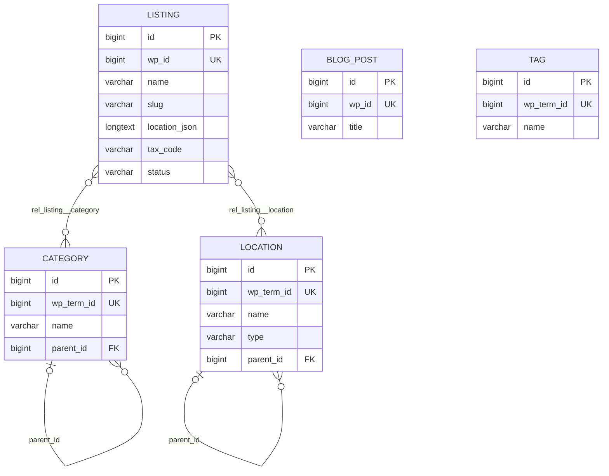

# Yellow Pages Vietnam — Tổng hợp dự án

> Cập nhật: 2026-10-01 · Phạm vi: cấu hình ứng dụng, JDL, mô hình dữ liệu và quan hệ, cách map và đồng bộ dữ liệu từ schema `jhipster_vnyp` sang database của dự án.

## Mục lục

1. [Tổng quan](#1-tổng-quan)
2. [Môi trường phát triển](#2-môi-trường-phát-triển)
3. [Mô hình dữ liệu](#3-mô-hình-dữ-liệu)
4. [JDL](#4-jdl)
5. [Map dữ liệu jhipster_vnyp → dự án](#5-map-dữ-liệu-jhipster_vnyp--dự-án)
6. [Quy trình đồng bộ dữ liệu](#6-quy-trình-đồng-bộ-dữ-liệu)
7. [Sinh lại code khi sửa JDL](#7-sinh-lại-code-khi-sửa-jdl)
8. [Lỗi đã gặp và cách xử lý](#8-lỗi-đã-gặp-và-cách-xử-lý)
9. [Việc còn tồn đọng](#9-việc-còn-tồn-đọng)
10. [Lệnh hay dùng](#10-lệnh-hay-dùng)

---

## 1. Tổng quan

Ứng dụng danh bạ doanh nghiệp (Yellow Pages Vietnam), chuyển từ hệ thống WordPress cũ sang JHipster. Dữ liệu chuẩn đã được trích từ WordPress vào schema MySQL `jhipster_vnyp`, sau đó đồng bộ sang database của dự án.

| Thành phần | Giá trị |
|---|---|
| Generator | JHipster 9.3.0, monolith |
| Backend | Spring Boot 4.1.1, Java 21, Maven |
| Frontend | Angular 22, TypeScript 6 |
| Database | MySQL (dev và prod), Liquibase quản lý schema |
| Tìm kiếm | Elasticsearch (`search * with elasticsearch`) |
| Xác thực | JWT |
| Ngôn ngữ giao diện | `en` (gốc), `vi` |
| Package | `com.mycompany.myapp` |
| Cấu hình generator | [`.yo-rc.json`](../.yo-rc.json) |
| Định nghĩa entity | [`yp-schema.jdl`](../yp-schema.jdl) |
| Script đồng bộ | [`db-sync/`](../db-sync/) |

**Ràng buộc kỹ thuật đã thống nhất:** không đổi phiên bản JHipster hay Spring Boot, không thêm thư viện, không đổi cấu trúc package.

---

## 2. Môi trường phát triển

### 2.1 Docker

Khi chạy `./mvnw`, Spring Docker Compose tự bật các container trong [`src/main/docker/services.yml`](../src/main/docker/services.yml):

| Container | Image | Cổng | Ghi chú |
|---|---|---|---|
| `javaspringbootbackend-mysql-1` | `mysql:26.7.0` | `127.0.0.1:3306` | user `root`, mật khẩu rỗng (chỉ dùng cho dev) |
| `javaspringbootbackend-elasticsearch-1` | `elasticsearch:9.4.5` | `127.0.0.1:9200` | 1 node, trạng thái `yellow` là bình thường |

> ⚠️ Dữ liệu MySQL nằm trong **anonymous volume** của Docker. Xóa container bằng `docker compose down -v` hoặc `docker rm -v` sẽ **mất toàn bộ dữ liệu**, gồm cả `jhipster_vnyp`.

> Healthcheck của container Elasticsearch thường báo `unhealthy` do quá thời gian chờ. ES vẫn hoạt động bình thường: kiểm tra bằng `curl.exe http://localhost:9200/_cluster/health`.

### 2.2 Hai database trong cùng một MySQL server

| Schema | Vai trò | Ghi chú |
|---|---|---|
| `jhipster_vnyp` | **Dữ liệu chuẩn** (nguồn), trích từ WordPress | Chỉ đọc. Không được ghi vào. |
| `javaspringbootbackend` | Database của ứng dụng | Do Liquibase tạo, dữ liệu chép từ `jhipster_vnyp` |

### 2.3 Cổng và profile

- Backend dev: `http://localhost:8081` (đã đổi từ 8080 trong [`application-dev.yml`](../src/main/resources/config/application-dev.yml)).
- Liquibase dev chạy với `contexts: dev, faker`. Changeset faker đã chạy một lần nên **không chèn lại** dữ liệu giả khi khởi động lại.

### 2.4 Backup

| File | Nội dung |
|---|---|
| `C:\Users\ADMIN\Documents\tuanna\db_backup\jhipster_vnyp_20261001.sql.gz` | Toàn bộ `jhipster_vnyp` (495 MB, `mysqldump --single-transaction --set-gtid-purged=OFF`) |

Khôi phục (chạy trong Git Bash; PowerShell 5.1 làm hỏng UTF-8 khi pipe):

```bash
gunzip -c /c/Users/ADMIN/Documents/tuanna/db_backup/jhipster_vnyp_20261001.sql.gz \
  | docker exec -i javaspringbootbackend-mysql-1 mysql -uroot
```

---

## 3. Mô hình dữ liệu

### 3.1 Sơ đồ quan hệ



`BlogPost` và `Tag` không có quan hệ với bảng nào, giống hệt nguồn. Nguồn không có bảng nối giữa bài viết và thẻ, và bảng `tag` hiện có 0 dòng.

### 3.2 Entity và số liệu

| Entity | Bảng | Số dòng | Mô tả |
|---|---|---:|---|
| `Listing` | `listing` | 1.855.619 | Doanh nghiệp |
| `Category` | `category` | 2.394 | Ngành nghề, dạng cây cha/con |
| `Location` | `location` | 15.313 | Địa phương: 98 `province`, 4.035 `district`, 11.180 `ward` |
| `BlogPost` | `blog_post` | 2.288 | Bài viết tin tức |
| `Tag` | `tag` | 0 | Thẻ |
| (bảng nối) | `rel_listing__category` | 25.184.298 | Listing N–N Category |
| (bảng nối) | `rel_listing__location` | 1.798.195 | Listing N–N Location |
| built-in | `jhi_user`, `jhi_authority`, `jhi_user_authority` | | Người dùng và quyền của JHipster |

### 3.3 Quan hệ

| Quan hệ | Kiểu | Hiện thực trong code | Cột DB |
|---|---|---|---|
| Listing ↔ Category | ManyToMany, Listing là bên sở hữu | `Listing.categories` / `Category.listings` (`mappedBy`) | `rel_listing__category(listing_id, category_id)` |
| Listing ↔ Location | ManyToMany, Listing là bên sở hữu | `Listing.locations` / `Location.listings` (`mappedBy`) | `rel_listing__location(listing_id, location_id)` |
| Category → Category cha | ManyToOne | `Category.parent` | `category.parent_id → category.id` |
| Location → Location cha | ManyToOne | `Location.parent` | `location.parent_id → location.id` |

**Bảng nối không cần entity riêng.** Chúng chỉ có 2 cột khóa ngoại, và `@ManyToMany` + `@JoinTable` đã xử lý đủ. Chỉ tạo entity riêng khi bảng nối cần thêm cột dữ liệu (ví dụ `is_primary`, `display_order`).

> ⚠️ **Hiệu năng:** không gọi `category.getListings()` hay `location.getListings()`, vì một ngành có thể có hàng trăm nghìn doanh nghiệp. Muốn lọc doanh nghiệp theo ngành hoặc địa phương, dùng API có phân trang, ví dụ:
> `GET /api/listings?categoryId.equals=123&page=0&size=20`

### 3.4 Chi tiết trường

Kiểu JDL được sinh thành kiểu MySQL như sau: `String` → `VARCHAR(n)`, `TextBlob` → `LONGTEXT`, `Instant` → `DATETIME(6)`, `Boolean` → `TINYINT`, `Double` → `DOUBLE`, `Long` → `BIGINT`, `Integer` → `INT`.

#### Listing (`listing`)

| Field | Cột | Kiểu | Ràng buộc | Ghi chú |
|---|---|---|---|---|
| `wpId` | `wp_id` | Long | required, unique | `wp_posts.ID` |
| `apiId` | `api_id` | String(100) | | ID từ API nguồn (dạng chuỗi) |
| `name` | `name` | String(500) | required | Tên doanh nghiệp |
| `nameEn` | `name_en` | String(500) | | |
| `nameAlias` | `name_alias` | String(500) | | |
| `slug` | `slug` | String(500) | | **Không unique**: nguồn có 7 slug NULL và 34 nhóm trùng |
| `description` | `description` | TextBlob | | |
| `phone` | `phone` | String(100) | | |
| `mobile` | `mobile` | String(100) | | |
| `email` | `email` | String(255) | | |
| `website` | `website` | String(500) | | |
| `address` | `address` | TextBlob | | |
| `locationJson` | `location_json` | TextBlob | | JSON: `province`, `ward`, `street`, `province_code`, `ward_code`, `coordinate` |
| `taxCode` | `tax_code` | String(100) | | Mã số thuế |
| `representative` | `representative` | String(255) | | |
| `capital` | `capital` | String(100) | | Vốn |
| `foundedYear` | `founded_year` | String(50) | | Dạng text gốc, ví dụ `2024-01-11` |
| `businessType` | `business_type` | String(100) | | |
| `businessStatus` | `business_status` | String(50) | | |
| `industryCode` | `industry_code` | String(100) | | |
| `managedBy` | `managed_by` | String(255) | | |
| `thumbnail` | `thumbnail` | String(500) | | **ID attachment WordPress**, không phải URL |
| `images` | `images` | TextBlob | | Danh sách ID attachment WordPress |
| `viewCount` | `view_count` | Integer | | |
| `isFeatured` | `is_featured` | Boolean | | |
| `status` | `status` | String(50) | | `publish` (1.855.611), `draft` (8) |
| `publishedAt` | `published_at` | Instant | | |
| `modifiedAt` | `modified_at` | Instant | | |
| `createdAt` | `created_at` | Instant | | Ở nguồn là thời điểm migrate (2026-06-29), không phải ngày đăng |
| `updatedAt` | `updated_at` | Instant | | |
| `esIndexed` | `es_indexed` | Boolean | | |

> **Tọa độ doanh nghiệp** nằm trong `location_json` dưới dạng chuỗi `"coordinate":"21.0001:105.698"` (1.791.151 doanh nghiệp có tọa độ). Phải giữ nguyên dạng text: **không** chuyển sang DECIMAL hay Double, vì làm tròn hoặc thêm số 0 đều làm sai tọa độ.

#### Category (`category`)

| Field | Cột | Kiểu | Ràng buộc |
|---|---|---|---|
| `wpTermId` | `wp_term_id` | Long | unique |
| `name` | `name` | String(255) | required |
| `slug` | `slug` | String(255) | |
| `description` | `description` | TextBlob | |
| `icon` | `icon` | String(255) | |
| `listingCount` | `listing_count` | Integer | |
| `createdAt` / `updatedAt` | `created_at` / `updated_at` | Instant | |
| `parent` (quan hệ) | `parent_id` | → `category.id` | |

#### Location (`location`)

| Field | Cột | Kiểu | Ràng buộc |
|---|---|---|---|
| `wpTermId` | `wp_term_id` | Long | unique |
| `name` | `name` | String(255) | required |
| `slug` | `slug` | String(255) | |
| `type` | `type` | String(50) | `province` / `district` / `ward` |
| `code` | `code` | String(50) | |
| `latitude` / `longitude` | `latitude` / `longitude` | Double | Ở nguồn đã là `double`, giữ nguyên |
| `createdAt` | `created_at` | Instant | |
| `parent` (quan hệ) | `parent_id` | → `location.id` | |

#### BlogPost (`blog_post`)

| Field | Cột | Kiểu | Ràng buộc |
|---|---|---|---|
| `wpId` | `wp_id` | Long | required, unique |
| `title` | `title` | String(500) | required |
| `slug` | `slug` | String(500) | (nguồn có 1 slug trùng) |
| `content` / `excerpt` | `content` / `excerpt` | TextBlob | |
| `thumbnail` | `thumbnail` | String(500) | |
| `status` | `status` | String(50) | |
| `viewCount` | `view_count` | Integer | |
| `publishedAt` / `createdAt` / `updatedAt` | | Instant | |

#### Tag (`tag`)

| Field | Cột | Kiểu | Ràng buộc |
|---|---|---|---|
| `wpTermId` | `wp_term_id` | Long | unique |
| `name` | `name` | String(255) | required |
| `slug` | `slug` | String(255) | |

---

## 4. JDL

File: [`yp-schema.jdl`](../yp-schema.jdl). Nguyên tắc: **bám đúng schema `jhipster_vnyp`** về tên bảng/cột, kiểu, độ dài, NOT NULL, UNIQUE và quan hệ. Lần kiểm tra tự động gần nhất cho kết quả khớp 100%.

### 4.1 Quy ước đặt tên

| Quy ước | Lý do |
|---|---|
| Tên bảng ghi rõ: `entity Listing(listing)`, `entity BlogPost(blog_post)`… | Cố định tên bảng trùng với nguồn |
| Field camelCase, JHipster tự đổi sang snake_case | `wpId` → `wp_id`, `locationJson` → `location_json`… trùng tên cột nguồn |
| Tên quan hệ ManyToMany để **số ít**: `Listing{category(name)} to Category{listing}` | Cột nối sinh ra là `category_id`, đúng như nguồn. Field Java vẫn là số nhiều (`categories`). |
| `required` chỉ đặt khi nguồn là NOT NULL; `unique` chỉ đặt khi nguồn có UNIQUE KEY | Không thêm ràng buộc làm dữ liệu cũ không lưu được |

### 4.2 Tùy chọn

```
dto * with mapstruct
service * with serviceImpl
paginate Listing, Category, Location, BlogPost with pagination
paginate Tag with infinite-scroll
filter Listing, Category, Location, BlogPost
search * with elasticsearch
```

### 4.3 Giới hạn của JDL và JHipster 9.3.0

| Giới hạn | Cách xử lý |
|---|---|
| Bảng nối luôn có tiền tố `rel_` (`rel_listing__category`); JDL không đổi được, vì generator ghi đè tên | Script đồng bộ map `listing_category` → `rel_listing__category` |
| Không khai báo được index thường (`slug`, `status`, `tax_code`, `api_id`, `is_featured`, `type`) | Viết thêm changelog Liquibase tay (xem [mục 9](#9-việc-còn-tồn-đọng)) |
| Không khai báo được `ON DELETE CASCADE` và `DEFAULT` | Như trên |
| Không thêm được cột vào entity built-in `User` (`jhi_user.wp_user_id` của nguồn) | Chưa chuyển user từ nguồn |
| Bảng không có cột `id` làm khóa chính (`staging_listing` dùng `wp_id`) | Không đưa vào app |
| Comment `/** … */` trên field được chép nguyên vào file i18n JSON **mà không escape** | **Không dùng dấu `"` trong comment JDL** (xem [mục 8](#8-lỗi-đã-gặp-và-cách-xử-lý)) |

---

## 5. Map dữ liệu jhipster_vnyp → dự án

### 5.1 Map bảng

| `jhipster_vnyp` | `javaspringbootbackend` | Cách chép |
|---|---|---|
| `listing` | `listing` | Chép thẳng 32 cột, giữ nguyên `id` |
| `category` | `category` | Chép, sau đó đổi `parent_id` (xem 5.2) |
| `location` | `location` | Chép, sau đó đổi `parent_id` (xem 5.2) |
| `listing_category(listing_id, category_id)` | `rel_listing__category(listing_id, category_id)` | Chép thẳng |
| `listing_location(listing_id, location_id)` | `rel_listing__location(listing_id, location_id)` | Chép thẳng |
| `blog_post` | `blog_post` | Chép thẳng |
| `tag` | `tag` | Chép thẳng (0 dòng) |
| `jhi_user`, `jhi_authority`, `jhi_user_authority` | — | **Không chép.** App dùng user mặc định của JHipster (`admin`, `user`). |
| `staging_listing` | — | **Không chép.** Bảng tạm lúc migrate, trùng nội dung với `listing`. |
| `migration_log` | — | **Không chép.** Nhật ký migrate. |

### 5.2 Điểm cần chú ý khi map

1. **`parent_id` ở nguồn trỏ tới `wp_term_id`, không phải `id`.** Ví dụ: `category.parent_id = 523` nghĩa là cha có `wp_term_id = 523`. Khi chép phải tra cha theo `wp_term_id` rồi gán `id` của cha. Đã kiểm tra: 2.354/2.354 category và 15.215/15.215 location có cha đều tìm được cha.
2. **Giữ nguyên `id` gốc.** Quan hệ và đường dẫn cũ vẫn đúng. Entity dùng `GenerationType.IDENTITY`, nên MySQL tự đẩy `AUTO_INCREMENT` lên sau id lớn nhất.
3. **Datetime chép nguyên giá trị, không đổi múi giờ.** App đọc `DATETIME` theo UTC (`hibernate.jdbc.time_zone: UTC`). Nếu dữ liệu nguồn là giờ Việt Nam thì giao diện sẽ hiển thị lệch 7 tiếng (xem [mục 9](#9-việc-còn-tồn-đọng)).
4. **Ảnh doanh nghiệp chưa dùng được.** `thumbnail` và `images` chỉ chứa ID attachment của WordPress. Muốn có URL ảnh cần thêm dữ liệu `wp_posts.guid` từ WordPress.
5. **Tiếng Việt** ở nguồn là UTF-8 chuẩn (`utf8mb4`). Dấu `?` thấy trong PowerShell chỉ là lỗi hiển thị của console.

---

## 6. Quy trình đồng bộ dữ liệu

### 6.1 Các file

| File | Chức năng |
|---|---|
| [`db-sync/sync_from_jhipster_vnyp.sql`](../db-sync/sync_from_jhipster_vnyp.sql) | Xóa dữ liệu đích rồi chép toàn bộ từ `jhipster_vnyp`. Chạy lại nhiều lần được. |
| [`db-sync/verify_sync.sql`](../db-sync/verify_sync.sql) | So số dòng, checksum nội dung, datetime, cây cha/con, AUTO_INCREMENT |

### 6.2 Các bước trong script đồng bộ

| Bước | Việc làm |
|---|---|
| 0 | Xóa dữ liệu đích theo thứ tự khóa ngoại: bảng nối → `listing` → `category`/`location` (đặt `parent_id = NULL` trước) → `blog_post`, `tag` |
| 1 | `category`: chép với `parent_id = NULL`, sau đó `UPDATE … JOIN` theo `wp_term_id` để gán cha |
| 2 | `location`: như bước 1 |
| 3 | `listing`: `INSERT … SELECT` 32 cột cùng tên |
| 4 | Bảng nối: `listing_category` → `rel_listing__category`, `listing_location` → `rel_listing__location` |
| 5 | `blog_post`, `tag` |

Chép category/location với `parent_id = NULL` trước rồi mới gán cha để tránh lỗi khóa ngoại khi bản ghi con được chèn trước bản ghi cha.

### 6.3 Cách chạy

**Bước 1: tăng bộ nhớ InnoDB (bắt buộc).** Image MySQL mặc định chỉ có buffer pool 128 MB và redo log 100 MB. Với cấu hình đó, chép 25 triệu dòng bảng nối mất hơn 1 giờ. Các lệnh sau chỉ có hiệu lực tới khi container khởi động lại:

```bash
echo "SET GLOBAL innodb_buffer_pool_size = 2147483648;
      SET GLOBAL innodb_redo_log_capacity = 2147483648;" \
  | docker exec -i javaspringbootbackend-mysql-1 mysql -uroot
```

**Bước 2: đồng bộ** (Git Bash, tại thư mục dự án):

```bash
docker exec -i javaspringbootbackend-mysql-1 mysql -uroot < db-sync/sync_from_jhipster_vnyp.sql
```

**Bước 3: kiểm tra.** Mọi dòng kết quả phải có `ok = 1`:

```bash
docker exec -i javaspringbootbackend-mysql-1 mysql -uroot < db-sync/verify_sync.sql
```

**Bước 4: reindex Elasticsearch.** Dữ liệu chép bằng SQL không đi qua tầng service nên ES không được cập nhật (xem [mục 9](#9-việc-còn-tồn-đọng)).

> Nếu terminal bị ngắt giữa chừng, câu lệnh SQL vẫn chạy tiếp trong MySQL. Kiểm tra bằng `SELECT id, time, LEFT(info,80) FROM information_schema.processlist WHERE command <> 'Sleep';` trước khi chạy lại, tránh chèn trùng.

### 6.4 Kết quả đồng bộ ngày 2026-10-01

| Kiểm tra | Kết quả |
|---|---|
| Số dòng 7 bảng | Khớp hết (bảng ở [mục 3.2](#32-entity-và-số-liệu)) |
| Checksum nội dung `listing` (28 cột) | `3982185450798924` ở cả hai phía |
| Datetime `listing` (4 cột) | 0 dòng lệch |
| Checksum hai bảng nối | Khớp |
| Cây cha/con category, location | 0 dòng sai |
| AUTO_INCREMENT | `listing` 1.855.620, `category` 2.395, `location` 15.314, `blog_post` 2.289 |

---

## 7. Sinh lại code khi sửa JDL

```powershell
# 1. Commit trước để có thể quay lại
git add yp-schema.jdl
git commit -m "..."

# 2. Sinh code
npx jhipster jdl yp-schema.jdl --force

# 3. Xem thay đổi, commit
git add -A
git commit -m "..."
```

Lưu ý:

- **Xóa entity:** JHipster không có lệnh xóa entity. Phải gỡ code của entity đó trước khi sinh lại (lần này dùng `git revert --no-commit` commit chứa code sinh tự động).
- **Đổi cấu trúc bảng đã có dữ liệu:** Liquibase không tự sửa bảng đã tồn tại. Ở dev: xóa và tạo lại database `javaspringbootbackend`, chạy app để Liquibase tạo bảng mới, rồi chạy lại [quy trình đồng bộ](#6-quy-trình-đồng-bộ-dữ-liệu).
- **Đổi mapping Elasticsearch:** xóa index cũ trước khi chạy app, vì Spring Data không tạo lại index đã tồn tại.
- Sau khi sinh lại, kiểm tra `application-dev.yml` vẫn giữ `port: 8081`.

### Code sửa tay: kiểm tra lại sau mỗi lần sinh code với `--force`

| File | Sửa gì | Vì sao |
|---|---|---|
| `service/mapper/LocationMapper.java`, `CategoryMapper.java` | `toDto` và `partialUpdate` bỏ qua `listings` (`@Mapping(target = "listings", ignore = true)`) | JHipster 9.3.0 **luôn** sinh chiều ngược của ManyToMany, kể cả khi JDL khai báo một chiều. Nếu map `listings`, mỗi địa phương hoặc ngành tải hàng trăm nghìn listing, và `/api/locations` bị treo. |
| `service/criteria/ListingCriteria.java` | Thêm filter `locationTreeId` | Lọc listing theo cả cây địa phương. Mỗi listing chỉ gắn vào **một** cấp (tỉnh 1,46 triệu, phường/xã 319 nghìn, quận/huyện 23 nghìn), nên lọc theo tỉnh phải gồm cả cấp con. |
| `repository/LocationRepository.java` | `findSubtreeIds(id)` | Lấy id của địa phương và mọi cấp con |
| `service/ListingQueryService.java` | `inLocationTree()` dùng `EXISTS` trên bảng nối; `findInLocationTree()`: với tập ≥ 100 nghìn dòng thì lấy trang bằng `semijoin=off` | Tốc độ: TP.HCM 541 nghìn listing từ 5,6 s còn ~1,1 s; Hà Nội ~0,65 s; tỉnh và huyện nhỏ 0,1–0,3 s |
| `entities/location/filter/*` | Component `jhi-location-tree-filter`: 3 ô chọn Tỉnh/thành → Quận/huyện → Phường/xã, đồng bộ với URL `filter[locationTreeId.equals]` | Lọc listing theo địa phương trên giao diện |
| `entities/listing/list/listing.html`, `listing.ts`, `listing.spec.ts` | Gắn `jhi-location-tree-filter`; trong spec thay bằng stub | |
| `entities/location/tree/*` | Trang cây đơn vị hành chính `/location/tree` (tải dần từng cấp), mỗi nút có link "Xem doanh nghiệp" | Hiển thị phân cấp tỉnh → quận/huyện → phường/xã |
| `entities/location/location.routes.ts` | Route `tree` | |
| `layouts/navbar/navbar.html`, `navbar.ts` | Nhóm menu **Tỉnh thành**: Đơn vị hành chính, Tỉnh thành, Quận huyện, Phường xã (lọc `filter[type.equals]`) | |
| `config/font-awesome-icons.ts` | Icon `map`, `sitemap`, `chevron-*`, `location-dot`, `spinner` | |
| `i18n/{vi,en}/global.json`, `location.json` | Key `locationGroup`…, `location.tree.*` | |

---

## 8. Lỗi đã gặp và cách xử lý

| Lỗi | Nguyên nhân | Cách xử lý |
|---|---|---|
| `Expected ',' or '}' after property value in JSON` khi `jhipster jdl` | Comment JDL có dấu `"`, bị chép nguyên vào file i18n `listing.json` | Bỏ dấu `"` khỏi mọi comment `/** … */` |
| `Table 'listing' already exists` khi chạy app | Database còn bảng cũ, changelog mới lại `CREATE TABLE` | Xóa và tạo lại `javaspringbootbackend` (dev) |
| `Port 8081 was already in use` | Lần chạy trước vẫn còn sống: Liquibase chạy bất đồng bộ nên web server không dừng khi Liquibase lỗi | Ctrl+C ở terminal cũ hoặc `Stop-Process -Id <PID>` |
| `src refspec main does not match any` khi push | Branch local tên `master` | `git branch -M main` |
| Đồng bộ rất chậm (hơn 1 giờ) | Buffer pool InnoDB mặc định 128 MB | Tăng buffer pool và redo log trước khi chạy ([mục 6.3](#63-cách-chạy)) |
| `FUNCTION … MD5 does not exist` | MySQL 26.7 đã bỏ hàm `MD5()` | Dùng `SHA2(x, 256)` |
| `No database selected` | Script thiếu `USE` | Thêm `USE javaspringbootbackend;` ở đầu script |
| Lệnh `mysql -e "..."` có `\"` bị lỗi trong PowerShell | PowerShell xử lý dấu nháy khác bash | Ghi SQL ra file rồi pipe vào `docker exec -i … mysql`, hoặc dùng Git Bash |

---

## 9. Việc còn tồn đọng

| # | Việc | Ghi chú |
|---|---|---|
| 1 | **Reindex Elasticsearch** cho 1,86 triệu listing | Index đang rỗng. Trước đó cần xóa index cũ: `curl.exe -X DELETE "http://localhost:9200/article,articlecategory,articletag,cachedcontent,category,gallery,listing,listingimage,location,redirectrule,staticpage"` |
| 2 | **Changelog Liquibase viết tay**: index thường, `ON DELETE CASCADE`, `DEFAULT` | Index cần cho hiệu năng: `listing(slug)`, `listing(status)`, `listing(tax_code)`, `listing(api_id)`, `listing(is_featured)`, `location(type)`, `category(slug)` |
| 3 | **Xác định múi giờ** của datetime nguồn | Mở một listing trên giao diện, so với website cũ. Nếu lệch 7 giờ thì `UPDATE` trừ 7 giờ. |
| 4 | **URL ảnh** doanh nghiệp | Cần `wp_posts.guid` từ WordPress để đổi ID attachment thành URL |
| 5 | **User từ WordPress** (`jhi_user` của nguồn: 4 user, có `wp_user_id`) | Chưa chuyển |
| 6 | **Bảo mật khi lên production** | `jwtSecretKey` trong `.yo-rc.json` đã ở trên GitHub: đặt khóa khác qua biến môi trường `JHIPSTER_SECURITY_AUTHENTICATION_JWT_BASE64_SECRET`. MySQL dev dùng `root` không mật khẩu. |
| 7 | Cố định cấu hình InnoDB | Nếu đồng bộ thường xuyên, ghi `innodb_buffer_pool_size` vào [`src/main/docker/config/mysql/my.cnf`](../src/main/docker/config/mysql/my.cnf) |

---

## 10. Lệnh hay dùng

```bash
# Chạy ứng dụng (dev)
./mvnw

# Mở MySQL shell
docker exec -it javaspringbootbackend-mysql-1 mysql -uroot javaspringbootbackend

# Đếm nhanh số dòng
echo "SELECT COUNT(*) FROM javaspringbootbackend.listing;" | docker exec -i javaspringbootbackend-mysql-1 mysql -uroot

# Xem câu SQL đang chạy
echo "SELECT id, time, LEFT(info,80) FROM information_schema.processlist WHERE command <> 'Sleep';" \
  | docker exec -i javaspringbootbackend-mysql-1 mysql -uroot

# Trạng thái và index Elasticsearch
curl.exe http://localhost:9200/_cluster/health
curl.exe "http://localhost:9200/_cat/indices?v"

# Backup jhipster_vnyp
docker exec javaspringbootbackend-mysql-1 sh -c 'mysqldump -uroot --single-transaction --quick \
  --set-gtid-purged=OFF --default-character-set=utf8mb4 --databases jhipster_vnyp | gzip -c > /tmp/jhipster_vnyp.sql.gz'
docker cp javaspringbootbackend-mysql-1:/tmp/jhipster_vnyp.sql.gz ./jhipster_vnyp.sql.gz
```
